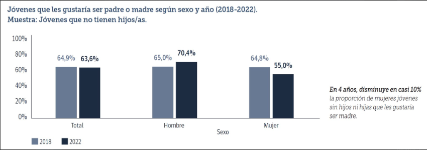
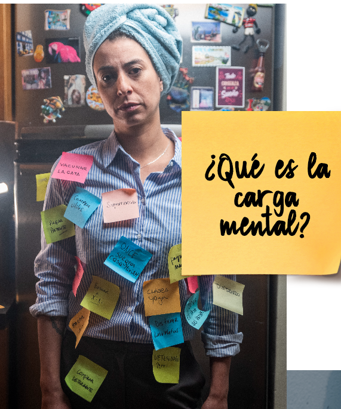
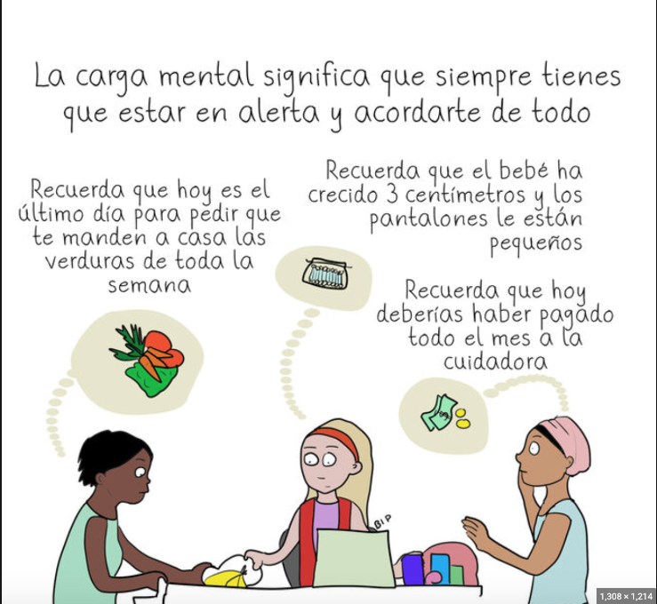
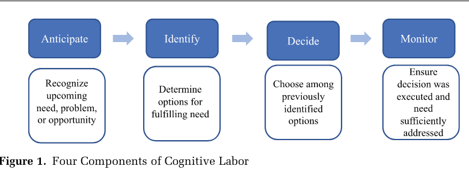
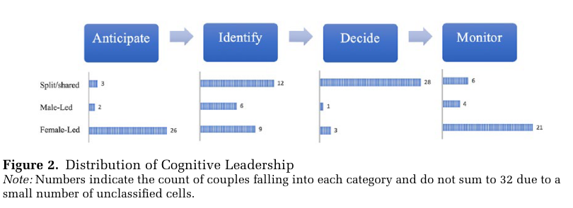
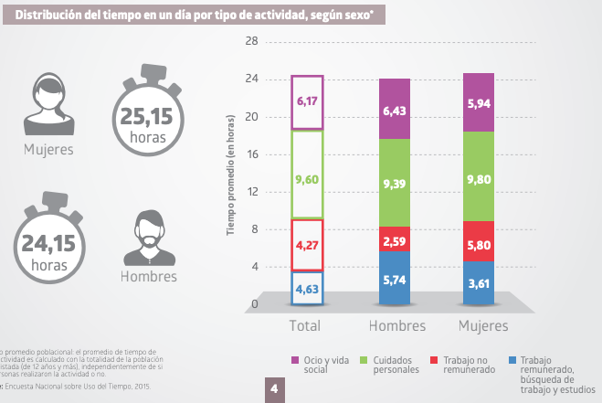
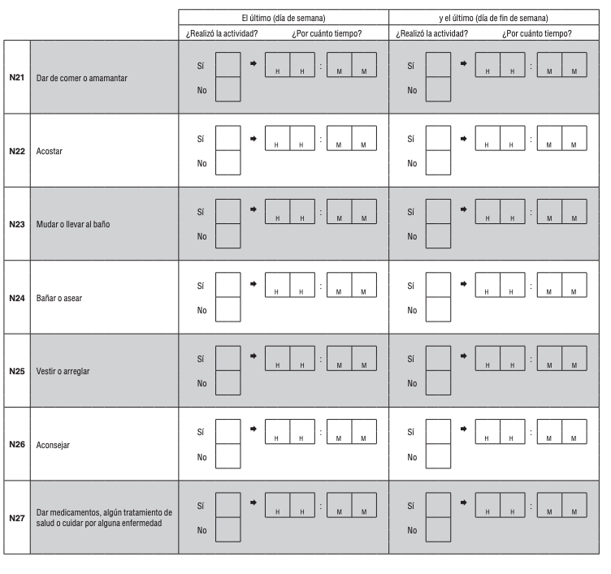
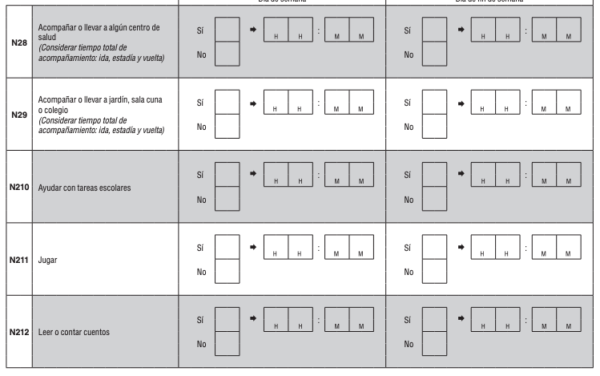
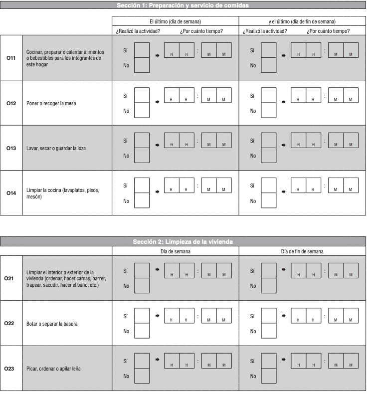

---

# Familia y Ma/Paternidades {background-image="C10_01.jpg" background-size="cover" background-opacity="0.35" style="color:white;"}

::: {style="color:#d4b8f5; font-size:1.1em; margin-top:0.5em;"}
SOL191 · Clase 10: Familia y Ma/Paternidades
:::

---

## Aviso

::: {style="font-size:0.85em;"}
- Prueba: comentarios y dudas.

::: {.cuadro-datos}
Solicitud de recorrección: "Las peticiones de re-corrección deberán hacerse por escrito a la profesora y ser solicitadas en un plazo máximo de 5 días hábiles desde la entrega de las correcciones. Las solicitudes tendrán que estar debidamente fundamentadas por el/la estudiante."
:::
:::

---

## Objetivos de hoy

::: {style="font-size:0.88em; line-height:1.8;"}
1. Comprender cómo la desigualdad de género puede producirse y reproducirse en la familia y las maternidad y paternidades.
2. Discutir sobre la división del trabajo en el hogar y sus diferentes dimensiones.
3. Aplicar el sistema multinivel al caso de la parentalidad gay en Chile.
:::

---

## Familia

::: {style="font-size:0.88em;"}
- [Amor y cuidado]{.hl}, pero también diferencia y desigualdad.
- Desafíos con la incorporación de la mujer al mundo laboral: falta de tiempo para realizar todas las tareas del hogar y tener un empleo remunerado.
- [Ideología de maternidad intensiva]{.hl}: la crianza debe tomar mucho tiempo, energía y recursos materiales, debe ser la prioridad sobre otros intereses, y debe ser realizada por las madres.
:::

---

## Familia en Chile: mujeres sostenedoras de hogar

::: {style="font-size:0.82em;"}
::: {.cuadro-datos}
En 2023-2024, el **43,8%** de las mujeres ocupadas es proveedora principal del hogar, lo que implica un alza de 14,4 puntos porcentuales en los últimos 13 años.
:::

- Han aumentado la proporción de mujeres solteras, y en menor medida de mujeres convivientes y divorciadas.
- Una parte minoritaria se debe a mujeres que viven con un hombre ocupado (es decir, que ganan más que el hombre).
- Alza en educación universitaria de mujeres, dando acceso a mayor autonomía económica.
- Ha habido un aumento en la diversidad de configuraciones familiares.
:::

---

## Baja de fecundidad

{fig-align="center" width="88%"}

::: {style="font-size:0.75em; margin-top:0.3em;"}
- Tasa global de fecundidad (número promedio de hijos/as que tienen las mujeres durante su edad fértil) es de 1,3 hijos.
- Chile hoy es uno de los países con menor tasa de fecundidad del continente.
- Cada vez menos mujeres quieren ser madres, quieren serlo a edades más avanzadas, y quieren tener sólo un hijo/a.
:::

---

## División del trabajo en el hogar en parejas heterosexuales

::: {style="font-size:0.85em;"}
- **Perspectiva tradicionalista:** los hombres deben ser responsables de proveer económicamente y las mujeres deben ser responsables del trabajo de cuidado.
- **Perspectiva neo-tradicionalista:** los hombres se enfocan en el trabajo y las mujeres pueden trabajar si quieren, pero sólo si no interfiere con su "real" trabajo de cuidar a su familia.
- **Perspectiva igualitaria:** división relativamente simétrica entre ambos tipos de trabajo.
:::

---

## Principales barreras para el trabajo compartido o división igualitaria

::: {style="font-size:0.82em;"}
- Institucionales:
  - La familia y el trabajo remunerado como instituciones avaras que demandan mucho tiempo y energía, y hay altas expectativas de dedicación.
  - Políticas públicas que restringen acceso a beneficios o responsabilidades por género.
- Ideológicas: creencias de maternidad intensiva, normas de género, expectativas sociales.
- En conjunto con la desigualdad de género en el trabajo, esto muchas veces lleva a la especialización a pesar de aspiraciones igualitarias: [maximización económica]{.hl}.
:::

---

## Preparing for Parenthood? (Bass 2015)

::: {style="font-size:0.82em;"}
- Entrevistas en profundidad con 60 hombres y mujeres sin hijos/as, en 30 parejas heterosexuales viviendo en San Francisco, EEUU.
- 73% de las parejas estaban casadas, la gran mayoría por más de 3 años.
- 27% estaban comprometidas o conviviendo.
- Entre 25 y 34 años.
- Ideologías de género igualitarias.

::: {.cuadro-datos}
¿Los planes de tener hijos/as en el futuro afectan de manera diferente las aspiraciones y decisiones de carrera de mujeres y hombres?
:::
:::

---

## Actividad en grupos

::: {style="font-size:0.85em;"}
::: {.cuadro-actividad}
Actividad en grupos de 2-4 personas.

En el artículo identificar ejemplos de cómo hombres y mujeres viven los distintos procesos:

1. Procesos mentales sobre el rol de ma/paternidad en sus trayectorias de carrera (páginas 369-373).
2. Procesos emocionales sobre la preparación para la intersección futura de trabajo y ma/paternidad (páginas 373-375).
3. Procesos de comportamiento sobre el ajuste de los objetivos de carrera en anticipación a la ma/paternidad (375-380).

Ir anotando en la pizarra en la medida que los encuentran.
:::
:::

::: notes
20 min
:::

---

## Dimensión cognitiva y emocional del trabajo doméstico

{fig-align="center" width="70%"}

---

## Modelo de trabajo cognitivo doméstico

{fig-align="center" width="70%"}

---

## La dimensión cognitiva del trabajo doméstico (Daminger 2019)

::: {style="font-size:0.85em;"}
La dimensión cognitiva implica:
:::

{fig-align="center" width="65%"}

::: notes
Invisible para otras personas.

Invisible a veces para la misma persona que lo hace, parte de cómo pensamos y operamos, hábitos.

Es difuso o abstracto y cuesta registrarlo o cuantificarlo.

No tiene límite de espacio o tiempo para hacerse, interrumpiendo el tiempo de ocio y trabajo remunerado.
:::

---

## Diferencias de género

{fig-align="center" width="80%"}

::: notes
Multiple couples exhibited a pattern of gender imbalance in anticipation and (less frequently) identification work followed by collaboration at the decision-making stage. Although Jenna and Peter mutually agreed to enroll their daughter in a music class, it was Jenna who found the class and alerted Peter.
:::

---

## Encuesta del uso del tiempo en Chile

{fig-align="center" width="85%"}

---

## Encuesta del uso del tiempo en Chile (cont.)

::: columns
::: {.column width="50%"}
{fig-align="center"}
:::
::: {.column width="50%"}
{fig-align="center"}
:::
:::

---

## Encuesta del uso del tiempo en Chile (cont.)

{fig-align="center" width="55%"}

---

## Estereotipos de ma-paternidad

::: {style="font-size:0.85em;"}
- Estereotipos y representaciones en los medios sobre la ma-paternidad son generizados.
- Estas representaciones se ven claramente en los medios, películas, redes sociales, etc.
- *https://www.youtube.com/watch?v=jHPbOGEUvZA*
- *https://www.youtube.com/watch?v=ASegpS-WDIU*

::: {.cuadro-actividad}
¿Qué estereotipos reproducen estas representaciones?
:::
:::

---

## Parentalidad de hombres gay en Chile (Herrera et al. 2018)

::: {style="font-size:0.85em;"}
- Entrevistas a 14 padres que se autoidentifican como hombres gay.
- Entre 25 y 60 años.
- Casi todos con educación universitaria.
- 5 fueron padres en relación homosexual.
- 9 fueron padres en relación heterosexual.
:::

---

## Parentalidad de hombres gay en Chile (Herrera et al. 2018)

::: {style="font-size:0.78em;"}
::: columns
::: {.column width="50%"}
**¿Cuáles son los principales desafíos que enfrentan los padres gay entrevistados?**

- La paternidad gay transgrede normas de género que asocian el cuidado y la crianza con la feminidad y donde los hombres son personas secundarias.
- Enfrentan los estereotipos asociados a la homosexualidad y a la paternidad gay.
- Preocupación sobre cómo su homosexualidad puede afectar negativamente la vida de sus hijos/as.
:::
::: {.column width="50%"}
**¿Qué estrategias siguen para enfrentar estos desafíos?**

Estrategias de protección:

- Discreción/escudos de protección frente a entorno hostil.
- Apertura/transparencia:

::: {.cuadro-datos}
"No queremos darles a entender un mensaje erróneo de que es algo malo."
:::
:::
:::
:::

---

## Aplicando el sistema multinivel

::: {style="font-size:0.88em;"}
::: {.cuadro-actividad}
¿Qué aspectos...

- [individuales o micro]{.hl}
- [interaccionales o meso]{.hl}
- [institucionales o macro]{.hl}

...nos ayudan a comprender las experiencias de desigualdad que viven los padres gay en Chile?
:::
:::

---

## Reflexión personal sobre trabajo y familia

::: {style="font-size:0.8em;"}
::: columns
::: {.column width="60%"}
Estas últimas dos clases revisamos cómo la desigualdad de género se reproduce en el trabajo y la familia.

::: {.cuadro-actividad}
Elige una cosa que aprendiste en estas últimas dos clases:

- ¿Cuál es?
- ¿Cómo crees que se vincula con lo aprendido en clases anteriores?
- ¿Qué dudas te gustaría resolver sobre estas últimas dos clases?
:::
:::
::: {.column width="38%"}
{fig-align="center"}
:::
:::
:::

::: notes
10 minutos
:::

---

## Presentaciones: próxima semana!

::: {style="font-size:0.8em;"}
- Sus presentaciones serán evaluadas con la rúbrica que está en Canvas y revisaron en la ayudantía: 10% de la nota. Por favor revisar la rúbrica.
- Cada persona entregará retroalimentación a cada grupo (5% de la nota). Durante la presentación, completarán un formulario (traer computador o celular por favor) donde responderán preguntas simples que serán feedback para cada grupo (no afectarán su nota).
- Si entregan retroalimentación a todos los grupos, tendrán una nota 7.
- El feedback será sobre el contenido de la propuesta de investigación y sobre la presentación oral de cada persona. Por favor entregar feedback constructivo.
:::

::: notes
5
:::

---

## Próxima clase: Violencia de género

::: {style="font-size:0.88em;"}
**Lectura mínima:**

- Ananías Soto, C. A., Vergara Sánchez, K. D., Herrera Monsalve, C. V., & Barra Ortiz, B. Y. (2023). Violencia digital de género en Chile: Un estudio durante la pandemia de COVID-19.
:::
