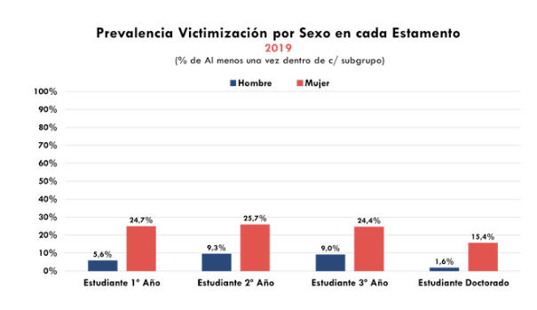
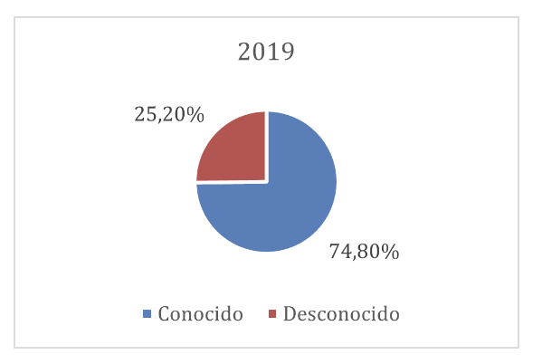
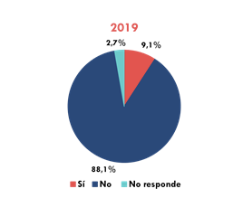

---

# Violencia de género {background-image="C11_01.jpg" background-size="cover" background-opacity="0.35" style="color:white;"}

::: {style="color:#d4b8f5; font-size:1.1em; margin-top:0.5em;"}
SOL191 · Clase 11: Violencia de género
:::

---

## Algunas cifras de Chile

::: {style="font-size:0.9em;"}
::: columns
::: {.column width="50%"}
::: {.cuadro-datos}
**1 de cada 4** mujeres fue víctima de violencia intrafamiliar en 2022.
:::

::: {.cuadro-datos}
El 2023, **20 femicidios** (Sernameg) y **132 femicidios frustrados**.
:::
:::
::: {.column width="50%"}
::: {.cuadro-datos}
Promedio de edad de primer abuso sexual (niños y niñas) es de **10,5 años** (2021).
:::

::: {.cuadro-datos}
**9 de cada 10** mujeres han sido víctimas de acoso sexual callejero al menos una vez en su vida.
:::
:::
:::
:::

---

## Cifras PUC: violencia sexual

::: columns
::: {.column width="60%"}
{fig-align="center"}
:::
::: {.column width="38%"}
{fig-align="center"}

{fig-align="center"}
:::
:::

---

## Misoginia según Manne

::: {style="font-size:0.85em;"}
*(Manne 2018)*

::: {.cuadro-datos}
Más allá del odio u hostilidad individual hacia las mujeres, la misoginia es un [sistema de control social]{.hl}. Funciona para fiscalizar y asegurar la subordinación de la mujer y mantener normas patriarcales.
:::

Sexismo es la ideología que racionaliza y justifica el patriarcado, mientras que la misoginia es "la policía" que castiga a quienes desafían este orden.

**El castigo misógino:** castigo a las mujeres que desafían las normas de género o fracasan en servir los intereses de los hombres.

  - Incluye el abuso verbal, la violencia física, el aislamiento social, entre otras.

::: {.cuadro-actividad}
¿Ejemplos de comportamientos o situaciones dónde las mujeres desafían las normas y pueden ser fiscalizadas? ¿Y de hombres?
:::
:::

---

## Misoginia y justicia (Manne)

::: {style="font-size:0.8em;"}
*(Manne 2018)*

::: {.cuadro-datos}
La sociedad ofrece **"himpathy"** o simpatía excesiva a quienes perpetúan violencia hacia las mujeres, minimizando sus acciones y/o culpando a las víctimas, lo que perpetúa el sistema patriarcal.
:::

- Caso Martín Pradenas: acusado de violencia sexual a varias mujeres durante años. El foco estuvo en Pradenas, su estatus y su familia, y en cómo una condena afectaría su futuro y reputación — quitando el foco al sufrimiento y trauma de sus víctimas.

::: {.cuadro-datos}
**Injusticia epistémica:** cuando los conocimientos, experiencias y voces de las mujeres son devaluados o ignorados, reforzando su estatus subordinado.
:::

- Caso Nabila Rifo: sobreviviente de intento de femicidio. Hubo escepticismo sobre su testimonio y foco en su vida personal y su personalidad, lo que distrae del crimen cometido contra ella.
:::

::: notes
This case exemplifies "himpathy" as Turner's potential and future prospects were given more consideration and sympathy than the trauma and suffering of his victim. The societal reaction often focused on the harm the sentence would do to Turner's life rather than the severe impact his actions had on the victim, illustrating the tendency to prioritize the well-being of male perpetrators over female victims in cases of misogynistic violence.
:::

---

## Discusión en grupo: Ananías et al. (2023)

::: {style="font-size:0.9em;"}
::: {.cuadro-actividad}
**Violencia digital a mujeres en Chile**

- ¿Qué porcentaje de mujeres ha sufrido violencia digital?
- ¿En qué aspectos es interseccional la violencia digital?
- ¿Cuáles son los tipos de violencia digital? ¿Cuáles son más comunes?
- ¿Es menos "real" la violencia en el espacio digital?
- ¿Qué consecuencias tiene la violencia digital en las mujeres?
:::
:::

::: notes
20 min.
:::

---

## Tipos de violencia de género (ONU Mujeres)

::: {style="font-size:0.62em;"}
::: columns
::: {.column width="62%"}
**Violencia contra mujeres y niñas en el ámbito privado**

- Violencia económica
- Violencia psicológica
- Violencia emocional
- Violencia física
- Violencia sexual

**Feminicidio**

- Asesinatos por honor

**Violencia sexual**

- Acoso sexual
- Violación
- Violación correctiva
- Cultura de la violación

**Trata de personas**

**Mutilación genital femenina**

**Matrimonio infantil**

**Violencia en línea o digital**

- Ciberacoso
- Sexteo o sexting
- Doxing
:::
::: {.column width="36%"}
{fig-align="center"}
:::
:::
:::

::: notes
Este tipo de violencia, también llamada maltrato en el hogar o violencia de pareja, es cualquier patrón de comportamiento que se utilice para adquirir o mantener el poder y el control sobre una pareja íntima. Una de las formas más comunes de violencia que sufren las mujeres.

15 minutos.
:::

---

## Presentaciones

::: {style="font-size:0.85em;"}
- Sus presentaciones serán evaluadas con la rúbrica que está en Canvas y revisaron en la ayudantía: [10% de la nota]{.hl}. Por favor revisar la rúbrica.
- Cada persona entregará retroalimentación a cada grupo ([5% de la nota]{.hl}). Durante la presentación, completarán un formulario (traer computador o celular por favor) donde responderán preguntas simples que serán feedback para cada grupo (no afectarán su nota).
- Si entregan retroalimentación a todos los grupos, tendrán una nota 7.
- 6 minutos de presentación y 2-3 minutos de preguntas.
:::

::: notes
5 min.
:::

---

## Feedback de pares

::: columns
::: {.column width="55%"}
::: {style="font-size:0.9em;"}
- Contenido: aspecto positivo y mejorable (o dudas) de la propuesta.
- Presentación: aspecto mejorable a cada persona.
- Por favor entregar feedback constructivo.
:::
:::
::: {.column width="43%"}
{fig-align="center"}
:::
:::
