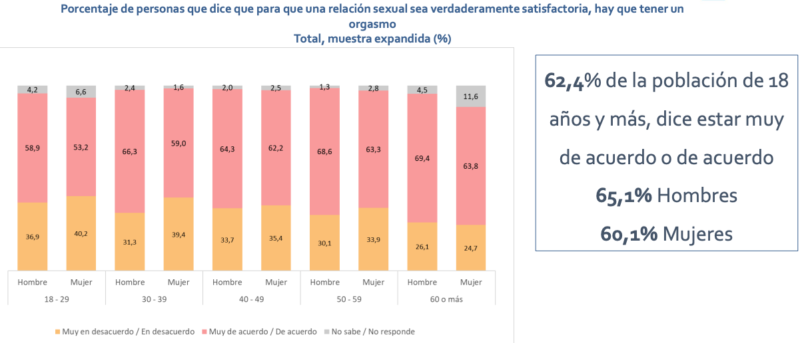

---

# Sexualidad {background-image="C12_01.jpg" background-size="cover" background-opacity="0.35" style="color:white;"}

::: {style="color:#d4b8f5; font-size:1.1em; margin-top:0.5em;"}
SOL191 · Clase 12: Sexualidad
:::

---

## Educación sexual

::: {.cuadro-actividad}
**Pregunta para la sala:** ¿Qué tipo de educación sexual recibiste en tu establecimiento educacional?
:::

---

## Benavente y Vergara (2006)

::: {style="font-size:0.9em;"}
- [Sexualidad como constructo social]{.hl}
- Capacidad física para la excitación sexual y el placer
- Significados personales y socialmente compartidos relacionados con el comportamiento y con la formación de las identidades sexuales y de género
- Representación e interpretación cultural de funciones naturales ordenadas en relaciones sociales jerárquicas
:::

---

## Construcción de la sexualidad: hombres

::: {style="font-size:0.9em;"}
- [Cuerpo para sí]{.hl} del hombre
- Ejercer la sexualidad como manera de reafirmar la hombría
- Sexualidad sin control como algo que se considera parte de la identidad de género
- Que adquieran experiencia
- Excitación física como algo natural
- Placer como parte de sus vidas
:::

---

## Construcción de la sexualidad: mujeres

::: {style="font-size:0.85em;"}
- [Cuerpo para otro]{.hl} de las mujeres
- Discurso centrado en la menstruación y cuidado del cuerpo
- Secreto y falta de información alrededor de la menstruación
- Menstruación como inicio del riesgo y necesidad de cuidado
- Temor y vergüenza del cuerpo sexuado
- Lo masculino como sujeto de placer, representa lo activo, frente a lo femenino como objeto de placer
:::

---

## Placer sexual en Chile: pocos datos

::: {style="font-size:0.75em;"}
::: columns
::: {.column width="50%"}
::: {.cuadro-datos}
**ENSSEX 2023** (representativa)

Nota promedio de bienestar con la vida sexual:

- Nacional: **5.08**
- Hombres: **5.35**
- Mujeres: **4.83**
:::
:::
::: {.column width="50%"}
::: {.cuadro-datos}
**Encuesta Gleeden 2021** (app para encuentros extraconyugales, 12 mil usuarios)

- El 55% de las mujeres afirma tener un orgasmo al mantener relaciones sexuales, versus el 91% de los hombres.
- Mujeres: 60% reconoce haber fingido un orgasmo, 20% reporta hacerlo siempre.
  - ¿Por qué? "Mi pareja/amante es impaciente" (50%) y "Quiero acabar rápido porque no me apetece" (50%).
:::
:::
:::
:::

---

## ENSSEX 2023

{fig-align="center" width="85%"}

---

## La "brecha del orgasmo"

::: {style="font-size:1.1em; text-align:center; margin-top:1em;"}
Video: La brecha del orgasmo
:::

::: {style="font-size:0.85em; color:#666; text-align:center; margin-top:0.5em;"}
*https://www.youtube.com/watch?v=H6DnmEFrIos*
:::

---

## Sexualidades: normas sobre sexualidad hoy

::: {style="font-size:0.8em;"}
- Hetero- y mono-normativas: supuesto de heterosexualidad y monogamia.
- El [imperativo del coito]{.hl}:
  - Asume heterosexualidad
  - Afecta cómo entendemos el bienestar sexual, penetración como "obligatoria" y dificultad o falta de deseo como "disfuncional"
  - Como la gran mayoría de las veces los hombres tienen orgasmos con la penetración, pero las mujeres no, este imperativo prioriza una actividad que privilegia el orgasmo masculino
- Normas definen roles masculinos (asertivo, tomar iniciativa, empujar la interacción) y femeninos (receptivo, paciente, no toma iniciativa y responde a iniciativa masculina) en la interacción sexual.
:::

::: notes
Que todo lo demás "no cuenta", llevando cualquier dificultad o falta de deseo de llevar a cabo la penetración pene-vagina como "disfuncional".

Esto, en conjunto con otras normas e ideas, puede llevar a "la brecha del orgasmo" en relaciones heterosexuales.
:::

---

## Orgasmo y placer sexual en el contexto universitario (Armstrong et al. 2012)

::: {style="font-size:0.72em;"}
- Hay una mayor satisfacción y tasa de orgasmo en relaciones que en encuentros casuales.
- Una mayor variedad de prácticas sexuales se asocia a una mayor satisfacción. Las mujeres participan de más prácticas sexuales en relaciones que en encuentros casuales y esto explica en parte la brecha de orgasmo entre ambos.
- Tanto hombres como mujeres reportan que los hombres generalmente no están preocupados del placer femenino en los encuentros casuales, pero sí son más atentos en las relaciones. Las mujeres sí reportan esfuerzos en encuentros casuales por el placer masculino.
- [Doble estándar]{.hl}: el "derecho" al placer sexual se ha vuelto recíproco en las relaciones, pero pareciera que en encuentros casuales las mujeres no tienen el mismo "derecho" al placer que los hombres.
:::

---

## Documentales recomendados

::: columns
::: {.column width="50%"}
{fig-align="center"}
:::
::: {.column width="50%"}
{fig-align="center"}
:::
:::

---

## Feedback de pares

::: {style="font-size:0.85em;"}
::: columns
::: {.column width="55%"}
- Contenido: aspecto positivo y mejorable (o dudas) de la propuesta.
- Presentación: aspecto mejorable a cada persona.
- Por favor entregar feedback constructivo.
- Link enviado por correo ayer.
:::
::: {.column width="43%"}
{fig-align="center"}
:::
:::
:::

::: notes
Terminar 3:50.
:::
