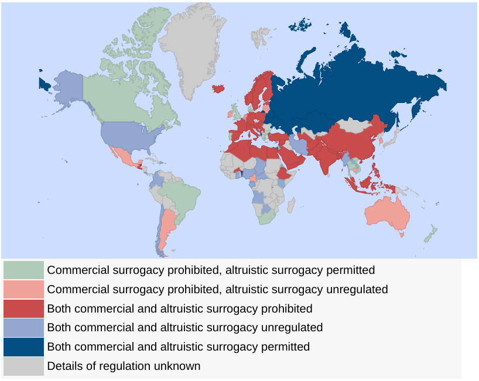
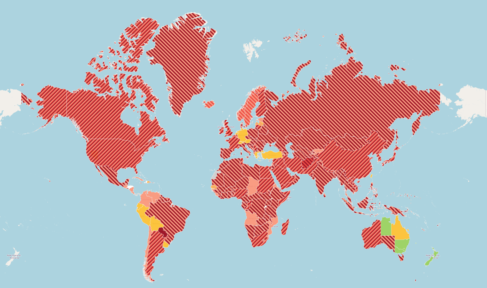
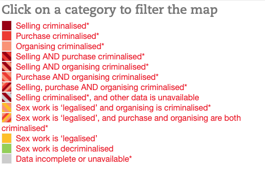

---

# Debates Feministas {background-image="C13_01.jpg" background-size="cover" background-opacity="0.35" style="color:white;"}

::: {style="color:#d4b8f5; font-size:1.1em; margin-top:0.5em;"}
SOL191 · Clase 13: Debates Feministas
:::

---

## Objetivos de hoy

::: {style="font-size:0.9em; line-height:1.8;"}
- Recolectar información sobre dos temas actuales asociados al feminismo y la desigualdad de género: [la gestación subrogada]{.hl} y [el trabajo sexual]{.hl}.
- Desarrollar un debate en clases para evaluar críticamente una tesis asociada a cada tema.
:::

---

## Instrucciones {background-color="#f8f4ff"}

::: {style="font-size:0.72em;"}
- División del curso en 2 grupos, uno "a favor" y otro "en contra".
- Asignar roles dentro de su equipo:
  - Investigadores, sistematizadores de argumentos.
  - Tomadores de notas, presentador/a de apertura de debate, presentador/a de respuesta, presentador/a de cierre.
- Fuentes o tipos de evidencia para defender sus argumentos
  - Artículos académicos, libros o tesis, artículos de medios confiables, organizaciones de la sociedad civil, estadísticas oficiales.
  - Evitar argumentos en base a experiencia personal u opinión personal.
- Tiempos: **25 minutos** de preparación en equipos y **25 minutos** de debate.
:::

---

## Estructura del debate

::: {style="font-size:0.78em; line-height:1.7;"}
- Posición "a favor": 5 minutos
- Posición "en contra": 5 minutos
- 5 minutos para que equipos preparen sus respuestas
- Respuesta de equipo "en contra": 3 minutos
- Respuesta de equipo "a favor": 3 minutos
- Cierre de equipo "en contra": 3 minutos
- Cierre de equipo "a favor": 3 minutos
- Votación: ¿qué grupo presentó mejores argumentos?
:::

::: notes
25 minutos
:::

---

## Preparación en equipos

::: {style="font-size:0.85em; line-height:1.8;"}
- 15 minutos para recolectar evidencia e información relevante
- 10 minutos para discutir ideas de argumentos e identificar aquellos más fuertes
  - 3-4 argumentos.
:::

::: notes
25 minutos
:::

---

## Debate 1: Gestación subrogada (GS)

::: {style="font-size:0.78em;"}
::: columns
::: {.column width="40%"}
{fig-align="center"}

::: {style="font-size:0.7em; color:#999; text-align:center;"}
*This Photo by Unknown Author is licensed under CC BY-SA-NC*
:::
:::
::: {.column width="58%"}
- La GS es un método de reproducción asistida donde una mujer lleva un embarazo para otra pareja.
- GS tradicional vía inseminación artificial de la mujer con espermios del padre, haciendo a esta mujer también la madre genética.
- GS gestacional vía implantación de un embrión de la pareja solicitante o bien de donantes de óvulos y/o espermios.
- Puede ser [comercial]{.hl}, es decir, donde se le entrega una recompensa económica a la mujer gestante por su embarazo, o
- Puede ser [altruista]{.hl}, donde la mujer no recibe ningún pago fuera de reembolsos por costos médicos y asociados al embarazo.
- Pero la distinción en la realidad no es tan clara.
:::
:::
:::

---

## Regulación de la gestación subrogada en el mundo

{fig-align="center" width="65%"}

---

## ¿Quién recurre a la gestación subrogada?

::: {style="font-size:0.85em; line-height:1.7;"}
- Puede ser usado por parejas infértiles, parejas homosexuales, personas solteras, mujeres que han tenido enfermedades que las han dejado infértiles, o que tienen enfermedades genéticas que se traspasarían al feto, entre otras.
- Como en muchos países no es legal o no está regulado, muchas personas recurren a la GS en otros países.
- En Chile no está regulado y se han enviado proyectos de ley para regularlo, sin éxito.
- Hay muchos argumentos a favor y en contra de la gestación subrogada en el debate actual.
:::

---

## Tesis: gestación subrogada

::: {.cuadro-actividad}
**Tesis a debatir:**

"La gestación subrogada, en cualquiera de sus formatos, debería ser legal en todas partes del mundo."
:::

---

## Cierre debate 1

::: {.cuadro-actividad}
- ¿Tenían una posición clara frente a este debate previo a esta actividad?
- ¿Alguien cambió de opinión con respecto a este debate?
:::

---

## Debate 2: Trabajo sexual

::: {style="font-size:0.85em;"}
::: columns
::: {.column width="42%"}
{fig-align="center"}
:::
::: {.column width="55%"}
- El trabajo sexual incluye cualquier tipo de trabajo donde un servicio sexual se provee a cambio de un beneficio o recompensa económica.
  - Servicios sexuales directos, pornografía, entre otros.
  - Refiere a una transacción consensuada entre adultos, no considera el tráfico sexual.
- La mayoría de las trabajadoras sexuales son [mujeres cis o trans]{.hl} y la mayoría de los consumidores son hombres.
:::
:::
:::

---

## Datos sobre trabajo sexual

::: columns
::: {.column width="62%"}
{fig-align="center"}
:::
::: {.column width="36%"}
{fig-align="center"}
:::
:::

---

## Tesis: trabajo sexual

::: {.cuadro-actividad}
**Tesis a debatir:**

"El trabajo sexual debería ser legal y regulado, como cualquier otro trabajo."
:::

---

## Cierre debate 2

::: {.cuadro-actividad}
- ¿Tenían una posición clara frente a este debate previo a esta actividad?
- ¿Alguien cambió de opinión con respecto a este debate?
:::

---

## Recordatorios {background-color="#f8f4ff"}

::: {style="font-size:0.8em; line-height:1.7;"}
- Ayudantías-Tutorías esta semana
- Entregaremos notas y feedback presentaciones mañana miércoles: revisar antes de sus tutorías.
- Próxima clase es nuestra última clase
  - Lectura: Verónica Gago (2019), capítulo 6 #LaInternacionalFeminista, pág 191-218.
  - Invitada especial: Inés Martínez-Echagüe, socióloga PhD(c) UNC Chapel Hill, experta en género y relaciones románticas y movimientos feministas en Latinoamérica.
  - Traer preguntas para Inés!
  - Cierre curso: dudas proyecto final y despedida del curso
:::
