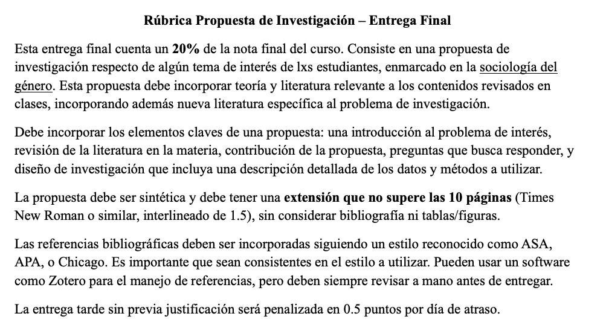
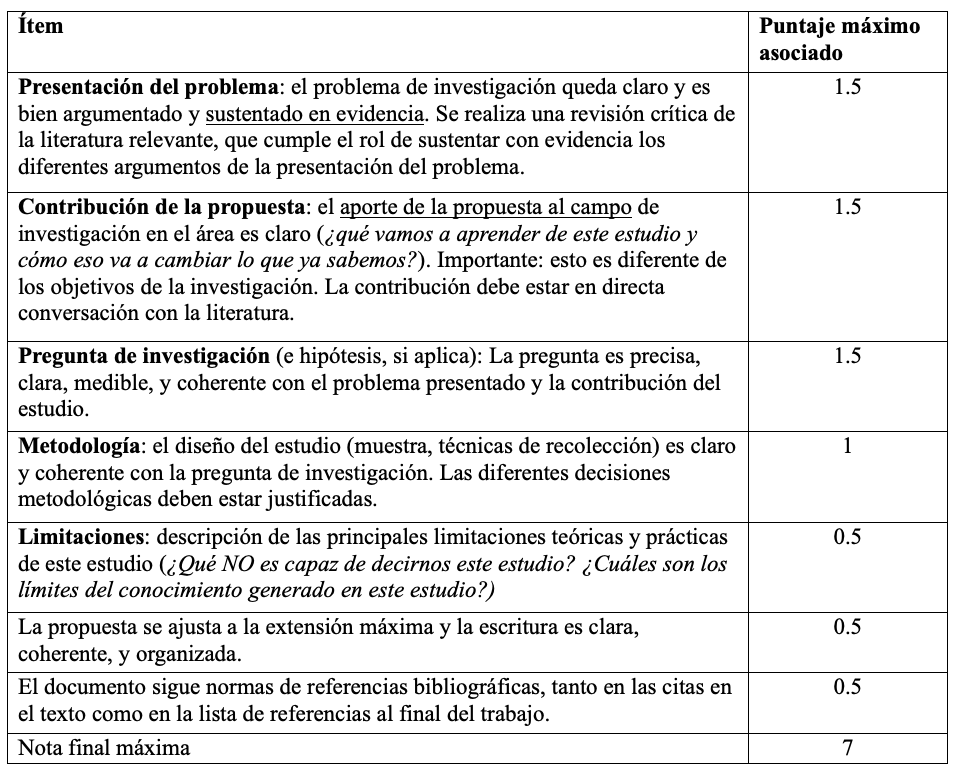

---

# Cambio social y movimientos feministas {background-image="C14_01.jpg" background-size="cover" background-opacity="0.35" style="color:white;"}

::: {style="color:#d4b8f5; font-size:1.1em; margin-top:0.5em;"}
SOL191 · Clase 14: Cambio social y movimientos feministas
:::

---

## Objetivos de hoy

::: {style="font-size:0.9em; line-height:1.8;"}
- Revisión de rúbrica y dudas trabajo final
- Evaluación docente y despedida curso
- Break 10 minutos
- Clase sobre movimientos feministas en Latam: Inés Martínez Echagüe (UNC Chapel Hill)
- Preguntas y cierre
:::

---

## Trabajo final

{fig-align="center" width="80%"}

---

## Trabajo final: entrega y consultas

::: {style="font-size:0.85em;"}
::: columns
::: {.column width="55%"}
{fig-align="center"}
:::
::: {.column width="43%"}
::: {.cuadro-datos}
**Entrega:** [2 de julio]{.hl} a las 23:59pm en Canvas
:::

Recibiremos dudas por correo hasta el 1 de julio a las 11am.

Enviar correo a mí, Bianca y Alonso para asegurar pronta respuesta.
:::
:::
:::

---

## Evaluación docente

::: {style="font-size:0.85em;"}
::: columns
::: {.column width="50%"}
{fig-align="center"}

::: {style="text-align:center; font-size:0.9em; color:#555; margin-top:0.3em;"}
En Canvas: Encuestas de Docencia
:::
:::
::: {.column width="48%"}
**¿Por qué importa?**

- Feedback para próxima versión del curso
- Permite identificar aquellos aspectos que funcionaron bien o que podrían mejorar
- Es parte muy importante de la evaluación que hace la Facultad de los y las docentes
:::
:::
:::

---

## Invitada especial: Inés Martinez-Echagüe

::: {style="font-size:0.88em;"}
::: {.cuadro-datos}
- Candidata doctoral en Sociología, University of North Carolina at Chapel Hill, EEUU.
- Magíster en Políticas Públicas y Género, en FLACSO.
- Socióloga, Universidad de la República en Uruguay.
:::

Investiga sobre [género y desigualdad]{.hl}, [movimientos feministas]{.hl}, relaciones románticas y amor, trabajos de cuidado, entre otros.
:::
