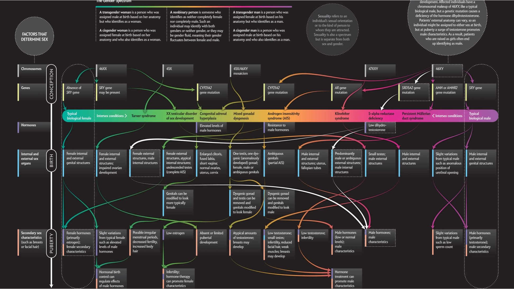
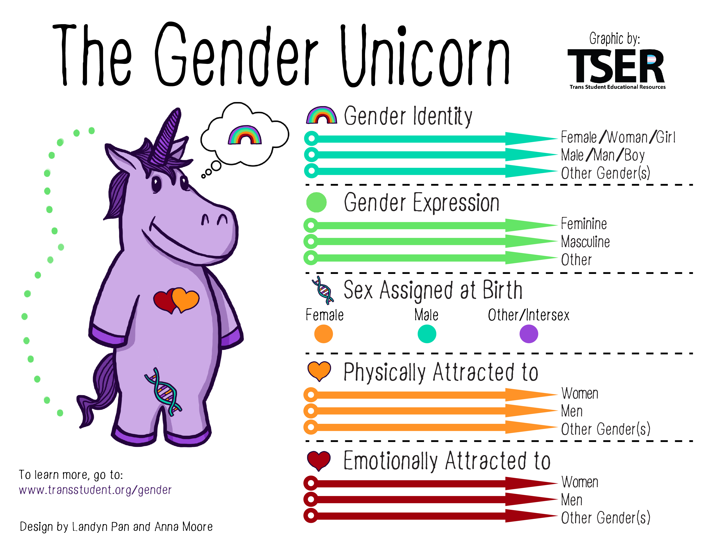
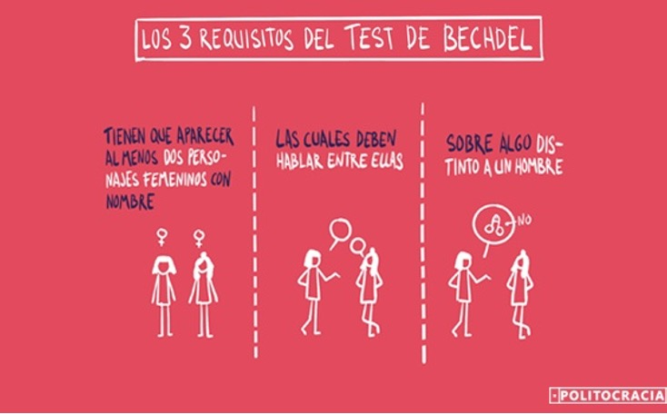
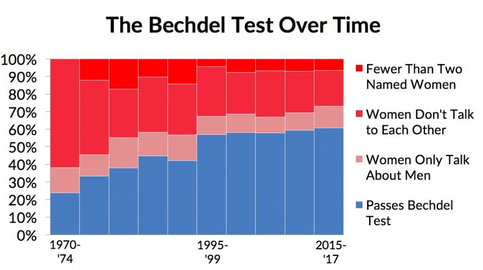
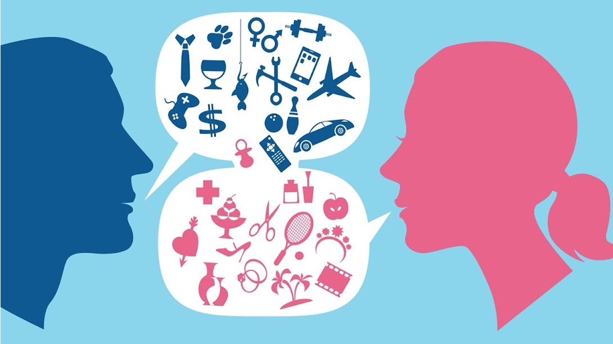
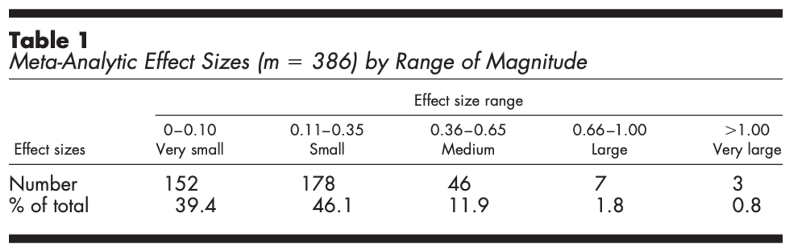
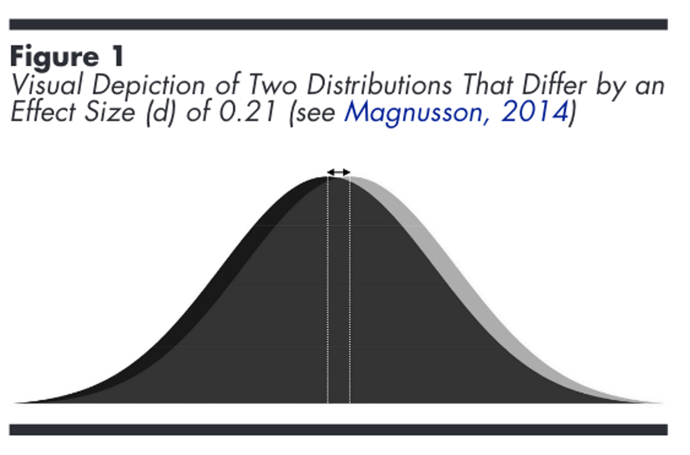

---

# Binarismo, esencialismo y otras construcciones sociales {background-color="#1e1035" style="color:white;"}

::: {style="color:#d4b8f5; font-size:1.1em; margin-top:0.5em;"}
SOL191 · Clase 2
:::

---

## Recordatorios para la discusión {background-color="#f8f4ff"}

::: {style="font-size:0.85em;"}
::: columns
::: {.column width="50%"}
- Decir su nombre antes de hablar
- Respetar pronombres
- No juzgar las ideas de otras personas
- Dar espacio para que todas las personas opinen
- No interrumpir (especialmente en grupos pequeños)
:::
::: {.column width="50%"}
- Cuidar el respeto al plantear ideas
- No tener miedo de opinar
- No asumir que todos saben lo mismo
- Modular el lenguaje, evitar modismos
- No grabar las clases
:::
:::
:::

::: notes
Recordar brevemente el acuerdo de buenas prácticas co-construido en la Clase 1. Preguntar si quieren agregar algo nuevo después de la primera semana.

2 min.
:::

---

## Plan de clase

::: {style="font-size:0.85em;"}
::: columns
::: {.column width="50%"}
**Primera parte** (~45 min)

- El binarismo de sexo/género
- Sexo biológico e intersexualidad
- Video + discusión grupal
:::
::: {.column width="50%" .fragment}
**Segunda parte** (~45 min)

- Identidades fuera del binario
- Binarismo en la crianza
- Esencialismo de género
- ¿Cuándo son "reales" las diferencias?
:::
:::
:::

::: notes
Dar una hoja de ruta clara al inicio. Tiempos aproximados que pueden ajustarse.
:::

---

## Objetivos de la clase

::: {style="font-size:0.88em; line-height:1.8;"}
1. Reflexionar sobre el binarismo de sexo/género y sus implicancias
2. Evaluar qué tan claro o definitivo es el sexo biológico
3. Analizar las consecuencias del binarismo para personas intersexuales
4. Comprender el esencialismo de género, discutiendo diferencias y similitudes entre sexos y sus consecuencias
:::

---

# Parte I: El binarismo {background-color="#6B4C9A" style="color:white;"}

---

## ¿Qué es el binarismo de género?

::: {style="font-size:0.88em;"}
::: columns
::: {.column width="60%"}
Hay dos tipos de personas: aquellas que tienen cuerpos de hombre y son masculinas, y aquellas que tienen cuerpos de mujer y son femeninas. Estos dos tipos son **fundamentalmente diferentes y opuestos**.

::: {.cuadro-actividad}
**Pregunta para la sala:** ¿Cuáles son algunas implicancias del binarismo? ¿Qué facilita? ¿Qué dificulta?
:::
:::
::: {.column width="38%" .fragment}
:::
:::
:::

::: notes
El binarismo tiene varias capas. Facilita generalizar y esencializar: hablar de "los hombres" como si fueran todos iguales y "las mujeres" como si fueran todas iguales, y como si fueran mucho más diferentes entre géneros que dentro de cada género.

Los medios, la cultura popular y la socialización reproducen estas ideas constantemente.

Dar 3-4 minutos para que piensen y compartan. Anotar respuestas en la pizarra organizándolas por "facilita" y "dificulta".

5 min.
:::

---

## ¿Qué tan claro es el sexo biológico?

::: {style="font-size:0.6em;"}
La determinación del sexo biológico involucra múltiples etapas y no siempre es clasificable en términos binarios. Se estima que aproximadamente un **1,7% de la población** presenta alguna variación intersexual — una frecuencia similar a la del pelo rojo.
:::

{fig-align="center" width="90%"}

::: notes
La intersexualidad nos recuerda que la clasificación en sexos "femenino" y "masculino" no es tan clara como asumimos. No siempre es visible externamente.

Las personas intersexuales nos muestran que, aunque demos por sentado que todos son biológicamente hombre o mujer sin ambigüedades, hay un camino con etapas complejas que determinan qué tan ambiguas son estas categorías.

8 min.
:::

---

## Consecuencias del binarismo para personas intersexuales {background-color="#f8f4ff"}

::: {style="font-size:1.1em; text-align:center; margin-top:1em;"}
Video: Consecuencias médicas y sociales de la intersexualidad
:::

::: {style="font-size:0.85em; color:#666; text-align:center; margin-top:0.5em;"}
*https://www.youtube.com/watch?v=2S0e-i117vY*
:::

::: notes
**Video sugerido:** "What It's Like To Be Intersex" de BuzzFeed (YouTube, ~5 min) o fragmento del documental "Intersexion" (2012). También se puede usar el video de Teen Vogue "5 Misconceptions About Sex and Gender" (~6 min).

Vincular con la lectura de Human Rights Watch (2018) sobre cirugías no consentidas a personas intersexuales.

7 min para el video.
:::

---

## Discusión en grupo

::: {style="font-size:0.88em;"}
::: {.cuadro-actividad}
**En grupos de 3-4 personas:**

1. ¿Qué les sorprendió del video?
2. ¿Cómo se conecta con la lectura de Human Rights Watch?
3. ¿Qué consecuencias tiene el binarismo para las personas que no encajan en él?
:::
:::

::: {style="font-size:0.85em; color:#555; margin-top:1em;"}
⏱ 5 min discusión grupal · 5 min plenario
:::

::: notes
Circular por los grupos. Tomar nota de las ideas más interesantes para el plenario.

En el plenario, conectar las respuestas con el concepto de que el binarismo no es solo una descripción, sino una imposición normativa sobre los cuerpos.
:::

---

# Parte II: Fuera del binario {background-color="#6B4C9A" style="color:white;"}

---

## Las dimensiones del género: el Gender Unicorn

::: columns
::: {.column width="55%"}
{fig-align="center"}
:::
::: {.column width="43%" .fragment}
::: {style="font-size:0.72em; line-height:1.5;"}
Cinco dimensiones **independientes**, cada una en **espectro** (APA 2024):

[**Identidad de género:**]{.hl} sentido interno de ser hombre, mujer, ambos, ninguno u otro.

[**Expresión de género:**]{.hl} cómo comunicamos nuestro género (apariencia, vestimenta, comportamiento).

[**Sexo asignado al nacer:**]{.hl} designación basada en anatomía, hormonas y cromosomas.

[**Atracción sexual:**]{.hl} hacia quién(es) sentimos atracción física.

[**Atracción romántica:**]{.hl} hacia quién(es) sentimos atracción emocional. Puede diferir de la sexual.
:::
:::
:::

::: notes
Este modelo reemplaza al Genderbread Person. Los cambios clave: usa "sexo asignado al nacer" en vez de "sexo biológico", reconoce géneros fuera del binario occidental, y separa atracción sexual de romántica.

El término "sexo biológico" se usa cada vez menos en ciencias sociales porque sugiere que el sexo es simple, estático y binario. En contextos médicos sigue siendo relevante, pero el consenso académico actual prefiere "sexo asignado al nacer" (APA 2024; Clarke 2022, Columbia Law Review).

5 min.
:::

---

## Identidades más allá del binario

::: {style="font-size:0.88em;"}
::: columns
::: {.column width="55%"}
El binarismo va más allá del sexo biológico: también se espera que las personas se identifiquen con un género binario.

Se espera que una persona asignada de sexo "masculino" al nacer se identifique como hombre y se comporte "como hombre".

::: {.cuadro-datos}
Más de **1 de cada 10** personas reporta sentirse tan masculina como femenina, o más "atípica" que "típica" en su identidad de género.
:::
:::
::: {.column width="43%" .fragment}
:::
:::
:::

::: notes
Pero ser claramente "hombre" o "mujer" en la sociedad de hoy va más allá del desarrollo físico. También se espera que la persona se identifique como tal y se comporte según esas expectativas.

Conectar con las dimensiones del Gender Unicorn recién vistas: identidad y expresión son independientes del sexo asignado.

5 min.
:::

---

## Personas transgénero y no binarias

::: {style="font-size:0.85em;"}
::: columns
::: {.column width="50%"}
**Personas transgénero:** experimentan alguna forma de incongruencia entre el sexo asignado al nacer y su identidad de género.

**Personas no binarias / genderqueer:** rechazan el binarismo de género o no se identifican exclusivamente como hombre o mujer. Incluye identidades como género fluido.
:::
::: {.column width="50%" .fragment}
**Personas cisgénero:** su identidad de género coincide con el sexo asignado al nacer.

::: {.cuadro-datos style="margin-top:1em;"}
Estas categorías no son binarias entre sí — la diversidad de experiencias dentro de cada grupo es enorme.
:::
:::
:::
:::

::: notes
Transgénero es un término paraguas que abarca un grupo diverso de personas. No todas las personas trans son binarias (hombre o mujer); algunas se identifican fuera del binario.

El uso de "disforia de género" como término clínico ha sido criticado por patologizar la experiencia trans. La OMS reclasificó la transexualidad fuera de los trastornos mentales en la CIE-11 (2019).

5 min.
:::

---

## Binarismo y género en la crianza

::: {style="font-size:0.85em;"}
*(Compton & Bridges 2013)*

::: columns
::: {.column width="50%"}
La constancia de género se establece desde **antes de nacer** y se refuerza durante toda la crianza, tanto para niños/as como para los adultos que los crían.

Los objetos adquieren género: juguetes, ropa, colores, decoración.
:::
::: {.column width="50%" .fragment}
::: {.cuadro-actividad}
**Preguntas para reflexionar:**

- ¿En qué otros tipos de objetos vemos este binarismo?
- ¿Qué diferencias buscan marcar?
- ¿Cuáles son las implicancias?
:::
:::
:::
:::

::: notes
La ropa infantil es un ejemplo claro: la diferenciación va ampliándose con la edad. Comparar ropa de recién nacido vs. ropa de 2 años vs. ropa de 5 años.

Relación entre binarismo y consumo: el "gender reveal" como fenómeno cultural reciente que refuerza el binarismo antes incluso del nacimiento.

5 min.
:::

---

## El género según Connell

::: {style="font-size:0.88em;"}
::: {.cuadro-datos}
"El género es la **estructura de relaciones sociales** que se centra en el ámbito reproductivo, y en el conjunto de prácticas que introducen las distinciones reproductivas entre cuerpos en los procesos sociales."

— Connell (2009: 11)
:::

El género es **multidimensional**: va más allá de nuestra identidad o de un solo ámbito como la sexualidad. Los patrones de género varían entre contextos, pero siempre son patrones *de género*. Se reproducen socialmente por el poder de la estructura sobre la acción individual, pero también cambian en la medida en que creamos nuevas situaciones.
:::

::: notes
Cómo lidiamos con los cuerpos y las consecuencias que eso tiene en nuestras vidas personales y colectivas.

Conectar con la definición consensuada de la Clase 1: el género como sistema de estratificación y sistema social.

3 min. Transición a la sección de patriarcado.
:::

---

# Parte III: Patriarcado, sexismo y misoginia {background-color="#1e1035" style="color:white;"}

---

## El patriarcado

::: {style="font-size:0.88em;"}
*(Johnson 2015)*

::: {.cuadro-datos}
Tipo de sociedad que promueve el **privilegio masculino** mediante su [hombre-dominación]{.hl}, [hombre-identificación]{.hl} y [hombre-centrismo]{.hl}.
:::

**Privilegio:** cualquier ventaja no ganada disponible para miembros de una categoría social, mientras es sistemáticamente negada a miembros de otra.
:::

::: notes
Los hombres también sufren por su participación en el patriarcado, pero no porque sean oprimidos *por ser hombres*. Aunque haya otros ejes de opresión igual o más relevantes en un contexto situacional, los hombres siguen perteneciendo a la categoría de género dominante.

4 min.
:::

---

## Hombre-dominación

::: {style="font-size:0.85em;"}
::: columns
::: {.column width="55%"}
Las posiciones de autoridad — política, económica, legal, religiosa, educacional, militar, doméstica — están generalmente reservadas para los hombres.

Genera diferencias de poder y promueve la idea de que los hombres son superiores a las mujeres.

::: {.cuadro-actividad}
¿Qué ejemplos ven en Chile hoy?
:::
:::
::: {.column width="43%" .fragment}
{fig-align="center"}
:::
:::
:::

::: notes
Foto de los presidentes de Chile firmando un acuerdo — todos hombres excepto Bachelet. Preguntar: ¿qué les dice esta imagen?

Otros ejemplos: directorios de empresas, rectorías de universidades, obispados, generales de las FFAA.

4 min.
:::

---

## Hombre-identificación

::: {style="font-size:0.85em;"}
::: columns
::: {.column width="55%"}
Las ideas y creencias culturales sobre lo que es bueno, deseable, preferido o normal están culturalmente asociadas a cómo pensamos **la masculinidad**.

::: {.cuadro-actividad}
¿Qué otros ejemplos identifican?
:::
:::
::: {.column width="43%" .fragment}
::: {.cuadro-datos}
**Ejemplo: el "trabajador ideal"**

El estándar del buen trabajador asume disponibilidad total, sin responsabilidades de cuidado — un perfil históricamente masculino. Quien no calza (mayoritariamente mujeres) es evaluado como menos comprometido. El estándar parece neutro, pero está construido sobre una norma masculina.
:::
:::
:::
:::

::: notes
Otros ejemplos: los ensayos clínicos de medicamentos que históricamente usaron solo sujetos masculinos, asumiendo que los resultados eran generalizables (ver Criado Perez 2019, Invisible Women). La idea de "liderazgo" asociada a rasgos estereotípicamente masculinos (asertividad, competitividad, decisión), mientras rasgos como la colaboración o la empatía son vistos como "blandos".

En Chile: la jornada laboral completa como norma de "compromiso", la cultura del "quedarse tarde" como señal de productividad.

4 min.
:::

---

## Hombre-centrismo

::: {style="font-size:0.85em;"}
::: columns
::: {.column width="55%"}
El foco de atención está principalmente en hombres y niños y lo que ellos hacen: en las conversaciones, las películas, las historias, las noticias.

::: {.cuadro-actividad}
¿Conocen el **test de Bechdel**? ¿Qué otros ejemplos de hombre-centrismo identifican?
:::
:::
::: {.column width="43%" .fragment}
{fig-align="center"}
:::
:::
:::

::: notes
En más del 80% de las películas, hombres ocupan dos de los tres roles principales con más diálogo.

Dato interesante: las películas que pasan el test de Bechdel rinden $2.68 por cada dólar invertido, vs. $2.45 para las que no lo pasan.

4 min.
:::

---

## El test de Bechdel

{fig-align="center" width="75%"}

::: notes
El test es un mínimo muy bajo — y aun así solo ~50% de las películas lo pasa desde los años 90. Preguntar: ¿qué nos dice esto sobre cómo se construyen las narrativas culturales?

3 min.
:::

---

## Sexismo vs. misoginia

::: {style="font-size:0.82em;"}
*(Manne 2018)*

::: columns
::: {.column width="48%"}
### Misoginia: la "policía"

La función de **vigilar y fiscalizar** la aplicación de las normas y expectativas del patriarcado.

Atributo de contextos sociales donde mujeres y niñas reciben **tratamiento hostil** — frecuentemente cuando violan el orden patriarcal.
:::
::: {.column width="48%" .fragment}
### Sexismo: la "justificación"

Ideología cuya función es **racionalizar y justificar** las relaciones sociales patriarcales.

**Naturaliza** las diferencias entre sexos para hacer el orden social parecer inevitable. Supuestos, creencias, estereotipos y narrativas que representan a mujeres y hombres como significativamente diferentes.
:::
:::
:::

::: notes
La distinción de Manne es muy útil pedagógicamente. El sexismo opera en el plano de las ideas (justificación); la misoginia opera en el plano de las consecuencias (castigo). No son lo mismo, aunque se refuerzan mutuamente.

Pedir ejemplos concretos de cada uno. Un buen ejemplo: "las mujeres son naturalmente más empáticas" (sexismo) vs. el acoso a una política por ser "demasiado ambiciosa" (misoginia).

5 min.
:::

---

## Control y opresión

::: {style="font-size:0.85em;"}
::: columns
::: {.column width="50%"}
**El control como valor fundamental** *(Johnson 2015)*

Los hombres mantienen su privilegio controlando tanto a mujeres como a otros hombres y disidencias que lo pongan en riesgo. Para controlar a otro, es necesario verse como **separado** de otro.
:::
::: {.column width="50%" .fragment}
**¿Qué es la opresión?**

Un sistema de desigualdad social a través del cual un grupo es posicionado para dominar y beneficiarse de la explotación y subordinación de otro grupo.

Un grupo no puede ser oprimido "por la sociedad" — la opresión ocurre en la **relación** entre grupos.
:::
:::
:::

::: notes
La opresión no es solo un acto individual de discriminación; es un sistema sostenido estructuralmente.

Nota sobre interseccionalidad: el patriarcado no opera solo. Se entrecruza con sistemas de opresión racial, de clase, de sexualidad, de capacidad, etc. Por eso hablamos de heteropatriarcado o cisheteropatriarcado. Desarrollaremos interseccionalidad con más profundidad en clases posteriores.

5 min.
:::

---

# Parte IV: Esencialismo de género {background-color="#6B4C9A" style="color:white;"}

---

## ¿Qué es el esencialismo de género?

::: {style="font-size:0.85em;"}
::: columns
::: {.column width="50%"}
El binarismo fortalece la idea de "opuestos" e incentiva la **maximización de las diferencias aparentes** entre hombres y mujeres, haciendo el binarismo parecer más importante de lo que es.

La realidad es que hay **mucho más en común que diferente** entre hombres y mujeres.
:::
::: {.column width="48%" .fragment}
{fig-align="center"}
:::
:::
:::

::: notes
El binarismo no solo asume la existencia de solo dos sexos, sino que culturalmente intentamos hacer las diferencias más grandes de lo que son.

Ejemplos de maximización cultural: tamaño corporal (hombres incentivados a agrandar, mujeres a reducir), pelo corporal y de la cabeza, ropa infantil desde los 2 años, colores y juguetes.

Ejemplo concreto: las diferencias promedio de tamaño corporal son reales pero las curvas se sobrelapan significativamente. Sin embargo, culturalmente se exageran.

5 min.
:::

---

## Diferencias y similitudes entre géneros

::: {style="font-size:0.85em;"}
*(Zell et al. 2015)*

::: columns
::: {.column width="50%"}
**Metasíntesis monumental:**

- Más de **20.000** estudios combinados
- Muestra de **12 millones** de personas
- **21.000** mediciones
- **386** atributos analizados
:::
::: {.column width="50%" .fragment}
**Atributos medidos:**

Pensamientos, emociones, comportamientos, habilidades intelectuales, estilos de comunicación, personalidad, felicidad y bienestar, habilidades físicas, entre otros.
:::
:::
:::

::: notes
La pregunta clave: el binarismo de género puede ser una construcción social, pero ¿hay diferencias reales entre hombres y mujeres? Zell et al. intentaron responder esto de la manera más comprensiva posible.

Explicar brevemente qué es un tamaño del efecto (d de Cohen): una medida estandarizada de la magnitud de una diferencia. d < 0.2 = trivial, 0.2-0.5 = pequeña, 0.5-0.8 = moderada, > 0.8 = grande.

5 min.
:::

---

## Resultados: la hipótesis de las similitudes de género

::: {style="font-size:0.85em;"}
::: columns
::: {.column width="48%"}
::: {.cuadro-datos}
**El 85% de las diferencias entre sexos son triviales o pequeñas** (d < 0.35).

Solo un 0.8% son muy grandes y 1.8% grandes.
:::

Consistente con la *Gender Similarities Hypothesis* (Hyde 2005).
:::
::: {.column width="50%" .fragment}
{fig-align="center"}
:::
:::
:::

::: notes
Esto no significa que no haya diferencias — significa que son mucho menores de lo que asumimos. El ejemplo de la altura: los hombres son más altos en promedio, pero si ponemos las dos curvas de distribución juntas, el sobrelapamiento es enorme. Lo mismo ocurre con la gran mayoría de atributos psicológicos y de comportamiento.

5 min.
:::

---

## Distribuciones sobrelapadas

{fig-align="center" width="80%"}

::: {style="font-size:0.85em; text-align:center; margin-top:0.5em;"}
La mayoría de las diferencias psicológicas, cognitivas y de comportamiento son **mucho menores** de lo que la cultura popular sugiere. Las distribuciones se sobrelapan enormemente.
:::

::: notes
Este gráfico muestra visualmente lo que los números dicen: las curvas de distribución de hombres y mujeres se sobrelapan en la gran mayoría de los atributos medidos. Las diferencias promedio existen, pero la variación *dentro* de cada grupo es mucho mayor que la variación *entre* grupos.

3 min.
:::

---

## Trabajo en grupo {background-color="#f8f4ff"}

::: {style="font-size:0.88em;"}
::: {.cuadro-actividad}
**En grupos de 3-4 personas, discutir:**

1. ¿Qué implicancias tienen estos resultados para cómo entendemos el género?
2. ¿Cuáles son las **limitaciones** de esta conclusión?
3. Si las diferencias son tan pequeñas, ¿por qué las **percibimos** como enormes?
:::
:::

::: {style="font-size:0.85em; color:#555; margin-top:1em;"}
⏱ 10 min discusión grupal · 10 min plenario
:::

::: notes
Limitaciones que deberían surgir: sesgo de publicación, contextos culturales de los estudios (mayoritariamente WEIRD), la diferencia entre promedios y experiencias individuales, que "medible" no significa "importante", y que las diferencias sociales son reales aunque no sean "innatas".

En el plenario, conectar con la siguiente sección sobre cuándo son "reales" las diferencias.

20 min total.
:::

---

## ¿Cuándo son "reales" las diferencias?

::: {style="font-size:0.85em;"}
*(Wade & Ferree 2023)*

**Nivel 1 — Son reales si podemos medirlas.** Pero: deseabilidad social, contexto de medición, priming experimental.

**Nivel 2 — Son reales si se observan en todas las culturas.** Pero: las diferencias pueden ser resultado de condiciones sociales compartidas, no de naturaleza.

**Nivel 3 — Son reales si son biológicas.** Pero: lo biológico puede ser "entrenable" y modificable.

**Nivel 4 — Son reales si son biológicas e inmutables.** Muy pocas diferencias llegan a este nivel.
:::

::: notes
Esta escala de Wade & Ferree es excelente para que los estudiantes desarrollen pensamiento crítico sobre afirmaciones esencialistas. Cada nivel parece más convincente, pero cada uno tiene sus propias limitaciones.

Ejemplo práctico: "los hombres son más agresivos". ¿En qué nivel de "realidad" estamos? Depende de cómo definimos agresión, en qué contextos, si estamos midiendo agresión física o verbal, si las diferencias son consistentes cross-culturalmente, etc.

8 min.
:::

---

## Ficha de salida (Wooclap) {background-color="#f8f4ff"}

::: {style="font-size:0.88em;"}
::: {.cuadro-actividad}
**Responde brevemente en Wooclap:**

1. ¿Qué idea de la clase de hoy desafió algo que dabas por sentado? Explica qué pensabas antes y qué piensas ahora.
2. ¿Qué pregunta te quedó dando vueltas después de la clase de hoy?
:::
:::

::: {style="font-size:0.85em; color:#555; margin-top:1em;"}
Se evalúa por calidad: completa · media · cero.
:::

::: notes
3 min. Dar tiempo real para escribir — no apurar.

Rúbrica: Completa = responde ambas preguntas con reflexión propia conectada al contenido de la clase. Media = responde pero de forma vaga o sin conexión con la clase. Cero = no responde o respuesta genérica sin relación.

Revisar las respuestas después de clase — las preguntas de la ficha 2 son excelente insumo para abrir la Clase 3.
:::

---

## Próxima semana

::: {style="font-size:0.85em;"}
::: columns
::: {.column width="55%"}

Clase liderada por ayudantes, con invitada y actividad grupal.

**Tema:**

Explicaciones para la desigualdad — Aplicación al caso de mujeres en STEM

**Lecturas mínimas:**

- Sanchis-Segura (2020). "Cerebros masculinos y femeninos. ¿Mito o realidad?" *Metodé*
- Valenzuela et al. (2022). "Bichos Raros: Género y Subjetividades en el Campo de la Investigación en Matemáticas en Chile." *Psicoperspectivas* 21(2): 118–30.
:::
::: {.column width="42%" .fragment}
::: {.cuadro-datos style="font-size:0.95em;"}
**Pregunta guía:**

¿Cómo se explican las diferencias de género en STEM? ¿Son innatas o construidas?
:::
:::
:::
:::
