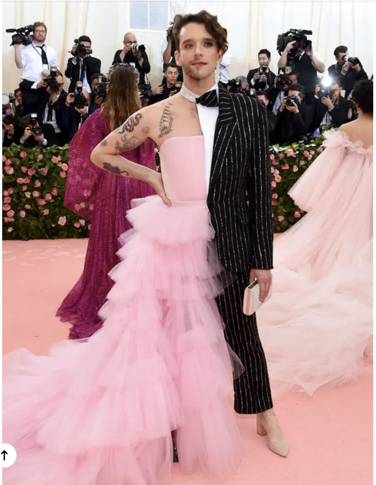
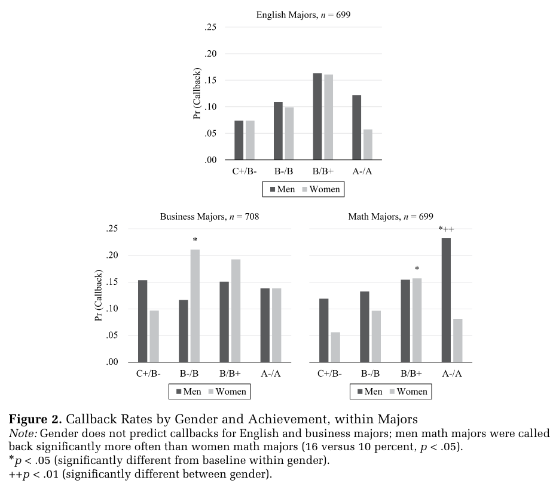
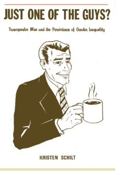
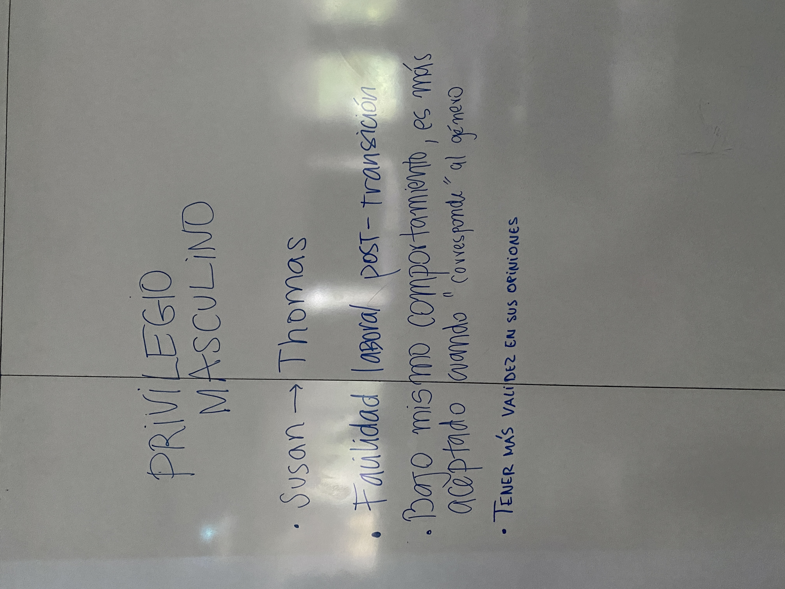
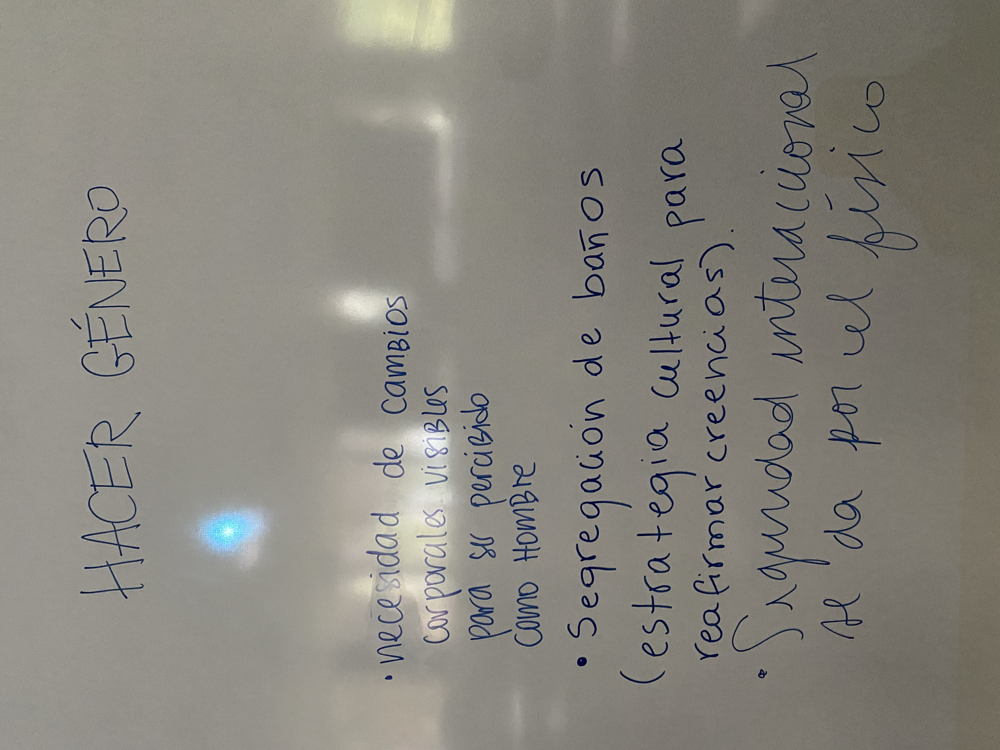
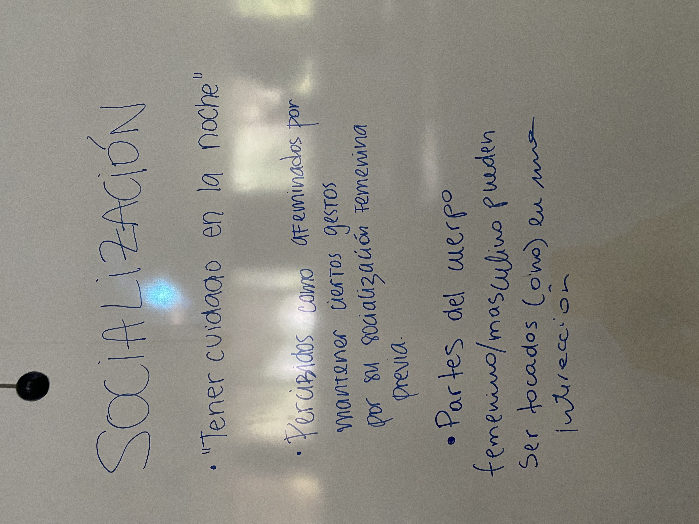

---

# Interacciones {background-image="C4_01.jpg" background-size="cover" background-opacity="0.35" style="color:white;"}

::: {style="color:#d4b8f5; font-size:1.1em; margin-top:0.5em;"}
SOL191 · Clase 4: Interacciones
:::

---

## Preguntas de investigación

::: {style="font-size:0.85em;"}
- **Foco y definición:** ¿qué quieren saber exactamente? ¿es tan amplia que sería muy compleja de responder? ¿va a permitir indagar en profundidad?
- **Contribución al campo:** ¿ya se ha estudiado? ¿qué sería un aporte? ¿qué falta estudiar o abordar? ¿es actual y relevante?
- **Conexión con teoría sociológica:** ¿cómo definimos ciertos conceptos? ¿con quién conversamos? ¿qué teorías o ideas de la literatura me ayudan a enmarcar este estudio?
- **Coherencia entre pregunta y metodología:** ¿la metodología y muestra propuesta va a permitirme responder mi pregunta de investigación?
- **Interés:** ¿me interesa suficiente para leer bastante sobre este tema?
- Revisión de ejemplos
:::

---

## Dónde y cómo buscar información

::: {style="font-size:0.85em;"}
Foco debe estar en literatura académica: artículos científicos y libros académicos.

- Google Scholar y Bibliotecas UC (y otras menos formales)
  - Palabras clave
  - Revisar título del journal o revista
  - Mirar el número de citas
  - Buscar entre quienes citan un artículo clave
- Administración de referencias bibliográficas: gran ahorro de tiempo
- <https://bibliotecas.uc.cl/investigacion/administre-sus-referencias-bibliograficas>
:::

---

## Objetivos de hoy

::: {style="font-size:0.95em; line-height:1.8;"}
1. Reflexionar sobre el rol que las normas y expectativas de género cumplen en la interacción social
2. Comprender teorías de "hacer género" y expectativa de status
3. Aplicar estas ideas a la lectura asignada sobre las experiencias de personas trans en el trabajo (Schilt)
:::

---

## Normas y expectativas de género

::: {style="font-size:0.82em;"}
::: columns
::: {.column width="42%"}
{fig-align="center"}

{fig-align="center"}
:::
::: {.column width="55%"}
El género lo "hacemos" en la medida que obedecemos o rompemos reglas y expectativas de género. Estas expectativas funcionan como "reglas del juego" a las que los individuos rinden cuentas.

Es la manera en que el género como constructo social se refuerza en la interacción social.

Cuando los individuos interactúan, se encuentran expectativas diferenciadas por género sobre su comportamiento, arraigadas en creencias estereotipadas.

En la medida en que las reglas se sigan más o menos, el género se produce en interacción — con variación contextual, cultural y temporal.
:::
:::
:::

::: notes
Bush y príncipe Abdullah de Arabia Saudita.
:::

---

## Teorías de "hacer género"

::: {style="font-size:0.88em;"}
::: {.cuadro-datos}
"Sostenemos que el 'hacer género' es realizado por mujeres y hombres cuya competencia como miembros de la sociedad es rehén de su producción."
:::

El género es algo que uno **hace**, más que algo que uno **es**.

::: {.cuadro-datos}
"Hacer género significa crear diferencias entre niños y niñas y hombres y mujeres, diferencias que no son naturales, esenciales o biológicas. Una vez que las diferencias han sido construidas, se utilizan para reforzar la 'esencialidad' de género."

— West y Zimmerman
:::
:::

---

## Ejemplos de "hacer género" {background-color="#f8f4ff"}

::: {.cuadro-actividad}
¿Qué ejemplos se les ocurren de cómo "hacemos género" en la vida cotidiana?
:::

::: notes
Slide originalmente en blanco en la presentación — espacio para ejemplos generados en la discusión de la clase.
:::

---

## ¿Por qué "hacemos género"? (Wade & Ferree 2023)

::: {style="font-size:0.8em;"}
- **Lo hemos "sobreaprendido":** es un hábito, hemos aprendido a movernos y expresarnos de una manera y lo seguimos haciendo de manera inconsciente.
- **Por placer:** hacer el género puede hacernos sentir bien; "performar bien" puede ser visto como una habilidad, y hacerlo de manera exitosa o elaborada puede ser gratificante.
- **Para otras personas:** porque nos sentimos observados y que debemos hacer género. Depende de la audiencia que tenemos.
- **Para evitar la fiscalización de género:** tenemos la responsabilidad de explicar y justificar nuestras decisiones cuando no seguimos las normas. Quienes no siguen las normas de feminidad, masculinidad o heteronormatividad pueden ser castigados/as ("puta", "maricón", "niñita", "mandona").
- Las normas se rompen todo el tiempo, ya sea de manera incidental o intencional.
:::

::: notes
Hay veces en que las personas justifican romper las normas y eso "compensa" por el comportamiento, y veces en que es intencional y un acto de resistencia.
:::

---

## Hacer género no binario {background-color="#f8f4ff"}

::: {style="font-size:0.85em;"}
::: columns
::: {.column width="55%"}
Es un desafío ser visto como no binario en un mundo de género binario, y muchas veces implica mezclar lo femenino con lo masculino.

::: {.cuadro-datos}
"Quiero que las personas me miren y no piensen que soy hombre o mujer. Si están confundidos, ese es el punto."

— Kline, en Wade & Ferree (2023)
:::

Es una manera de rechazar el binario, pero que depende del binario.
:::
::: {.column width="42%" .fragment}
{fig-align="center" width="95%"}
:::
:::
:::

::: notes
No binario como una forma de rechazar el binario, pero que depende del binario también, porque no hay comportamientos o apariencias que digan "ni masculino ni femenino".
:::

---

## Diferencias entre socialización y "hacer género"

::: {style="font-size:0.88em;"}
- Ambos enfoques reconocen que los individuos luchan con cuestiones de género en las que hay creencias y expectativas diferenciadas.
- Difieren en si estas expectativas se convierten en algo intrínseco al individuo (una parte de su identidad) o son una característica de interacciones continuas.
- "Doing Gender" también reconoce que no todo el mundo encuentra las mismas expectativas — puede haber distintas maneras de "hacer" género en su intersección con otras identidades.
:::

---

## Socialización en los medios

::: {style="font-size:0.9em;"}
**Miss Representation:** <https://www.youtube.com/watch?v=keVhWR9esmA>

::: {.cuadro-actividad}
- ¿Estás de acuerdo o en desacuerdo con la información presentada?
- Este documental se hizo el año 2011, ¿cuánto ha cambiado?
- ¿Pueden los individuos resistirse a la socialización de los medios? ¿Cómo?
:::
:::

---

## ¿La socialización nos lleva a "hacer género"?

::: {style="font-size:0.88em;"}
- Tal vez, pero ese no es el punto central de la teoría de "hacer" género.
- Lo central es abordar el género como las expectativas de comportamiento que ya existen, sigamos o no estas expectativas.
- Ya sea que "hagamos" o "no hagamos" el género, esto puede tener consecuencias — por ejemplo, en cómo las demás personas nos tratan en las interacciones.
- Incluso cuando hombres y mujeres se comportan de manera idéntica, puede haber consecuencias diferentes.
:::

---

## Creencias de género y relaciones sociales (Ridgeway & Correll 2004)

::: {style="font-size:0.78em;"}
- Las creencias culturales de género hegemónicas, ampliamente compartidas, tienen efecto en los contextos sociales relacionales.
  - Situación en que las personas se definen a sí mismas en relación a otras para poder actuar, ya sea en interacciones o solas, si sienten que su comportamiento o sus consecuencias serán evaluadas socialmente.
- **Gender beliefs:** creencias culturales que definen las características distinguibles entre hombres y mujeres y lo esperable en términos de comportamiento.
  - Mujeres más comunales (orientación hacia lo comunitario), hombres más instrumentales y con mayor agencia.
  - Es jerárquico: los hombres son vistos como más competentes en general y en las dimensiones más valoradas por la sociedad, y lo contrario con las mujeres.
  - Son hegemónicos — todos los conocemos, aunque no los endosemos personalmente.
:::

::: notes
Supuesto de que el género es un sistema que constituye una diferencia y organiza la desigualdad en base a esa diferencia.

Son estereotipos, pero también son más que eso: tienen un significado social más amplio que considera las reglas o esquemas culturales.
:::

---

## "Gender stereotypes as gender rules"

::: {style="font-size:0.85em;"}
Estas creencias no son solo descriptivas (cómo creemos que hombres y mujeres son), sino también:

- **Prescriptivas:** cómo hombres y mujeres deben comportarse.
- **Proscriptivas:** cómo hombres y mujeres no deben comportarse.

Por ejemplo, las mujeres son penalizadas o castigadas socialmente cuando no siguen normas proscriptivas al ser líderes con agencia, ambiciosas, muy competentes (e.g., Rudman & Glick 1999; Quadlin 2018).

¿Y los hombres?: <https://www.youtube.com/watch?v=u0loTWc9Y14>
:::

---

## Quadlin (2018)

::: {style="font-size:0.85em;"}
::: columns
::: {.column width="45%"}
Las mujeres con rendimiento académico muy alto son penalizadas en el mercado laboral, especialmente cuando vienen de áreas matemáticas. La evidencia sugiere que los empleadores valoran a las mujeres más por ser amistosas, mientras que a los hombres por ser competentes y comprometidos (Quadlin 2018).
:::
::: {.column width="53%" .fragment}
{fig-align="center" width="95%"}
:::
:::
:::

::: notes
En comparación a hombres de muy alto rendimiento y a mujeres de rendimiento moderado-bueno.
:::

---

## En los contextos sociales relacionales…

::: {style="font-size:0.82em;"}
1. **Hay una categorización de sexo.** Categorizamos a otras personas con respecto a su sexo de manera automática e inconsciente. Suele ser la primera categoría en que agrupamos, mostrando que el género es un principio organizador importante. En general ocurre en base a apariencias y señales de comportamiento.
2. **El género tiende a ser difuso y operar como identidad "de fondo".** Hay otras identidades culturalmente más específicas (jefe y empleado/a) que están "al frente". El impacto de las creencias varía según el contexto, y se combina con las otras identidades y roles relevantes (ej. sesgo en cómo llevamos a cabo el rol de jefe y empleado/a).
:::

::: notes
La psicología cognitiva muestra que... Video de Ridgeway.
:::

---

## Cuándo el género es efectivamente destacado (*salient*)

::: {style="font-size:0.85em;"}
::: columns
::: {.column width="42%"}
{fig-align="center"}

{fig-align="center"}
:::
::: {.column width="55%"}
- **Situaciones mixtas:** cuándo los actores reales o implicados son de diferente categoría sexual.
- **Situaciones en contextos tipificados por género:** cuando los estereotipos de un género u otro están culturalmente vinculados a las actividades centrales de la situación.
:::
:::
:::

---

## Expectation states theory (Berger et al. 1977; Correll & Ridgeway 2003; Ridgeway & Correll 2004)

::: {style="font-size:0.75em;"}
Las creencias sobre un mayor status de los hombres moldean implícitamente las expectativas que los participantes tienen de su propia competencia y la de los demás, y estas expectativas operan como profecías autocumplidas. Esto impacta en:

- Autopercepciones de competencia que afectan cómo las personas interactúan, cuánto aportan y cómo valoran ese aporte (relacionado a la clase pasada).
- **Doble estándar:** incluso cuando a hombres y mujeres les va igual de bien, los hombres se evalúan a sí mismos y a otros hombres con mayor habilidad que a las mujeres.
  - Para ser evaluadas de manera similar, muchas veces las mujeres deben ser más exitosas en la tarea que los hombres (pero no tanto → Quadlin).
:::

::: notes
Supuestos: aplica para situaciones donde las personas tienen un objetivo o tarea compartida o valorada socialmente. Cuando el género es efectivamente destacado en estas situaciones...
:::

---

## Just one of the guys? (Kristen Schilt, 2011)

::: {style="font-size:0.85em;"}
::: columns
::: {.column width="62%"}
- Posición única de moverse a una categoría de género que tiene mayor estatus y ventajas sociales, culturales y económicas.
- ¿El contexto ocupacional obstaculiza o ayuda a hombres trans a "convertirse" en hombres en el trabajo?
- ¿Cómo interactúan los empleadores y colegas, consciente o inconscientemente, con hombres trans?
- ¿Pueden los hombres trans acceder a los beneficios de ser hombre en el trabajo?
:::
::: {.column width="35%" .fragment}
{fig-align="center" width="95%"}
:::
:::
:::

---

## Just one of the guys? — Metodología

::: {style="font-size:0.78em;"}
- Entrevistas con hombres trans sobre sus experiencias en el trabajo, cómo negocian trabajar como hombres y hombres trans:
  - Personas que se mantuvieron en el mismo trabajo.
  - Personas que encontraron nuevos trabajos donde siempre fueron conocidos como hombres.
  - Personas que encontraron nuevos trabajos donde fueron conocidos como trans.
- En Texas (más conservador) y California (más liberal).
- Rango de ocupaciones: abogados, construcción, profesores, retail, servicios de comida.
- 54 entrevistados, en su mayoría blancos (80%), de 18 a 64 años.
- Comparación de dos estrategias en el trabajo: *open* (hombres trans públicamente trans) y *stealth* (hombres trans que no cuentan que son trans — "disimulo").
:::

---

## Actividad en clases sobre Schilt {background-color="#f8f4ff"}

::: {.cuadro-actividad}
¿Qué significa "alcanzar la hombría social" (*achieving social maleness*)? ¿Cómo se relaciona con el cuerpo? ¿Y de qué manera es un proceso interaccional?

Ejemplos de:

1. Socialización (temprana o no)
2. Hacer género
3. Privilegio masculino
4. Desventaja masculina
:::

::: notes
15 min de trabajo en equipo, luego plenario 5-10 min.

Ejemplo de hacer género: cómo es adecuado o apropiado tocar a alguien en el trabajo cambia — palmada en el pecho versus abrazos.

Ejemplo de socialización: alerta de quién entra al baño como mujer, cambiar forma de actuar al entrar al baño antes de transicionar; hombres y mujeres afroamericanas con respecto a criminalidad y sexualidad.

Ejemplos de privilegio o desventaja masculina: mecánico, cómo los hombres viejos los tratan, no sentir miedo en la noche, ser una amenaza para mujeres.
:::

---

::: columns
::: {.column width="25%"}
{fig-align="center"}
:::
::: {.column width="25%"}
{fig-align="center"}
:::
::: {.column width="25%"}
{fig-align="center"}
:::
::: {.column width="25%"}
{fig-align="center"}
:::
:::

---

## Recomendaciones de género

::: columns
::: {.column width="33%"}
{fig-align="center"}
:::
::: {.column width="33%"}
{fig-align="center"}
:::
::: {.column width="33%"}
{fig-align="center"}
:::
:::

::: {style="font-size:0.8em; text-align:center; margin-top:0.5em;"}
<https://open.spotify.com/episode/23ydVYiUUxGOeNaVuZaMy5>
:::

::: {style="font-size:0.85em; color:#555; text-align:center;"}
¡Bienvenidas más recomendaciones para compartir con el curso!
:::

---

## Próxima semana: Instituciones generizadas

::: {style="font-size:0.82em;"}
- Crocco-Valdivia, Alejandra Andrea, y Caterine Galaz-Valderrama. 2023. "Mujeres en la academia: Exploración de una organización generizada a partir de una revisión sistemática." *Estudios Pedagógicos* (Valdivia) 49(2): 439–454.
- Mickey, Ethel L. 2019. "When Gendered Logics Collide: Going Public and Restructuring in a High-Tech Organization." *Gender & Society* 33(4): 509–533.
:::
