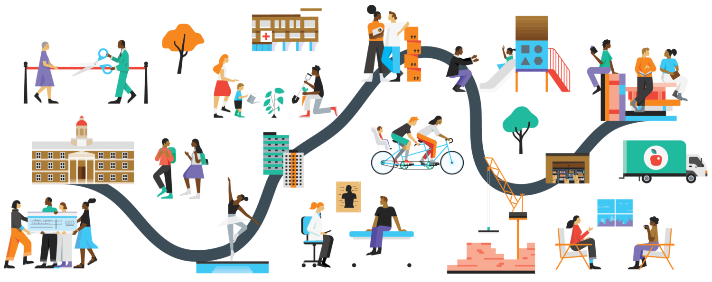
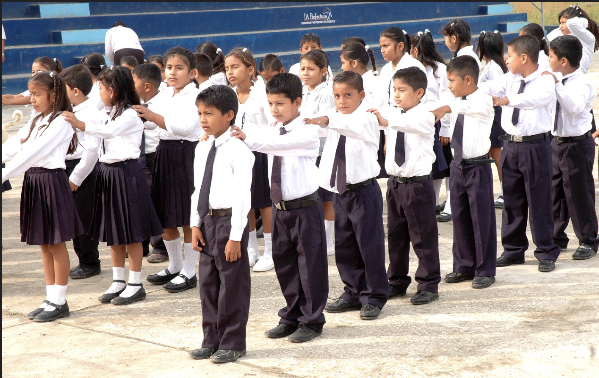
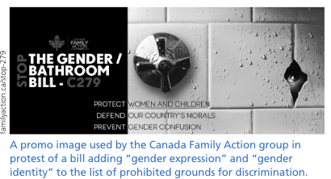
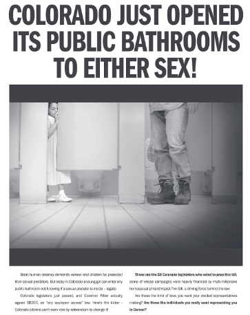
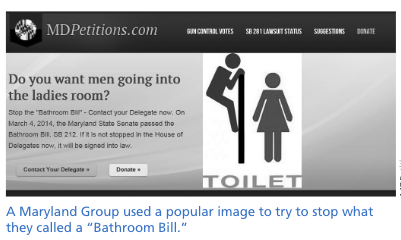
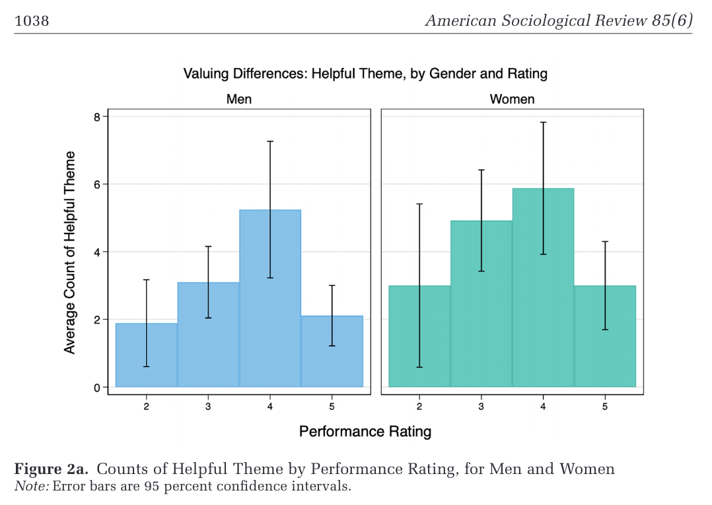
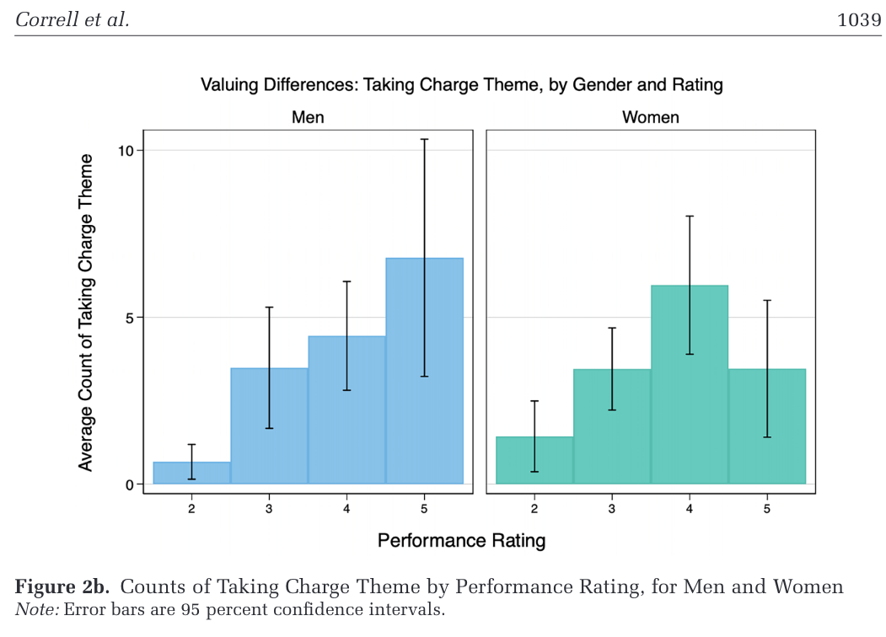
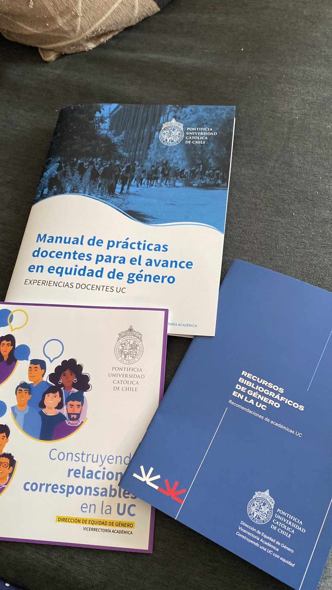
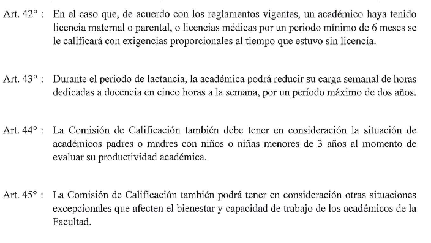
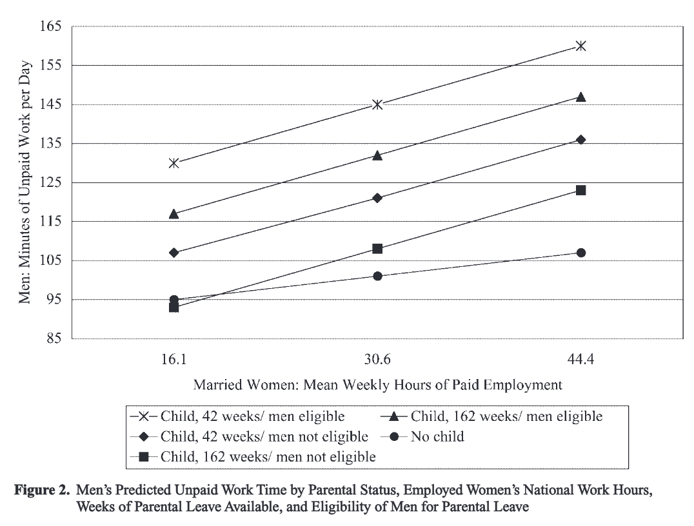

---

# Instituciones generizadas y nivel macro {background-color="#1e1035" style="color:white;"}

{fig-align="center" width="65%"}

::: {style="color:#d4b8f5; font-size:1.1em; margin-top:0.5em;"}
SOL191 · Clase 5
:::

---

## Fecha de la prueba {background-color="#f8f4ff"}

::: {.cuadro-datos}
**16 respuestas**

- 68,8% Mantener la fecha actual
- 31,3% Atrasar la prueba
:::

---

## Objetivos de hoy {background-color="#f8f4ff"}

---

## Instituciones generizadas

::: {style="font-size:0.85em; line-height:1.7;"}
Además de ser un conjunto de ideas y algo que uno "hace", el género también es un [principio organizador]{.hl} que permea nuestras instituciones sociales.

Las creencias e ideas de género que afectan nuestros ambientes ejercen una influencia en nuestras vidas independiente de nuestras propias creencias, personalidades, e interacciones.

El género permea en las **normas** (creencias y prácticas conocidas y seguidas ampliamente) y **políticas** (expectativas y reglas explícitas y codificadas) institucionales.
:::

---

## Gendered institutions {background-color="#f8f4ff"}

::: {style="font-size:0.85em;"}
::: columns
::: {.column width="50%"}
Donde el género se usa como [principio organizador]{.hl}, por ejemplo, mediante la canalización de hombres y mujeres en diferentes espacios o actividades, que son valorados de manera diferente.

Qué tan saliente es el género —su relevancia— varía a través de las diferentes partes, espacios y actividades de la institución.
:::
::: {.column width="48%"}
{fig-align="center"}
:::
:::
:::

---

## Sexismo estructural

::: {style="font-size:0.85em; line-height:1.7;"}
- Las instituciones generizadas afirman y refuerzan tanto las diferencias de género como la [desigualdad de género]{.hl}, de una manera interseccional.
- Resulta en desigualdades **institucionalizadas**: producidas y reproducidas por el funcionamiento rutinario de las instituciones.
- ¿Ejemplo de Crocco-Valdivia y Galaz-Valderrama (2023) sobre universidades generizadas?
:::

::: notes
Tareas que hacen. Lo que se valora más.
:::

---

## Organizaciones generizadas (Acker 1990)

::: {style="font-size:0.72em; line-height:1.6;"}
- Antes de Acker, las organizaciones se entendían como asexuadas o neutras con respecto al género.
- Lógica organizacional: los sistemas de reglas y políticas, descripciones de cargo, escalas de salario, y evaluaciones que damos por sentado.
- El género es una parte integral de la estructura y procesos organizacionales, ya que está implicado en los contratos en los que se basan las organizaciones.
- La naturaleza generizada de las organizaciones se esconde bajo trabajos y jerarquías que son aparentemente abstractas y neutras, pero que en realidad asumen una división del trabajo basada en género y que son definidas por la dominancia masculina.
  - Asumen que el trabajador típico es hombre, con cuerpo y sexualidad masculina, con rol mínimo en la procreación.
  - Esto marginaliza a las mujeres y sirve como estrategia de control y mantenimiento de la segregación de género en la organización.
:::

---

## Género en 5 procesos organizacionales

::: {style="font-size:0.7em; line-height:1.55;"}
- Divisiones de género: en el tipo de trabajo, los comportamientos que son permitidos, el uso del espacio físico, la distribución del poder.
- La construcción de símbolos e imágenes que explican, expresan, refuerzan, o a veces oponen estas divisiones. Ej., imagen de gerente como masculinidad fuerte y exitosa.
- Las interacciones que ejercen dominio y sumisión. Ej., diferencias de género en conversaciones (tomar turnos, interrupciones, tiempo).
- En la presentación o expresión propia: uso de lenguaje, ropa.
- En la lógica organizacional: las reglas, contratos, evaluaciones de desempeño.

::: {.cuadro-datos}
*"The concept of a universal worker excludes and marginalized women who cannot, almost by definition, achieve the qualities of a real worker because to do so is to become a man"* (150)
:::
:::

---

## Nueva economía, nuevas lógicas (Mickey 2019)

::: columns
::: {.column width="68%"}
::: {.cuadro-actividad}
**Reflexión corta (1 párrafo):** ¿Siguen siendo generizadas las organizaciones que operan bajo estas nuevas lógicas? ¿De qué manera?
:::
:::
::: {.column width="28%"}
{fig-align="center"}
:::
:::

---

## Ejemplos de instituciones generizadas

::: {style="font-size:0.9em;"}
::: {.cuadro-actividad}
**En grupos de 2-3 personas:**

- Piensen en un ejemplo de una institución que crean es generizada hoy en día.
- Elijan un ejemplo que refleje aspectos generizados.
- Luego lo vienen a anotar a la pizarra y, si alguien más ya anotó esa institución, pueden agregar su ejemplo debajo.
:::
:::

::: notes
10 minutos. Hasta acá llevaba 14. Al terminar la reflexión, debería ir 22 min aprox.

Ejemplo de cárceles como masculinizadas: el entrenamiento de los gendarmes asume un gendarme hombre en una cárcel de hombres; no considera que los problemas que vive la gendarme mujer son distintos (acoso sexual), y hay poca guía en cómo manejarlo, ni en cómo trabajar en cárceles de mujeres, que tienen importantes diferencias en el tipo de problemas, etc.

Mujeres asignadas a tareas de fuerza física para lidiar con agresión, lo que no les permite avanzar tan rápido como a los hombres.

La habilidad de manejar una situación de violencia se entrena y prepara mejor en hombres, y eso es lo que se valora más también.

Baños:
:::

---

## Baños: ejemplos de campañas "bathroom bill" {background-color="#f8f4ff"}

::: {style="font-size:0.75em;"}
::: columns
::: {.column width="33%"}
{fig-align="center"}
:::
::: {.column width="33%"}
{fig-align="center"}
:::
::: {.column width="33%"}
{fig-align="center"}
:::
:::
:::

---

## Baños y "penis panics"

::: {style="font-size:0.78em; line-height:1.6;"}
- Foco solo en baños de mujeres, no en baños de hombres.
- Foco en cuerpos biológicamente "masculinos" demuestra que el problema son los genitales, no la identidad.
- Supuesto heterosexual asume que los baños son zonas libres de sexualidad.
- Personas LGBTQ han sido históricamente asociadas con predadores sexuales.
- Espacio "solo de mujeres" en que la presencia del pene es una amenaza y peligro.
- Imagen de las mujeres como débiles y que necesitan protección.
- Implican que las personas trans merecen menos protección que mujeres y niños.
:::

---

## Lógica de género en evaluaciones (Correll et al. 2020)

::: {style="font-size:0.8em; line-height:1.6;"}
- Empresa importante de tecnología en Silicon Valley, CA, USA.
- Evaluaciones de desempeño de 208 trabajadores, realizadas por gerentes.
- Análisis del texto completo de la evaluación y el puntaje asignado (1 a 5).
- 88 códigos de lenguaje. Diferencias en dos tipos de lenguaje:
  - [Colaborativo]{.hl}: comunal, personalidad positiva, perspectiva de equipo, trabajo de servicio.
  - ["Hacerse cargo"]{.hl}: agencia, visión, líder, gerente, genio, visionario, comunicación asertiva.
:::

---

## ¿Por qué pasa esto? {background-color="#f8f4ff"}

::: columns
::: {.column width="50%"}
{fig-align="center"}
:::
::: {.column width="50%"}
{fig-align="center"}
:::
:::

::: {.cuadro-actividad}
¿Por qué esto evidencia una lógica generizada?
:::

::: notes
En la Figura 2a vemos que los gráficos bivariados para "helpful" tienen una forma no lineal similar para hombres y mujeres. Para ambos, mayores menciones de lenguaje "helpful" se asocian con puntajes más altos en el rango 2 a 4, alcanzando su punto máximo en un puntaje de 4; ser "helpful" no fue un descriptor común entre quienes recibieron un 5. Hay implicancias generizadas importantes en este patrón: las mujeres fueron vistas como más "helpful", pero como serlo no se asocia con los puntajes más altos, ser vista como "helpful" solo las lleva hasta cierto punto.

La Figura 2b muestra diferencias de género claras en los gráficos de "taking charge". Para los hombres, hay una relación positiva y lineal entre "taking charge" y el puntaje, mientras que para las mujeres la relación positiva alcanza su máximo en un puntaje de 4. Las mujeres con puntaje 5 tenían niveles similares de lenguaje de "taking charge" que las mujeres con puntaje 3 (n.s.). En resumen, "taking charge" fue claramente más valorado en los hombres: el nivel más alto de "taking charge" se asoció con un puntaje de 5 para los hombres, pero solo con un 4 para las mujeres. Una explicación es que tomar las riendas frecuentemente en el trabajo se percibe como una conducta altamente agente y, como tal, generó reacciones negativas cuando la ejercieron mujeres (Rudman et al.).

¿Explicación? ¿Por qué es evidencia de una lógica generizada?

15 min.
:::

---

## Perspectiva de género en las políticas organizacionales

::: columns
::: {.column width="35%"}
{fig-align="center"}
:::
::: {.column width="63%"}
{fig-align="center"}
:::
:::

::: notes
5 min.
:::

---

## La importancia del contexto nacional (Hook 2006)

::: {style="font-size:0.85em; line-height:1.7;"}
- Modelo teórico integrado que combina los mecanismos de niveles individual, hogar, y nacional para entender el trabajo no remunerado (de cuidados y hogar) que hacen los hombres.
- Más allá de las características individuales que llevan a los hombres a hacer más trabajo en el hogar, ¿cuáles son las políticas y prácticas que obstaculizan o facilitan el trabajo no remunerado de los hombres?
- Foco en dos dimensiones del contexto nacional: el **empleo femenino** y la **política de estado**.
:::

---

## Trabajo no remunerado de los padres según contexto nacional

{fig-align="center" width="65%"}

::: notes
Los padres hacen más trabajo no remunerado cuando están casados, las mujeres empleadas trabajan jornada completa, y cuando la licencia parental es corta y está disponible para los hombres. En contextos donde las mujeres casadas y empleadas trabajan pocas horas y los hombres no son elegibles para usar licencia parental, se predice que los padres hacen la misma cantidad de trabajo no remunerado que los hombres sin hijos. En síntesis, las prácticas nacionales de empleo femenino y las políticas nacionales son determinantes clave del tiempo de trabajo no remunerado de los padres a nivel individual.

5 min.
:::

---

## Lecturas mínimas próxima clase

::: {style="font-size:0.85em; line-height:1.6;"}
- Capítulo asignado de Risman (2018). Vamos a tener una actividad en clase. *El libro completo está disponible digital en el sitio web de la Biblioteca UC.*
- Viveros Vigoya, M. (2016). La interseccionalidad: una aproximación situada a la dominación.

::: {.cuadro-datos}
Recordatorio: ayudantía este viernes 12 a las 9:40 en Sala Auditorio CDDoc (Edificio Y).
:::
:::

::: notes
25-30 para terminar.
:::

---

## Sistema multinivel: preparación para la lectura de la próxima semana {background-color="#f8f4ff"}

::: {style="font-size:0.85em;"}
::: columns
::: {.column width="55%"}
- Barbara Risman (2018).
- Entrevistaron a 116 jóvenes que el año 2013 tenían entre 18 y 30 años.
- Examinar cómo esta generación entiende la estructura de género, o su lugar dentro de ella.
:::
::: {.column width="43%"}
{fig-align="center"}
:::
:::
:::

---

## Cuatro grupos de millennials

::: notes
5 min.
:::

---

## Sistema multinivel

::: {style="font-size:0.8em; line-height:1.6;"}
- Género como estructura que tiene consecuencias en tres niveles.
- **Individual:** en el desarrollo de nuestro "yo" como algo generizado.
  - El cuerpo, la socialización, las identidades.
- **Interaccional:** en cómo hombres y mujeres se enfrentan a diferentes expectativas incluso cuando ocupan una misma posición estructural.
  - Representación proporcional, redes sociales, estereotipos, sesgos.
- **Macro:** rara vez hombres y mujeres ocupan posiciones estructurales idénticas.
  - Distribución de recursos, reglas institucionales, creencias hegemónicas, y lógicas institucionales.
:::

::: notes
Esta diferenciación tiene consecuencias en tres niveles: (1) a nivel individual, en el desarrollo de los "yoes" generizados; (2) a nivel interaccional, porque hombres y mujeres enfrentan expectativas distintas incluso cuando ocupan la misma posición estructural; y (3) a nivel institucional, porque rara vez a mujeres y hombres se les asignan posiciones idénticas.

5 min.
:::

---

## Invitación: coloquio ISUC {background-color="#1e1035" style="color:white;"}

::: columns
::: {.column width="42%"}
Martes 16 de abril

13:30 horas

Sala Magíster ISUC
:::
::: {.column width="56%"}
{fig-align="center"}
:::
:::

---

## Evaluación temprana del curso

::: {style="font-size:0.9em; line-height:1.7;"}
- Recibir feedback temprano del curso permite identificar aspectos positivos y mejorables a tiempo.
- En Canvas, sección Encuestas de Docencia.

¡Muchas gracias!
:::

::: notes
15 minutos.
:::
