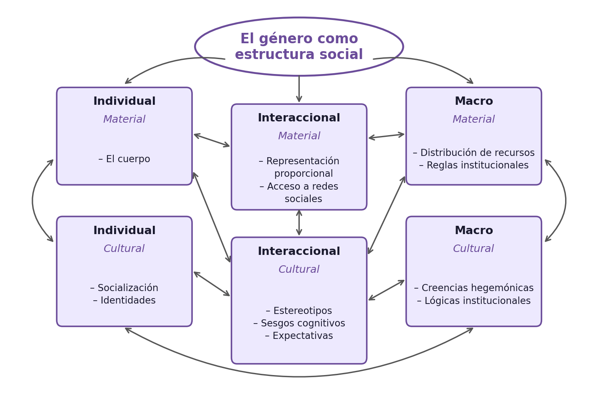
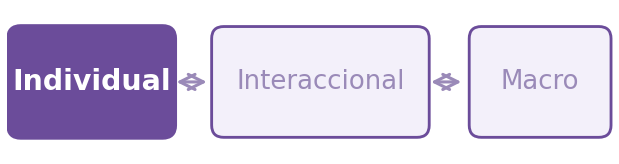
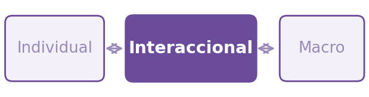
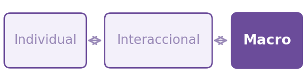
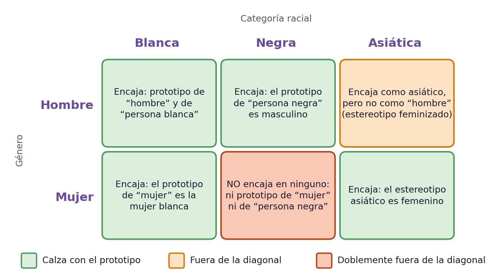

# Sistema multinivel e interseccionalidad {background-image="C6_01.jpg" background-size="cover" background-opacity="0.35" style="color:white;"}

::: {style="color:#d4b8f5; font-size:1.1em; margin-top:0.5em;"}
SOL191 · Clase 6: Sistema multinivel e interseccionalidad
:::

---

## Objetivos de hoy

::: {style="font-size:0.95em;"}
1. Entender el género como un **sistema multinivel**: individual, interaccional y macro.
2. Conocer la **interseccionalidad** como herramienta analítica, sus orígenes y sus críticas desde América Latina.
3. **Aplicar** ambos marcos a los cuatro grupos de millennials de Risman (2018).
:::

::: {.cuadro-datos .fragment}
**Hasta ahora:** en la clase 4 vimos el nivel interaccional (hacer género, creencias) y en la clase 5 el nivel institucional (organizaciones). Hoy los integramos en un solo sistema.
:::

::: notes
Recap: C4 = interacciones; C5 = instituciones. C6 = cómo se conectan los niveles entre sí.
:::

---

## ¿Por qué creen que las mujeres ganan menos en Chile?

::: {.cuadro-actividad}
Respondan en Wooclap:

**¿Por qué creen que, en promedio, las mujeres ganan menos que los hombres en Chile?**

Escriban libremente todas las razones que se les ocurran.
:::

::: notes
Pregunta abierta de diagnóstico. Las respuestas se revisan en la pizarra en la slide siguiente y se retoman al terminar la Parte I.
:::

---

:::

# Parte I: El sistema multinivel de género {background-color="#6B4C9A" style="color:white;"}

---

## Género como estructura multinivel

::: {style="font-size:0.85em;"}
- Género como sistema de estratificación que tiene implicancias en niveles individuales, interaccionales, y macro de análisis (Risman 2018).
- Las estructuras (Connell 1987, Giddens 1984, Risman 2018):
  - Existen fuera de los deseos o preferencias individuales y en parte explican el comportamiento humano
  - Restringen la acción pero también permiten la decisión de seguir o rechazar-resistir 
  - Organizan las posibilidades o el rango de decisión de la agencia
  - Relación recursiva entre los individuos y la estructura social
:::

---

## Lo material y lo cultural como componentes de la estructura

::: {style="font-size:0.85em;"}
::: columns
::: {.column width="50%" .fragment}
**Aspectos materiales**

Nuestros cuerpos y las reglas que distribuyen el acceso a recursos y las restricciones en un momento histórico particular.
:::
::: {.column width="50%" .fragment}
**Aspectos culturales**

Procesos ideológicos, significados dados a los cuerpos, normas de interacción social, ideologías o creencias ampliamente compartidas.
:::
:::
:::

::: notes
La cultura como un componente de la estructura, como una "caja de herramientas" de conocimiento cultural que nos ayuda a darle sentido y reaccionar al mundo.

Risman plasma la importancia del aspecto cultural de la estructura incorporándolo en cada nivel de la estructura, que tiene aspectos materiales y aspectos culturales.
:::

---

## El sistema multinivel de género

{.r-stretch fig-align="center" fig-alt="Modelo de Risman en español: el género como estructura social, con tres niveles (individual, interaccional y macro), cada uno con un componente material y uno cultural, conectados por flechas en ambos sentidos."}

::: notes
Traducción al español del modelo de Risman (2018). Para entender cómo opera el género como estructura social, debemos mirar cada nivel de análisis y las relaciones entre ellos. Y con la relación recursiva entre lo material y lo cultural en cada nivel y a través de diferentes niveles.

En las siguientes slides aparece un mini-mapa en la esquina superior derecha que indica en qué nivel estamos.
:::

---

## Nivel individual: el cuerpo, la socialización, las identidades {.con-mapa}

::: {.minimapa}
{fig-alt="Mini-mapa: nivel individual"}
:::

::: {style="font-size:0.82em;"}
::: columns
::: {.column width="55%"}
**Material**

- La experiencia del cuerpo: todes debemos interpretar y operar en nuestro cuerpo.
- Las hormonas y la genética importan, pero hay efectos en ambas direcciones

:::
::: {.column width="43%"}
{fig-align="center"}
:::
:::
:::

::: notes
La estructura tiene implicancias en cómo nos entendemos a nosotros mismos, las identidades y personalidades de las personas.
:::

---

## Nivel individual: el cuerpo, la socialización, las identidades {.con-mapa}

::: {.minimapa}
{fig-alt="Mini-mapa: nivel individual"}
:::

::: {style="font-size:0.82em;"}
::: columns
::: {.column width="55%"}
**Cultural**

- Noción del yo: cómo la cultura se internaliza.
- La socialización en los primeros años de vida es una manera en que la estructura de género se internaliza en la personalidad y las preferencias.
- La socialización va más allá de la familia: también es el sistema educativo, los pares, los medios.
- ¿Qué tan estables son estas predisposiciones? ¿Cómo se adoptan o resisten en la adultez?
:::
::: {.column width="43%"}
{fig-align="center"}
:::
:::
:::

::: notes
La estructura tiene implicancias en cómo nos entendemos a nosotros mismos, las identidades y personalidades de las personas.

Aunque importantes, ni nuestros cuerpos ni la socialización logran explicar la totalidad de la estratificación por género en la sociedad.
:::

---

## Nivel interaccional: representación, acceso, creencias, expectativas {.con-mapa}

::: {.minimapa}
{fig-alt="Mini-mapa: nivel interaccional"}
:::

::: {style="font-size:0.82em;"}
::: columns
::: {.column width="55%"}
**Material**

- La representación de nuestro género en cierto contexto y la experiencia de ser "token" (Kanter 1977).
- Desventaja material en acceso a redes y puestos de poder para grupos marginalizados con respecto al género (mujeres, no binarie, trans, entre otros).
:::
::: {.column width="43%"}
{fig-align="center"}
:::
:::
:::

::: notes
En cualquier interacción, las expectativas que están asociadas a nuestra categoría de sexo se hacen visibles y median lo que es esperado o no en esa interacción.
:::

---

## Nivel interaccional: representación, creencias, expectativas {.con-mapa}

::: {.minimapa}
{fig-alt="Mini-mapa: nivel interaccional"}
:::

::: {style="font-size:0.85em;"}
**Cultural**

- Creencias y estereotipos que enmarcan la interacción social y cómo nos enfrentamos a otras personas.
- Expectativas de "hacer género" como es esperado.
- Expectativas de status: se espera que las mujeres tengan una menor competencia, que sean más empáticas, mientras que los hombres más eficaces y con mayor agencia.
- La resistencia es posible y es una forma de ir cambiando la estructura, pero normalmente viene con costos.
:::

::: notes
En cualquier interacción, las expectativas que están asociadas a nuestra categoría de sexo se hacen visibles y median lo que es esperado o no en esa interacción.
:::

---

## Nivel macro: leyes y políticas, organizaciones, creencias culturales {.con-mapa}

::: {.minimapa}
{fig-alt="Mini-mapa: nivel macro"}
:::

::: {style="font-size:0.78em;"}
**Material**

- Sistema legal con diferentes derechos y deberes según género.
- Sistema legal que la mayoría de las veces no reconoce la existencia de géneros no binaries.
- Políticas diferenciadas por género.
- Algunos ejemplos en Chile:
  - Régimen matrimonial de sociedad conyugal donde el marido administra bienes (49% de los matrimonios en 2023, frente a 66% en 2001; Registro Civil).
  - Sistema basado en género binario.
  - Atenuante de adulterio solo para hombres en caso de femicidio.
  - Diferencias en ley de posnatal.
:::

::: notes
Dato de sociedad conyugal: Registro Civil, reportado por La Tercera (30-ene-2024): en 2023, 49% sociedad conyugal, 46% separación de bienes y 3-4% participación en los gananciales; en 2001 la sociedad conyugal era 66%. Por primera vez la separación de bienes igualó a la sociedad conyugal.
:::

---

## Nivel macro: leyes y políticas, organizaciones, creencias {.con-mapa}

::: {.minimapa}
{fig-alt="Mini-mapa: nivel macro"}
:::

::: {style="font-size:0.74em;"}
::: columns
::: {.column width="55%"}
**Cultural**

- Género como parte del conocimiento cultural y valores históricos.
- Lógicas culturales de género que organizan el ámbito público y privado.
- Estas creencias y actitudes ayudan a explicar parte de la desigualdad: ejemplo de empleo femenino.
- Entidades económicas que tienen definiciones basadas en lógicas de género, como la definición del trabajo que asume una cierta figura de trabajador (el "trabajador ideal", Acker 1990).
:::
::: {.column width="43%"}
{fig-align="center"}
:::
:::
:::

::: notes
Datos del 2020.
:::

---

## Ejercicio: la brecha salarial

::: {.cuadro-actividad}
Volvamos a las respuestas de la pizarra: **¿en qué nivel (individual, interaccional o macro) cae cada una?** ¿Qué niveles quedaron sin mencionar?
:::

::: notes
Clasificar en la pizarra las respuestas del formulario según los tres niveles. Lo habitual es que la mayoría sean explicaciones del nivel individual. Luego pasar a las slides siguientes, que muestran un ejemplo completo.
:::

---

## Ejercicio: la brecha salarial

::: {style="font-size:0.85em;"}
**Individual**

- Las mujeres se embarazan y amamantan, lo que le genera interrupciones en la trayectoria laboral, afectando su sueldo.
- Las mujeres han sido socializadas para priorizar menos su carrera y dedicarse a la familia, lo que afecta sus decisiones de carrera, afectando su sueldo.
:::

::: columns
::: {.column width="33%"}
{fig-align="center" height="250px"}
:::
::: {.column width="34%"}
{fig-align="center" height="250px"}
:::
::: {.column width="33%"}
{fig-align="center" height="250px"}
:::
:::

---

## Ejercicio: la brecha salarial (síntesis multinivel)

::: {style="font-size:0.6em;"}
**Individual**

- Las mujeres se embarazan y amamantan, lo que le genera interrupciones en la trayectoria laboral, afectando su sueldo.
- Las mujeres han sido socializadas para priorizar menos su carrera y dedicarse a la familia, lo que afecta sus decisiones de carrera, afectando su sueldo.

**Interaccional**

- Las mujeres muchas veces trabajan en ambientes en que son minoría y esa experiencia dificulta su experiencia, afectando su sueldo.
- Las mujeres experimentan sesgos en sus interacciones laborales, son vistas como menos competentes que los hombres, y esta discriminación afecta su sueldo.

**Macro**

- En general, la ley de postnatal permite a las mujeres tomar un postnatal mucho más largo que el de los hombres, lo que incide en su trayectoria y afecta su sueldo.
- Las organizaciones tienen lógicas culturales que benefician a los hombres, restringiendo las posibilidades de éxito de las mujeres, afectando su sueldo.
:::

# Parte II: Interseccionalidad {background-color="#6B4C9A" style="color:white;"}

---

## ¿Qué es la interseccionalidad? (Hill Collins & Bilge 2020)

::: {style="font-size:0.95em;"}
- Investiga cómo las relaciones de poder se entrecruzan en las relaciones sociales y experiencias individuales.
- Las categorías y sistemas de opresión como el género, la etnia, la clase, la sexualidad, entre otras, están interrelacionadas y son mutuamente influyentes.
- Una herramienta analítica, una forma de comprender y explicar la complejidad de la sociedad y las experiencias humanas.
:::

---

## ¿Qué debe considerar un marco interseccional?

::: {style="font-size:0.78em;"}
- Comprender la desigualdad mediante las interacciones de diferentes [categorías de poder]{.hl}.
- Las relaciones de poder se intersectan y dependen del contexto social.
- La interseccionalidad es relacional. Las categorías no son opuestas sino que interconectadas, lo que agrega valor y poder explicativo.
- El análisis interseccional es complejo y profundiza los conocimientos, abriendo nuevas categorías.
- Tiene un compromiso con la justicia social, que puede ser invisibilizada cuando hay reglas que parecen justas cuando no lo son y cuando producen resultados injustos y desiguales.
:::

---

## Genealogía: una idea anterior al concepto (Viveros Vigoya 2016)

::: {style="font-size:0.85em;"}
- El problema ya lo planteaban mujeres negras, indígenas y latinoamericanas mucho antes de que existiera el término:
  - **Sojourner Truth (1851):** "¿Acaso no soy una mujer?"
  - **Colectiva del Río Combahee (1977):** las opresiones no se pueden separar ni jerarquizar.
  - **América Latina:** Clorinda Matto de Turner (1899); feministas negras brasileñas como Lélia González y Sueli Carneiro ("raza-clase-género").
- El **término** lo acuña Kimberlé Crenshaw (1989), a propósito de un caso legal de trabajadoras negras de General Motors.
:::

::: notes
Comentar solo brevemente. Viveros (2016) muestra que estas ideas circulaban desde hacía mucho tiempo en contextos históricos y geopolíticos diversos. Crenshaw ha aclarado que su intención fue crear un concepto de uso práctico para analizar omisiones jurídicas, no una teoría general de la opresión.
:::

---

## Kimberlé Crenshaw sobre los orígenes de la interseccionalidad

::: {style="font-size:1em; text-align:center; margin-top:2em;"}
Video: Kimberlé Crenshaw sobre los orígenes del concepto de interseccionalidad
:::

::: notes
(Video incrustado en la presentación original.)
:::

---

## Suma vs. consubstancialidad (Viveros Vigoya 2016)

::: {.nonincremental style="font-size:0.66em;"}
::: columns
::: {.column width="48%" .fragment}
::: {style="background:#F3F4F6; border-left:5px solid #888; padding:0.6em 1em; border-radius:4px;"}
**Suma (aditiva)**

- Cada eje es una cantidad: género + raza + clase.
- Más ejes, más opresión.
- Cada persona queda en un "punto de cruce" fijo.
- Se puede aislar el efecto de cada eje.
- **Falla:** la posición más desventajosa no siempre es la que "suma más" (ej.: hombres jóvenes y controles policiales).
:::
:::
::: {.column width="48%" .fragment}
::: {.cuadro-datos}
**Consubstancialidad y coextensividad** (Kergoat)

- Los ejes son ingredientes de una mezcla: solo se separan para analizarlos.
- Se producen unos a otros.
- Cambian según la historia y el contexto.
- Cada eje cambia el significado de los otros.
- **Ejemplo (Viveros, Colombia):** la masculinidad "legítima" se mide también con clase y raza.
:::
:::
:::

::: {.cuadro-actividad .fragment style="margin-top:0.4em;"}
**Pista práctica:** si explicas "es por género, y además por clase", estás sumando. Si explicas *cómo la clase cambia lo que significa el género*, es consubstancial.
:::
:::

::: notes
Analogía: sumar es poner pesos en una balanza; consubstancialidad es una masa de pan: una vez mezclados harina, agua y levadura no puedes sacar un ingrediente ni decir cuánto del pan es "agua".

Tres pruebas de que la suma falla (Viveros): (1) el hombre esclavizado (Davis): no tiene los atributos que definen la dominación masculina (propiedad, proveer, controlar a su familia), así que el género no funciona igual que en un hombre blanco. (2) Matrimonio entre un hombre negro y una mujer blanca en Bogotá: la mujer pierde estatus y también prestigio como mujer, porque su sexualidad se vuelve sospechosa; la raza actúa a través del género. (3) Masculinidades en Armenia y Quibdó: se miden contra un modelo de clase y raza (proveedor responsable, padre presente).

Ejemplo chileno (propio, no de Viveros): la "dueña de casa" se define en contraste con la trabajadora de casa particular. La feminidad de una se construye frente a la de otra, de otra clase y otro origen (Dorlin, citada por Viveros).

Frase de cierre: la pregunta no es cuántas desventajas tiene alguien, sino cómo se producen unas a otras.
:::

---

## Interseccionalidad y estereotipos (Ridgeway & Kricheli-Katz 2013)

::: {style="font-size:0.95em;"}
- Cada categoría tiene un **prototipo**, construido desde el grupo dominante: "mujer" evoca a una mujer blanca; "persona negra" evoca a un hombre negro.
- Quienes **no calzan con el prototipo** de alguna de sus categorías están "fuera de la diagonal".
- Estar fuera de la diagonal trae **restricciones** y, a veces, **libertades**.
:::

---

## ¿Quién calza con el prototipo?

{.r-stretch fig-align="center" fig-alt="Cuadro con género (hombre, mujer) y categoría racial (blanca, negra, asiática): cuatro combinaciones calzan con el prototipo, los hombres asiáticos están fuera de la diagonal y las mujeres negras doblemente fuera."}

::: notes
"Fuera de la diagonal" significa que la persona no calza con el prototipo de una de sus categorías (hombres asiáticos: calzan con "asiático" pero no con "hombre") o de ninguna (mujeres negras: no son el prototipo de "mujer" ni de "persona negra"). Esquema propio a partir de Ridgeway & Kricheli-Katz (2013).
:::

---

## Restricciones y libertades fuera de la diagonal

::: {.nonincremental style="font-size:0.85em;"}
::: columns
::: {.column width="48%" .fragment}
**Restricción: hombres asiáticos**

- Calzan con "asiático", pero no con el prototipo de "hombre".
- En EE.UU. (2000), 75% de los matrimonios asiático–blanco eran de hombres blancos con mujeres asiáticas.
:::
::: {.column width="48%" .fragment}
**Libertad: mujeres negras en cargos de mando**

- Una jefa negra que actúa con asertividad es evaluada como efectiva y respetada, igual que un jefe blanco.
- Una jefa blanca o un jefe negro con la misma conducta son evaluados peor.
- Su asertividad no desafía directamente ni la jerarquía de género ni la de raza.
:::
:::
:::

---

## Desafíos

::: {style="font-size:0.78em;"}
::: columns
::: {.column width="55%"}
- Incluir múltiples dimensiones agrega complejidad
- No siempre muy claro cómo aplicar el concepto en la investigación empírica
- ¿Cómo usar las categorías sin cosificarlas o reducirlas a sólo eso?
- ¿Cómo integrar el análisis de múltiples categorías o dimensiones?
- ¿Cómo cuestionar las categorías en sí mismas y cómo se estudian?
- ¿Cómo incorporar un marco interseccional en los estudios con métodos cuantitativos?
:::
::: {.column width="43%"}
{fig-align="center"}

::: {style="font-size:0.55em; color:#888; text-align:center;"}
This Photo by Unknown Author is licensed under CC BY-NC-ND
:::
:::
:::
:::

---

## Críticas y aportes desde América Latina (Viveros Vigoya 2016)

::: {style="font-size:0.8em;"}
- **Un concepto no hegemónico en la región:** para muchas feministas latinoamericanas no aportaba nada nuevo, porque sus experiencias las obligaban desde antes a enfrentar opresiones simultáneas.
- **Un sesgo de origen:** los trabajos estadounidenses privilegiaron la intersección raza-género y dejaron la clase como una "mención obligada".
- **Universalismo cuestionado:** los feminismos indígenas, afrodescendientes y decoloniales criticaron que el sujeto del feminismo fuera la mujer blanco-mestiza y heterosexual. No se pueden asumir universales las desigualdades de género y raza.
- **Propuesta:** una interseccionalidad *situada y contextualizada*, abierta a otras diferencias (nacionalidad, religión, edad, diversidad funcional) y sin repetir el "mantra" raza-clase-género-sexualidad.
:::

---

## Ejemplo de una aplicación cuantitativa reciente: Cech (2022)

{fig-align="center" width="85%"}

---

## Aplicando el sistema multinivel

::: {.nonincremental style="font-size:0.62em;"}
::: columns
::: {.column width="68%"}
::: {.cuadro-actividad}
- Discutir en el grupo del capítulo asignado para identificar:
  - Describir al grupo
  - Principales conclusiones sobre cada nivel (individual, interaccional y macro)
  - 1 ejemplo por nivel: un caso de una persona, una historia, o una cita explicada.
  - Conclusión sobre el grupo: ¿qué les sorprendió? ¿creen que hay algún "grupo" de personas así en Chile hoy?
  - ¿Está incorporada la interseccionalidad en el análisis de Risman? Si creen que no, ¿qué faltó?
- Preparar "flash talk": presentación PPT para presentar al curso (6-8 min).
  - Idealmente todos deben exponer alguna parte de la presentación (introducción, conclusión de cada nivel, ejemplo de cada nivel, conclusión final — 8 personas).
  - Al final, 3 minutos para preguntas del curso.
:::
:::
::: {.column width="30%"}
{fig-align="center"}
:::
:::
:::

::: notes
Terminar primer módulo a las 3:50. 20 min de preparación. 44-50 min de presentaciones.
:::

---

## Mientras presentan los otros grupos

::: {.cuadro-actividad style="font-size:0.9em; margin-top:1.5em;"}
**Completen la guía de una página:** los **cuatro grupos** de Risman × los **tres niveles** (individual, interaccional y macro).

Anoten, para cada grupo, la idea principal de cada nivel.
:::

::: notes
La guía se entrega impresa, una por persona. Cada estudiante completa la fila del grupo que presenta; el grupo propio se completa con lo preparado.
:::

---

## Cuatro grupos de millennials

::: {style="font-size:0.85em; color:#666; text-align:center; margin-top:2em;"}
*(Tabla/diagrama de la presentación original — no se pudo extraer su contenido de forma automática.)*
:::

::: notes
5 min.
:::

---

## Evaluación temprana del curso

::: {.nonincremental style="font-size:0.9em; line-height:1.7;"}
- Recibir feedback temprano del curso permite identificar aspectos positivos y mejorables a tiempo.
- En Canvas, sección Encuestas de Docencia.

¡Muchas gracias!
:::

::: notes
15 minutos. Dejar el tiempo para que la respondan en clase. Si no alcanza hoy, se responde al inicio de la próxima clase.
:::
