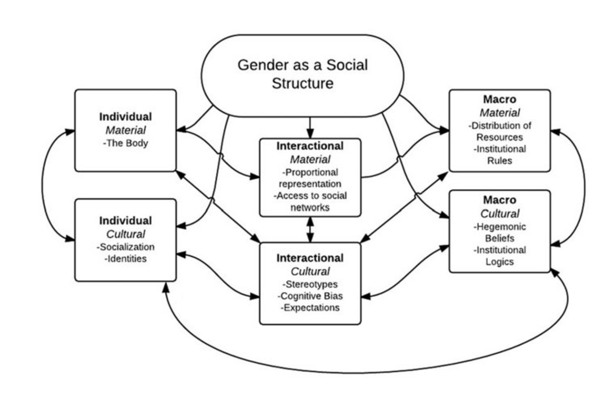
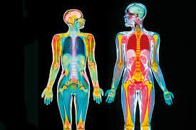
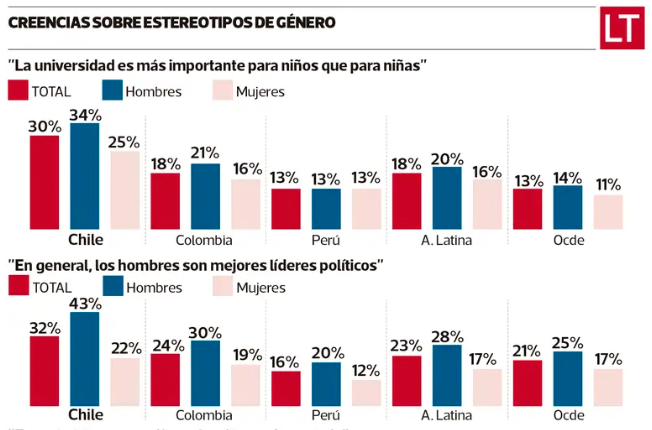
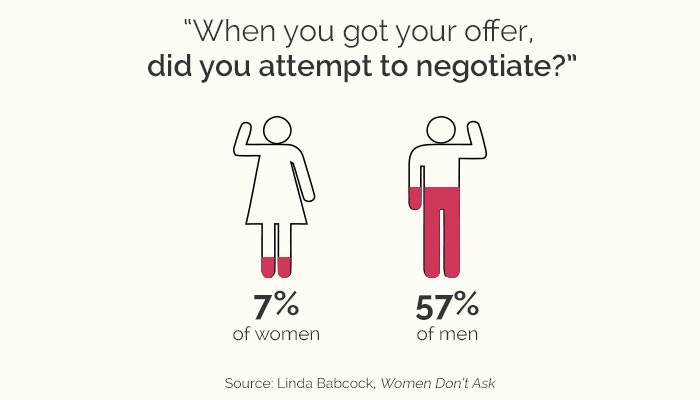
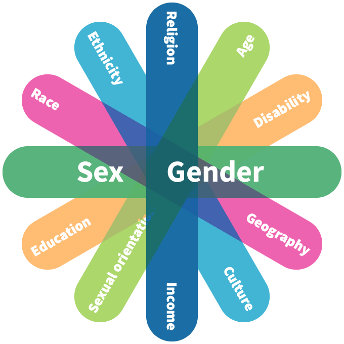
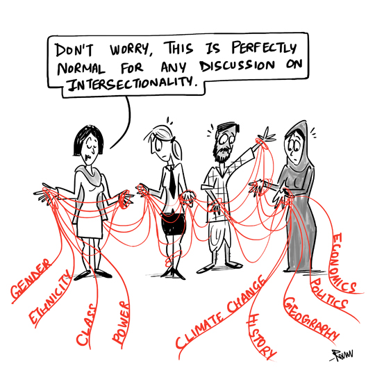
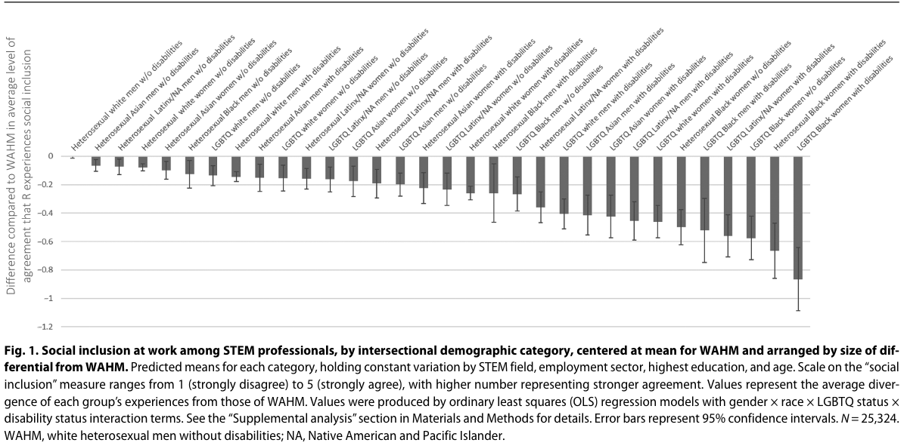
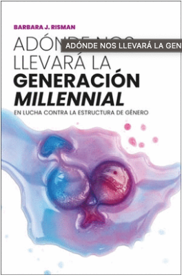

---

# Sistema multinivel e interseccionalidad {background-image="C6_01.jpg" background-size="cover" background-opacity="0.35" style="color:white;"}

::: {style="color:#d4b8f5; font-size:1.1em; margin-top:0.5em;"}
SOL191 · Clase 6: Sistema multinivel e interseccionalidad
:::

---

## Recomendación para proyecto final

{fig-align="center" width="55%"}

---

# Parte I: El sistema multinivel de género {background-color="#6B4C9A" style="color:white;"}

---

## Género como estructura multinivel

::: {style="font-size:0.85em;"}
- Género como sistema de estratificación que tiene implicancias en niveles individuales, interaccionales, y macro de análisis (Risman 2018).
- Las estructuras (Connell 1987, Giddens 1984, Risman 2018):
  - Existen fuera de los deseos o preferencias individuales y en parte explican el comportamiento humano
  - Restringen la acción pero también permiten la decisión de seguir o rechazar-resistir las estructuras heredadas (ahí yace el poder de transformación).
  - Organizan las posibilidades o el rango de decisión, o la agencia humana que re-construye la estructura de género a lo largo del tiempo.
  - Relación recursiva entre los individuos y la estructura social
:::

---

## Lo material y lo cultural como componentes de la estructura

::: {style="font-size:0.85em;"}
::: columns
::: {.column width="50%"}
**Aspectos materiales**

Nuestros cuerpos y las reglas que distribuyen el acceso a recursos y las restricciones en un momento histórico particular.
:::
::: {.column width="50%"}
**Aspectos culturales**

Procesos ideológicos, significados dados a los cuerpos, normas de interacción social, ideologías o creencias ampliamente compartidas.
:::
:::
:::

::: notes
La cultura como un componente de la estructura, como una "caja de herramientas" de conocimiento cultural que nos ayuda a darle sentido y reaccionar al mundo.

Risman plasma la importancia del aspecto cultural de la estructura incorporándolo en cada nivel de la estructura, que tiene aspectos materiales y aspectos culturales.
:::

---

## El sistema multinivel de género

{fig-align="center" width="85%"}

::: notes
Para entender cómo opera el género como estructura social, debemos mirar cada nivel de análisis y las relaciones entre ellos. Y con la relación recursiva entre lo material y lo cultural en cada nivel y a través de diferentes niveles.
:::

---

## Nivel micro: el cuerpo, la socialización, las identidades

::: {style="font-size:0.82em;"}
::: columns
::: {.column width="55%"}
**Material**

- La experiencia del cuerpo: todes debemos interpretar y operar en nuestro cuerpo.
- Las hormonas y la genética importan, pero hay efectos causales en ambas direcciones: el medio ambiente interactúa con los genes.
- Varios estudios muestran que la socialización tiene mayor poder explicativo que las hormonas en diversos resultados en la adultez, como personalidad o decisiones de carrera.
:::
::: {.column width="43%"}
{fig-align="center"}
:::
:::
:::

::: notes
La estructura tiene implicancias en cómo nos entendemos a nosotros mismos, las identidades y personalidades de las personas.
:::

---

## Nivel micro: el cuerpo, la socialización, las identidades

::: {style="font-size:0.82em;"}
::: columns
::: {.column width="55%"}
**Cultural**

- Noción del yo: cómo la cultura se internaliza.
- La socialización en los primeros años de vida es una manera en que la estructura de género se internaliza en la personalidad y las preferencias.
- La socialización va más allá de la familia: también es el sistema educativo, los pares, los medios.
- ¿Qué tan estables son estas predisposiciones? ¿Cómo se adoptan o resisten en la adultez?
:::
::: {.column width="43%"}
{fig-align="center"}
:::
:::
:::

::: notes
La estructura tiene implicancias en cómo nos entendemos a nosotros mismos, las identidades y personalidades de las personas.

Aunque importantes, ni nuestros cuerpos ni la socialización logran explicar la totalidad de la estratificación por género en la sociedad.
:::

---

## Nivel interaccional: representación, acceso, creencias, expectativas

::: {style="font-size:0.82em;"}
::: columns
::: {.column width="55%"}
**Material**

- La representación de nuestro género en cierto contexto y la experiencia de ser "token".
- Desventaja material en acceso a redes y puestos de poder para grupos marginalizados con respecto al género (mujeres, no binarie, trans, entre otros).
:::
::: {.column width="43%"}
{fig-align="center"}
:::
:::
:::

::: notes
En cualquier interacción, las expectativas que están asociadas a nuestra categoría de sexo se hacen visibles y median lo que es esperado o no en esa interacción.
:::

---

## Nivel interaccional: representación, creencias, expectativas

::: {style="font-size:0.85em;"}
**Cultural**

- Creencias y estereotipos que enmarcan la interacción social y cómo nos enfrentamos a otras personas.
- Expectativas de "hacer género" como es esperado.
- Expectativas de status: se espera que las mujeres tengan una menor competencia, que sean más empáticas, mientras que los hombres más eficaces y con mayor agencia.
- La resistencia es posible y es una forma de ir cambiando la estructura, pero normalmente viene con costos.
:::

::: notes
En cualquier interacción, las expectativas que están asociadas a nuestra categoría de sexo se hacen visibles y median lo que es esperado o no en esa interacción.
:::

---

## Nivel macro: leyes y políticas, organizaciones, creencias culturales

::: {style="font-size:0.78em;"}
**Material**

- Sistema legal con diferentes derechos y deberes según género.
- Sistema legal que la mayoría de las veces no reconoce la existencia de géneros no binaries.
- Políticas diferenciadas por género.
- Algunos ejemplos en Chile:
  - Régimen matrimonial de sociedad conyugal donde el marido administra bienes (55% de los matrimonios desde el 2011).
  - Sistema basado en género binario.
  - Atenuante de adulterio solo para hombres en caso de femicidio.
  - Diferencias en ley de posnatal.
:::

---

## Nivel macro: leyes y políticas, organizaciones, creencias

::: {style="font-size:0.82em;"}
::: columns
::: {.column width="55%"}
**Cultural**

- Género como parte del conocimiento cultural y valores históricos.
- Lógicas culturales de género que organizan el ámbito público y privado.
- Estas creencias y actitudes ayudan a explicar parte de la desigualdad: ejemplo de empleo femenino.
- Entidades económicas que tienen definiciones basadas en lógicas de género, como la definición del trabajo que asume una cierta figura de trabajador.
:::
::: {.column width="43%"}
{fig-align="center"}
:::
:::
:::

::: notes
Datos del 2020.
:::

---

## Ejercicio: la brecha salarial

::: {style="font-size:0.85em;"}
**Micro/Individual**

- Las mujeres se embarazan y amamantan, lo que le genera interrupciones en la trayectoria laboral, afectando su sueldo.
- Las mujeres han sido socializadas para priorizar menos su carrera y dedicarse a la familia, lo que afecta sus decisiones de carrera, afectando su sueldo.
:::

::: columns
::: {.column width="33%"}
{fig-align="center"}
:::
::: {.column width="34%"}
{fig-align="center"}
:::
::: {.column width="33%"}
{fig-align="center"}
:::
:::

---

## Ejercicio: la brecha salarial (síntesis multinivel)

::: {style="font-size:0.68em;"}
**Micro/Individual**

- Las mujeres se embarazan y amamantan, lo que le genera interrupciones en la trayectoria laboral, afectando su sueldo.
- Las mujeres han sido socializadas para priorizar menos su carrera y dedicarse a la familia, lo que afecta sus decisiones de carrera, afectando su sueldo.

**Meso/Interaccional**

- Las mujeres muchas veces trabajan en ambientes en que son minoría y esa experiencia dificulta su experiencia, afectando su sueldo.
- Las mujeres experimentan sesgos en sus interacciones laborales, son vistas como menos competentes que los hombres, y esta discriminación afecta su sueldo.

**Macro/Institucional**

- En general, la ley de postnatal permite a las mujeres tomar un postnatal mucho más largo que el de los hombres, lo que incide en su trayectoria y afecta su sueldo.
- Las organizaciones tienen lógicas culturales que benefician a los hombres, restringiendo las posibilidades de éxito de las mujeres, afectando su sueldo.
:::

---

# Parte II: Interseccionalidad {background-color="#6B4C9A" style="color:white;"}

---

## ¿Qué es la interseccionalidad? (Hill Collins & Bilge 2020)

::: {style="font-size:0.85em;"}
::: columns
::: {.column width="50%"}
- Investiga cómo las relaciones de poder se entrecruzan en las relaciones sociales y experiencias individuales.
- Las categorías y sistemas de opresión como el género, la etnia, la clase, la sexualidad, entre otras, están interrelacionadas y son mutuamente influyentes.
- Una herramienta analítica, una forma de comprender y explicar la complejidad de la sociedad y las experiencias humanas.
:::
::: {.column width="48%"}
{fig-align="center"}
:::
:::
:::

---

## ¿Qué debe considerar un marco interseccional?

::: {style="font-size:0.78em;"}
- Comprender la desigualdad mediante las interacciones de diferentes [categorías de poder]{.hl}.
- Las relaciones de poder se intersectan y dependen del contexto social.
- La interseccionalidad es relacional. Las categorías no son opuestas sino que interconectadas, lo que agrega valor y poder explicativo.
- El análisis interseccional es complejo y profundiza los conocimientos, abriendo nuevas categorías.
- Tiene un compromiso con la justicia social, que puede ser invisibilizada cuando hay reglas que parecen justas cuando no lo son y cuando producen resultados injustos y desiguales.
:::

---

## Kimberlé Crenshaw sobre los orígenes de la interseccionalidad

::: {style="font-size:1em; text-align:center; margin-top:2em;"}
Video: Kimberlé Crenshaw sobre los orígenes del concepto de interseccionalidad
:::

::: notes
(Video incrustado en la presentación original.)
:::

---

## Interseccionalidad y estereotipos (Ridgeway & Kricheli-Katz 2013)

::: {style="font-size:0.68em;"}
- Los grupos hegemónicos van a estar más sujetos a los estereotipos de género y raza — son miembros prototipo del grupo. Dependiendo del contexto, esto puede llevar a ciertas "restricciones" y "libertades" de las personas que están fuera de la diagonal
  - Que no calzan con el prototipo estereotípico hegemónico de su género, raza, y clase.
- **"Restricciones":** mujeres negras y hombres asiáticos en el mercado de relaciones heterosexuales (Galinsky et al.)
  - 73% de los matrimonios negro-blanco son de hombres negros con mujeres blancas
  - 86% de los matrimonios negro-asiático son entre hombres negros y mujeres asiáticas.
- **"Libertades"**
  - Hombres negros que son gay son menos discriminados en postulaciones a trabajos de manejo de personas que hombres blancos gay u hombres negros hetero (Pedulla 2012).
  - En contextos donde se valora la actitud dominante, las mujeres negras podrían ser menos (o no) penalizadas.
:::

---

## Desafíos

::: {style="font-size:0.78em;"}
::: columns
::: {.column width="55%"}
- Incluir múltiples dimensiones agrega complejidad
- No siempre muy claro cómo aplicar el concepto en la investigación empírica
- ¿Cómo usar las categorías sin cosificarlas o reducirlas a sólo eso?
- ¿Cómo integrar el análisis de múltiples categorías o dimensiones?
- ¿Cómo cuestionar las categorías en sí mismas y cómo se estudian?
- ¿Cómo incorporar un marco interseccional en los estudios con métodos cuantitativos?
:::
::: {.column width="43%"}
{fig-align="center"}

::: {style="font-size:0.55em; color:#888; text-align:center;"}
This Photo by Unknown Author is licensed under CC BY-NC-ND
:::
:::
:::
:::

---

## Ejemplo de una aplicación cuantitativa reciente: Cech (2022)

{fig-align="center" width="85%"}

---

## Aplicando el sistema multinivel

::: {style="font-size:0.72em;"}
::: columns
::: {.column width="68%"}
::: {.cuadro-actividad}
- Armar 4 grupos de cada capítulo asignado.
- Discutir para identificar:
  - Describir al grupo
  - Principales conclusiones sobre cada nivel
  - 1 ejemplo por nivel: un caso de una persona, una historia, o una cita explicada.
  - Conclusión sobre el grupo: ¿qué les sorprendió? ¿creen que hay algún "grupo" de personas así en Chile hoy?
- Preparar "flash talk": presentación PPT para presentar al curso (6-7 min).
  - Enviar presentación a tania.hutt@uc.cl 
  - Idealmente todos deben exponer alguna parte de la presentación (introducción, conclusión de cada nivel, ejemplo de cada nivel, conclusión final).
  - Al final, 3 minutos para preguntas del curso.
:::
** En este ejercicio NO está permitido el uso de IA **
:::
::: {.column width="30%"}
{fig-align="center"}
:::
:::
:::

::: notes
Terminar primer módulo a las 3:50. 20 min de preparación. 44-50 min de presentaciones.
:::

---

## Cuatro grupos de millennials

::: {style="font-size:0.85em; color:#666; text-align:center; margin-top:2em;"}
*(Tabla/diagrama de la presentación original — no se pudo extraer su contenido de forma automática.)*
:::

::: notes
5 min.
:::

---

## Evaluación temprana del curso

::: {style="font-size:0.9em; line-height:1.7;"}
- Recibir feedback temprano del curso permite identificar aspectos positivos y mejorables a tiempo.
- En Canvas, sección Encuestas de Docencia.

¡Muchas gracias!
:::

::: notes
15 minutos.
:::
