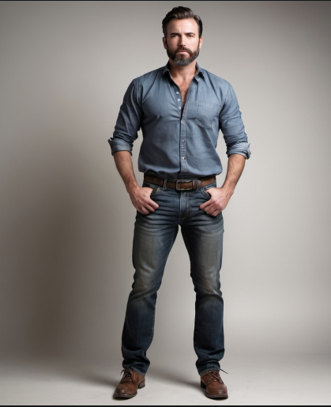
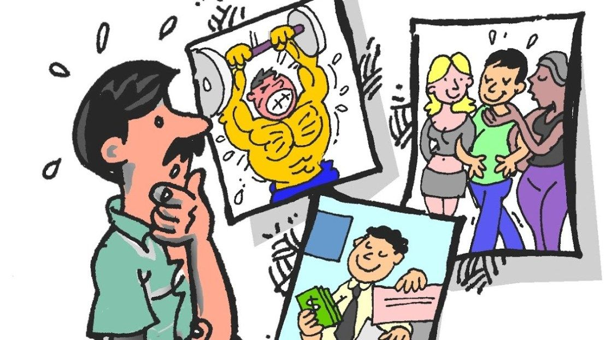
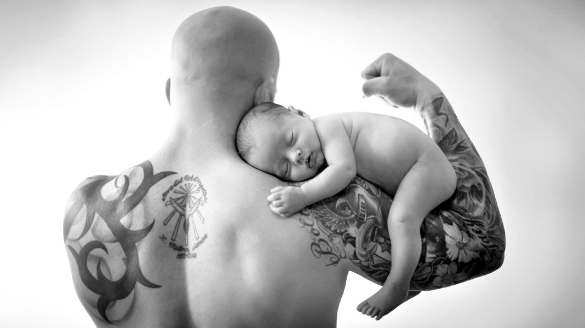
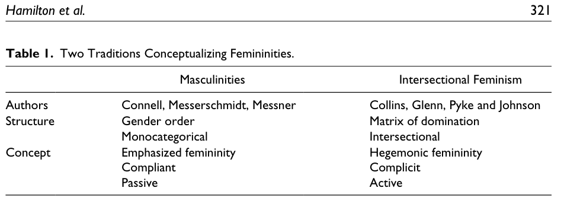
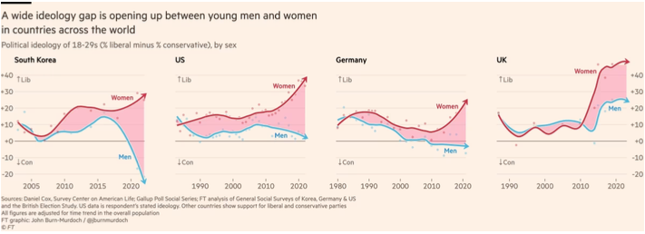

---

# Feminidades y Masculinidades {background-image="C7_01.jpg" background-size="cover" background-opacity="0.35" style="color:white;"}

::: {style="color:#d4b8f5; font-size:1.1em; margin-top:0.5em;"}
SOL191 · Clase 7: Feminidades y Masculinidades
:::

---

## Objetivos de hoy

::: {style="font-size:0.95em;"}
- Revisar y evaluar diferentes definiciones teóricas de los conceptos de feminidades y masculinidades.
- Aplicar estos conceptos con ejemplos de estudios empíricos.
:::

---

## Para ti, ¿qué característica es masculina? ¿y femenina? {background-color="#f8f4ff"}

::: notes
10 min.
:::

---

## Masculinidad hegemónica (según R. Connell)

::: {style="font-size:0.82em;"}
::: columns
::: {.column width="55%"}
- Vivimos en una sociedad que es "patriarcal". Los hombres, como grupo, tienen poder sobre las mujeres, como grupo.
- Sin embargo, no todos los hombres están en el poder o se sienten poderosos. La masculinidad tiene su propia jerarquía.
- La [masculinidad hegemónica]{.hl} es la forma de masculinidad más dominante y poderosa. Otros tipos de masculinidad incluyen la masculinidad gay o masculinidades racializadas (masculinidades subordinadas).
:::
::: {.column width="43%"}
{fig-align="center" width="90%"}

::: {style="font-size:0.65em; color:#666; text-align:center;"}
Imagen creada por inteligencia artificial para: "foto de cuerpo completo de un hombre de verdad siendo masculino"
:::
:::
:::
:::

---

## Masculinidad hegemónica (R. Connell)

::: {style="font-size:0.8em;"}
::: columns
::: {.column width="50%"}
- La masculinidad hegemónica ([MH]{.hl}) es dominante sobre las masculinidades y feminidades subordinadas.
- MH es un tipo ideal o una fantasía que muy pocos hombres encarnan, pero que muchos luchan por alcanzar.
- El contenido varía en el tiempo y el espacio, pero actualmente en la sociedad occidental tiende a ser un hombre heterosexual, blanco, educado, rico y fuerte.
- El contenido es menos importante que la posición en la jerarquía. El contenido puede ir modificándose, como veremos en esta clase.
:::
::: {.column width="48%"}
{fig-align="center"}
:::
:::
:::

---

## Feminidad enfatizada (R. Connell)

::: {style="font-size:0.85em;"}
- No existe ninguna forma de feminidad que sea dominante. Más bien, las formas de feminidad son respuestas al dominio masculino.
- La [feminidad enfatizada]{.hl} (FE), la forma más visible de feminidad, se organiza en torno al cumplimiento de la dominación masculina.
- Las FE incluyen rasgos y conductas que muestran dependencia de los hombres. ¿Ejemplos?
:::

::: notes
Como estar siempre en necesidad de ayuda, ser pequeña y débil, y evitar conductas dominantes.

15 min (hasta acá).
:::

---

## Masculinidad como homofobia (Kimmel)

::: {style="font-size:0.95em;"}
- Kimmel afirma que la homofobia es un principio organizativo central de nuestra definición de masculinidad.
- El esfuerzo por demostrar la propia masculinidad a otros hombres conduce al silencio y la complicidad en torno al sexismo y la homofobia.
:::

::: notes
35 min.
:::

---

## Pascoe sobre su libro: *Dude, you're a fag*

::: columns
::: {.column width="48%"}
{fig-align="center"}
:::
::: {.column width="48%"}
::: {.cuadro-actividad}
¿Cuáles son las consecuencias de esta necesidad de demostrar la masculinidad hegemónica para la vida de los hombres?
:::
:::
:::

::: notes
7 minutos - 10 min de plenario.
:::

---

## Crisis (Bridges y Pascoe 2018)

::: {style="font-size:0.85em;"}
- Connell dice que las relaciones de género son históricamente inestables y tienden a entrar en crisis. Estas crisis afectan las relaciones de género de manera incompleta.
- Se han intensificado en la historia reciente, resultando en "una gran pérdida de legitimidad del patriarcado" y "diferentes grupos de hombres están negociando esta pérdida en formas muy diferentes".
- Los periodos de cambio pueden venir con un [vértigo de género]{.hl}, un sentido de malestar e incomodidad en la medida que las estructuras y relaciones de género se van transformando.
:::

---

## Visiones/respuestas al "vértigo de género"

::: {style="font-size:0.8em;"}
Dos discursos actuales que han tomado popularidad en redes sociales: muchas críticas y también mucho respaldo, personas que se sienten muy identificadas con estas ideas y sienten que les están dando una voz.

Son ejemplos de discursos que van contra ideas actuales liberales con respecto al género. Hay muchos otros; estos son sólo dos ejemplos.
:::

::: {style="font-size:0.85em;"}
::: columns
::: {.column width="48%"}
::: {.cuadro-datos}
**Andrew Tate**

Influencer en redes sociales, empresario, ex boxeador. Ha sido acusado de incentivar la misoginia en hombres jóvenes.

Más de 8,5 millones de seguidores en X, tercera persona más googleada en 2023.
:::
:::
::: {.column width="48%"}
::: {.cuadro-datos}
**Estee Williams**

25 años, influencer "tradwife". 1,3 millones de likes en TikTok.
:::
:::
:::
:::

::: notes
10 min.
:::

---

## Discusión en grupo

::: {.cuadro-actividad}
- ¿Qué nos dicen estas ideas sobre las masculinidades y feminidades actuales? ¿Qué rol o espacio tienen estas formas de masculinidad y feminidad?
- ¿Qué impactos (positivos o negativos) podrían tener estas ideas en la desigualdad de género?
:::

::: notes
10 min discusión en grupo, luego plenario.
:::

---

## Masculinidades híbrido (Bridges y Pascoe 2018)

::: {style="font-size:0.85em;"}
::: columns
::: {.column width="48%"}
{fig-align="center"}
:::
::: {.column width="48%"}
- La masculinidad está cambiando.
- [Masculinidades híbrido]{.hl}: la incorporación selectiva de elementos de identidad típicamente asociados con diversas masculinidades o feminidades marginadas y subordinadas en las expresiones e identidades de género de los hombres privilegiados.
- ¿Qué ejemplos de masculinidades híbrido dan en este artículo?
:::
:::
:::

---

## Masculinidades híbrido

::: {style="font-size:0.9em;"}
- ¿Qué significan estos cambios, estas masculinidades híbrido? ¿Son cambios a la estructura de género? Hay dos miradas:
  - Sí, reflejan un cambio en las relaciones de género donde estas nuevas configuraciones de identidad son una forma de resistencia a la desigualdad de género.
  - Más que desafiar las relaciones de género, son parte de un proceso dinámico que se asocia a tres tipos de consecuencias que tienen las masculinidades híbrido.
:::

---

## Consecuencias de las masculinidades híbrido

::: {style="font-size:0.85em;"}
::: columns
::: {.column width="48%"}
**Distancia discursiva** *(discursive distance)*

- Crea espacio discursivo entre grupos de hombres privilegiados y la masculinidad hegemónica, permitiéndoles enmarcarse a sí mismos fuera de esos sistemas de privilegio y desigualdad.
- Ejemplos: "bromance"; hombres desaventajados como los dueños de las masculinidades "regresivas", quienes si toman masculinidades híbrido enfrentan consecuencias muy diferentes.
:::
::: {.column width="48%"}
{fig-align="center"}
:::
:::
:::

---

## Consecuencias de las masculinidades híbrido

::: {style="font-size:0.85em;"}
**Préstamo estratégico** *(strategic borrowing)*

- Estas masculinidades están disponibles a hombres jóvenes, blancos, hetero, de una manera menos significativa que para "otros", quienes producen parcialmente sus identidades en la lucha colectiva por sus derechos y reconocimiento.
- Turismo simbólico
  - Disfrutar de los placeres asociados con la transgresión de los límites normativos de género y sexuales, pero evitando gran parte de la injusticia y el dolor.
- Ejemplo: hombre metrosexual que toma prestada la cultura gay.
:::

---

## Consecuencias de las masculinidades híbrido

::: {style="font-size:0.9em;"}
**Fortaleciendo límites** *(boundary strengthening)*

- Fortalece límites simbólicos y sociales entre grupos (raciales, de género, sexualidad, clase), lo que esconde la desigualdad en formas históricamente novedosas.
- Tal como el "bromance", el "dude sex" depende de relaciones simbólicas que desafían y al mismo tiempo refuerzan sistemas de poder y desigualdad.
:::

---

## Feminidades (Hamilton et al. 2019)

::: {style="font-size:0.78em;"}
Cómo dos tradiciones sociológicas explican el rol de las feminidades en la dominación social

::: columns
::: {.column width="58%"}
**Connell y otros — Masculinidades**

- Género como estructura de dominación independiente
- Feminidades complementan las masculinidades hegemónicas: cómplices pasivas en la reproducción de género.
- Feminidades enfatizadas: pasivo y mono categórico.

**Hill Collins y otros — Dominación interseccional**

- Ideas culturales de feminidad reproducen una matriz de dominación: ideas culturales de feminidad son racializadas, hetero-generizadas, de clase, etc.
- Todas las feminidades pueden ser subordinadas a las masculinidades hegemónicas, pero algunas feminidades juegan un rol poderoso en reproducir otras formas de desigualdad: [dominación interseccional]{.hl}.
:::
::: {.column width="40%"}
{fig-align="center"}
:::
:::
:::

::: notes
In the context of the contemporary United States, women who perform hegemonic femininities may more easily locate and secure sexual and romantic partners who have access to racial privilege, greater education, wealth, income, attractiveness, and popularity.

Because high-status women often recruit and select incoming members, they are in the position to decide to whom and on what basis inclusion should be extended (Armstrong and Hamilton 2013).
:::

---

{fig-align="center" width="85%"}

---

## Feminidades hegemónicas

::: {style="font-size:0.85em;"}
::: {.cuadro-datos}
Ideales culturales de feminidad más celebrados en un momento y lugar determinados y que sirven para defender y legitimar todos los ejes de opresión en la matriz de dominación simultáneamente.

— Collins
:::

::: {.cuadro-actividad}
Las feminidades hegemónicas pueden recibir ciertos "bonos" o "premios". ¿Ejemplos?
:::
:::

::: notes
15 min. 10 min de discusión. 25 min en total (segundo módulo).
:::

---

## Masculinidades hegemónicas en la clase dominante (Madrid 2016)

::: {style="font-size:0.82em;"}
Estudia el proceso de construcción de masculinidades hegemónicas en la clase dominante chilena.

::: {.cuadro-actividad}
- ¿Qué hizo el autor en este estudio?
- ¿Cuáles son los tres tipos de colegios que identificó?
- ¿Cuáles son los principales resultados?
- ¿Cómo se podrían relacionar estos resultados con los conceptos de masculinidad hegemónica, masculinidades híbridas y masculinidades con perspectiva interseccional?
- Madrid no habla de las feminidades, menos de las feminidades hegemónicas y su relación con la clase social. ¿Cuál creen que es el rol de las feminidades en este estudio?
:::
:::

::: notes
De este modo, durante 2011 conduje entrevistas de historias de vida focalizadas (Plummer, 2001) con 32 hombres y 9 mujeres (de 19 a 45 años) ex-estudiantes de 18 colegios privados de elite, de los tres tipos identificados en la literatura — tradicionales católicos, nuevos movimientos católicos y no católicos —, todos ellos ubicados en la parte más adinerada de Santiago de Chile: "el barrio alto".
:::

---

## Actividad en grupo: ¿distanciamiento ideológico entre hombres y mujeres jóvenes?

::: {style="font-size:0.85em;"}
::: {.cuadro-actividad}
**Grupos de 4-5 estudiantes**

- Completar guía en grupo.
- Revisar el artículo sobre las opiniones políticas de hombres y mujeres jóvenes.
- Identificar el principal resultado destacado en el artículo.
- ¿Creen que efectivamente se está dando un distanciamiento político de género en las generaciones más jóvenes?
- ¿Por qué creen que podría estar o no pasando esto? ¿Cómo se podría relacionar con las masculinidades y feminidades?
- ¿Aplicará esto en el contexto chileno actual? ¿Cómo lo ven en su generación?
:::
:::

::: notes
15 min revisar y completar guía – 10 min plenario.
:::

---

{fig-align="center" width="90%"}

---

## Recordatorios
