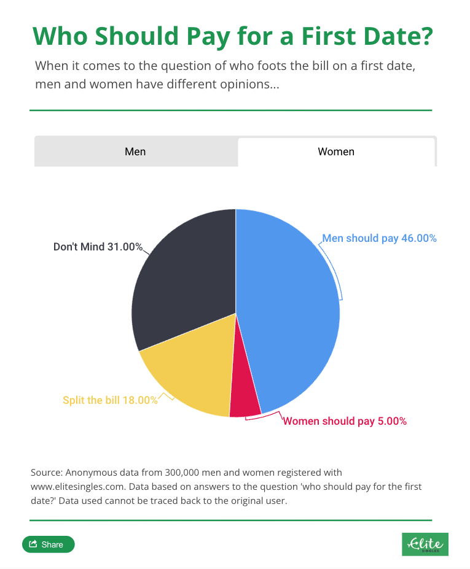

---

# Relaciones románticas y sexoafectivas {background-image="C7_01.jpg" background-size="cover" background-opacity="0.35" style="color:white;"}

::: {style="color:#d4b8f5; font-size:1.1em; margin-top:0.5em;"}
SOL191 · Clase 7
:::

---

## Objetivos de hoy

::: {style="font-size:0.9em;"}
- Explicar **por qué persisten los guiones de género** en las relaciones románticas pese a los cambios en otras esferas (Lamont 2021).
- Evaluar críticamente el **discurso de la elección individual** como forma de entender la igualdad en la pareja (Lamont 2021; Martínez Echagüe 2026).
- Identificar **quiénes quedan excluidos** de esos guiones y por qué (clase, raza, estatus migratorio).
- **Contrastar** esa evidencia, producida mayormente en EE. UU., con datos y estudios de Chile.
:::

::: notes
Total: 62 min de clase + 8 min de ficha de cierre. Avanzar lento: es preferible profundizar en las discusiones teóricas (actividad grupal y síntesis final) que cubrir todo el material de las diapositivas.
:::

---

## Para empezar: tomen posición {background-color="#f8f4ff"}

::: {style="font-size:1.1em;"}
**"La igualdad en la pareja es, principalmente, una cuestión de elección individual."**
:::

::: {.cuadro-actividad}
¿De acuerdo o en desacuerdo? Voten (Wooclap) y anoten una razón en una frase.
:::

::: notes
4 min (0–4). Registrar el resultado de la votación para repetirla al final de la clase y ver si cambió.
:::

---

## La paradoja de las citas (Lamont 2021)

::: {style="font-size:0.85em;"}
Cambios en las últimas décadas:

- atraso del matrimonio y una década de "autodesarrollo",
- aspiraciones igualitarias en la pareja,
- más espacio para que las mujeres sean sexualmente activas.

Sin embargo, el [modelo proactivo-reactivo]{.hl} persiste: los hombres toman la iniciativa, planifican y pagan; las mujeres responden.

::: {.cuadro-datos}
**Pregunta de Lamont:** si hay deseo de igualdad y cambios estructurales a favor de las mujeres, ¿por qué siguen guiando la interacción los guiones tradicionales?
:::

Su respuesta: hombres y mujeres heterosexuales **traducen viejas desigualdades a nuevos espacios** usando creencias de género preexistentes.
:::

::: notes
Conectar con Ridgeway y Correll (clase 4): las creencias de género se activan en contextos relacionales. Lamont cita explícitamente que el guion agente/comunal justifica otras desigualdades (brecha salarial, segregación ocupacional, división del trabajo en el hogar).
:::

---

## ¿Quién debería pagar en la primera cita?

::: columns
::: {.column width="48%"}
{fig-align="center"}
:::
::: {.column width="48%"}
{fig-align="center"}
:::
:::

::: {style="font-size:0.7em; color:#666; text-align:center;"}
Fuente: EliteSingles, datos anónimos de 300.000 usuarios/as del sitio.
:::

::: {.cuadro-actividad}
¿Qué supone cada respuesta sobre quién tiene agencia y quién tiene poder? ¿Qué limitaciones tiene esta fuente de datos? ¿Cómo creen que se respondería en Chile y con qué datos podríamos saberlo?
:::

::: notes
3 min. Muestra no probabilística: usuarios/as de un sitio de citas (autoseleccionados). Ayuda a discutir qué se puede y qué no se puede concluir. Idea de fondo: pagar no es solo un gesto, es un acto de iniciativa y de definición de quién "lleva" la relación. Reconocer que no tenemos un dato equivalente representativo para Chile: sirve para introducir el tema de la generalización.
:::

---

## Cuatro contextos donde esperaríamos cambio

::: {style="font-size:0.78em;"}
| Contexto | ¿Por qué esperaríamos cambio? | ¿Qué persiste? |
|:--|:--|:--|
| **Cultura del *hookup*** | Menos normas, más libertad sexual | Ambigüedad que favorece a quien quiere menos compromiso |
| **Autodesarrollo de las mujeres** | Independencia económica y proyecto propio | Dos imperativos en tensión; la elección como justificación |
| **Citas en línea** | Más iniciativa posible para las mujeres | Mismos patrones de contacto y jerarquías de deseabilidad |
| **Exclusión económica** | Los guiones de "clase media" no aplican | Se desea y se sufre el mismo guion |
:::

::: notes
Esta tabla es el mapa de la sección: 1 min. Cada contexto se desarrolla a continuación en una diapositiva (≈3 min cada una). Hoy no se revisa el hookup como "tema de moda", sino como prueba de la tesis de persistencia.
:::

---

## 1. Cultura del *hookup*

::: {style="font-size:0.8em;"}
- Es hoy la principal vía de formación de relaciones en universidades, pero la mayoría **no** conduce a una relación.
- La ambigüedad ("las cosas deben simplemente pasar") reproduce quién se supone que busca compromiso:
  - mujeres: orientación **relacional**; hombres: orientación **recreacional**,
  - mujeres con dificultad para negociar compromiso por temor a parecer **"desesperadas"**.
- **Jerarquía de deseabilidad**, racializada y generizada: no todas las personas tienen las mismas oportunidades (Wade 2017; Wilkins 2012).
- Mujeres de menor clase social quedan al margen de la vida universitaria y vuelven a las demandas de sus comunidades.

::: {.cuadro-datos}
Los beneficios de la cultura del *hookup* **no se distribuyen por igual**.
:::
:::

::: notes
3 min. Lamont subraya que aun el hookup, que parece "sin normas", se ordena por supuestos de género sobre quién quiere qué. Es un ejemplo claro de cómo las creencias de género se reproducen incluso donde el guion explícito desaparece.
:::

---

## 2. Autodesarrollo y citas: dos imperativos en tensión

::: {style="font-size:0.8em;"}
- Las mujeres enfrentan dos mensajes: el **imperativo de autodesarrollo** (estudiar, trabajar, posponer el matrimonio) y el **imperativo relacional** (una mujer "normal" siempre quiere una pareja) (Hamilton y Armstrong 2009).
- No hay guiones culturales para combinar independencia e intimidad (Bell 2013).
- En lugar de cambiar las prácticas, muchas hacen **trabajo ideológico**:
  - [*choice feminism*]{.hl}: las citas generizadas son una "preferencia personal" apolítica,
  - los procesos de género se "de-generizan" (Daminger 2020),
  - los quiebres se narran como "necesidad excesiva" propia (Dalessandro y Wilkins 2017).
- Persisten las **narrativas de desesperación**, incluso con más independencia.
:::

::: notes
3 min. Punto clave para la síntesis: aquí aparece por primera vez el lenguaje de la elección individual, que vamos a retomar con Martínez Echagüe. Lamont también destaca el placer: las personas disfrutan de los rituales generizados y los viven como compatibles con identidades feministas (Lamont 2014).
:::

---

## 3. Citas en línea

::: {style="font-size:0.8em;"}
- La mayoría de las personas jóvenes ya conoce a sus parejas por estos medios: podría cambiar quién inicia.
- Pero se repiten los patrones: **los hombres envían la gran mayoría de los mensajes**, la apariencia convencional concentra la atención y la jerarquía de deseabilidad (racializada) se **intensifica**.
- Las mujeres siguen dedicando mucho tiempo a filtrar contactos y a manejar el riesgo y el acoso (*cyberaggression*).
- Algunas mujeres encuentran que es **más empoderador** que las citas presenciales, lo que dice mucho de los riesgos que enfrentan fuera de línea.

::: {.cuadro-datos}
**En Chile** (Gómez-Urrutia y Tello-Navarro 2024; 60 estudiantes universitarios/as): también se espera que ellos tomen la iniciativa, y los códigos de género que restringen la sexualidad femenina se **trasladan al espacio digital**. Ellas evalúan más riesgos y son más cautas al "pelarse" (coquetear con varias personas). Ninguna dice haber subvertido los códigos ella misma.
:::
:::

::: {.cuadro-actividad}
¿Puede un nuevo espacio para conocer parejas cambiar las creencias de género que guían la interacción? ¿Qué se parece y qué se diferencia del caso chileno?
:::

::: notes
3 min. Pregunta intencionalmente abierta: un cambio de espacio o de formato cambia la forma pero no necesariamente las creencias (Ridgeway y Correll). Los hombres no reportan los mismos temores de seguridad que las mujeres. El estudio chileno (Comunicación y Sociedad, e8604) es cualitativo y solo con universitarios/as: sus conclusiones no son extrapolables a toda la juventud, como dicen sus autores. Conecta con el modelo proactivo-reactivo (iniciativa) y con la sanción a las mujeres que no se ajustan.
:::

---

## 4. Exclusión económica

::: {style="font-size:0.8em;"}
- La literatura se centra en jóvenes privilegiados/as; sin embargo, el sistema de citas nació en la clase trabajadora.
- Jóvenes de bajos ingresos **desean el mismo guion** (el hombre "romancea" con gestos que requieren recursos), pero no pueden costearlo: *"hacer romance con poco presupuesto"* (Ray 2018; Sassler y Miller 2017).
- Hombres inmigrantes indocumentados temen no ser parejas deseables si no pueden pagar las citas (Enriquez 2020; Pila 2016).
- La clase profesional se distingue con formas cada vez más "creativas" de romance (Swidler 2001).
:::

::: {.cuadro-datos}
El problema no es que valoren cosas distintas, sino **quién tiene los recursos para actuar el guion**.
:::

::: notes
3 min. No encontré estudios chilenos específicos sobre citas y clase social: es un vacío que se puede nombrar abiertamente y plantear como pregunta de investigación para el proyecto final. Conectar con interseccionalidad (clase 6): el guion de género opera como estándar para todos, aunque solo algunos puedan cumplirlo. Quedar "fuera" del guion no es lo mismo que desafiarlo.
:::

---

## Cinco conceptos clave de Lamont

::: {style="font-size:0.78em;"}
| Concepto | Qué significa (según Lamont) |
|:--|:--|
| **Modelo proactivo-reactivo** | Los hombres inician, planifican y pagan; las mujeres responden y aceptan o rechazan. |
| ***Hookup culture*** | Encuentros sexuales sin compromiso como vía dominante de formar relaciones en el contexto universitario. |
| ***Egalitarian essentialism*** | Se apoya la igualdad de oportunidades en lo público, pero se cree que hombres y mujeres son esencialmente distintos en lo privado (Pepin y Cotter 2018). |
| ***Choice feminism*** | Interpretar las prácticas generizadas como elecciones personales, apolíticas, compatibles con una identidad feminista (Stone 2007). |
| **Narrativas de desesperación** | Temor de las mujeres a ser vistas como "necesitadas" si buscan compromiso o toman la iniciativa. |
:::

::: notes
2 min. Se entregan las definiciones para que la actividad grupal sea de análisis y no de búsqueda. Las y los estudiantes pueden pedir más precisión; remitir a las secciones del artículo.
:::

---

## Actividad en grupos: ¿qué mecanismo explica la persistencia?

::: {style="font-size:0.9em;"}
::: {.cuadro-actividad}
**4 grupos**, uno por contexto (*hookup*, autodesarrollo, citas en línea, exclusión económica).

¿Qué **mecanismo** explica que el guion de género persista en su contexto: sanciones, placer y deseo, creencias esencialistas o restricciones materiales? Fundamenten con **un concepto** de la tabla anterior.
:::
:::

::: notes
4 min de trabajo + 5 min de plenario (1 min por grupo y cierre) = 9 min (20–29). En el plenario, anotar en la pizarra los mecanismos que mencionan, porque se usarán en la síntesis final. Si hay tiempo o los grupos terminan rápido, se puede preguntar: ¿qué evidencia falta o qué contexto está ausente? (casi toda la literatura revisada es de EE. UU. y de jóvenes de universidad).
:::

---

## ¿Y cuándo sí hay cambio? Contraste con parejas del mismo sexo

::: {style="font-size:0.82em;"}
*(Lamont 2017: lectura recomendada, no mínima)*

- 40 personas LGBTQ: ¿cómo negocian las prácticas culturales dominantes del cortejo?
- Rechazan activamente las normas heterosexuales y buscan prácticas **recíprocas** (ambas partes invitan, pagan, comunican interés).
- Pero pueden aparecer nuevas restricciones: la presión de ser "suficientemente queer", o el "mito" de que se está fuera del problema sistémico.

::: {.cuadro-actividad}
Lamont (2021) termina preguntando **bajo qué condiciones** se produce un cambio sostenido. ¿Qué sugiere este contraste?
:::
:::

::: notes
3 min (29–32). Es una diapositiva de cierre de la sección de Lamont, no un tema nuevo. Esta evidencia viene del artículo de 2017; la lectura mínima de 2021 la menciona solo de pasada.
:::

---

## ¿Qué es la igualdad en la pareja? {background-color="#f8f4ff"}

::: {.cuadro-actividad}
Escriban individualmente (1 min): ¿qué es para ti un **indicador** de igualdad de género en la pareja?
:::

::: notes
1 min (32–33). Pedir que lo guarden: después lo compararán con la definición que usa Martínez Echagüe (2026), que tomó como meta una división equitativa del trabajo doméstico y de algunas tareas de cuidado, con el 50/50 como horizonte flexible más que como regla estricta.
:::

---

## Equality takes work (Martínez Echagüe 2026)

::: {style="font-size:0.85em;"}
::: {.cuadro-datos}
**Pregunta:** ¿por qué las mujeres siguen haciendo la mayor parte del trabajo doméstico, incluso con metas igualitarias y pocas restricciones estructurales?
:::

- **Datos:** 40 entrevistas con ambos miembros de **20 parejas** heterosexuales, cis y con educación universitaria, en Carolina del Norte.
- **Argumento:** la desigualdad es el *default*; lograr una división equitativa **requiere trabajo**: el [*equality work*]{.hl}.
:::

::: notes
2 min (33–35). Publicado en *Social Forces* 104(3), 2026, pp. 898–916. Parejas de 26 a 46 años, entrevistas entre noviembre de 2019 y abril de 2020. Se eligió a propósito el caso "más fácil" para la igualdad (personas muy educadas, mayoritariamente blancas), lo que limita la generalización. Es trabajo cognitivo y emocional, y se suma al resto del trabajo doméstico que ya hacen mayoritariamente las mujeres. La autora lo diferencia de conceptos cercanos: carga mental, trabajo cognitivo (Daminger 2019) y gestión del hogar, que tratan de decidir qué hay que hacer y hacerlo, no de asegurar que el reparto sea equitativo. Método: análisis abductivo; entrevistó a cada integrante por separado y pidió ejemplos de episodios concretos para reducir respuestas aspiracionales. La nota de 2021 presentó el proyecto; las definiciones teóricas de igualdad que aparecían ahí no están en el artículo.
:::

---

## Equality work: seis pasos

::: {style="font-size:0.85em;"}
1. **Anticipar** la desigualdad antes de vivir juntos o tener hijos/as.
2. **Estrategizar**: diseñar sistemas para repartir de manera pareja.
3. **Monitorear** que el reparto no se deslice a la desigualdad.
4. **Reclamar** (*speaking up*): plantear la desigualdad, con riesgo de conflicto.
5. **Reparar** los sistemas cuando no funcionan.
6. **Retener** (*withholding*): dejar de hacer lo que la pareja no hace.

Casi todo recae en las **mujeres**; monitorear es el paso en que más participan ellos.
:::

::: {.cuadro-actividad}
¿Cuál de los seis pasos creen que es el más costoso y por qué?
:::

::: notes
2 min (35–37). Detalles: en el 75 % de las parejas con ideales igualitarios compartidos, ellas hablaron del tema de forma concreta; en más del 80 %, ellos respondieron de forma vaga. Ejemplo del paso 6: una participante decide no limpiar los platos como "no culpa consciente"; los estándares de limpieza de las mujeres se mencionaron como más altos el doble de veces que los de los hombres; en las 4 parejas que externalizaron, en dos fue fuente de conflicto. Paso 3: los hombres participan cuando también quieren evitar sobrecargarse. Paso 4: exige regular emociones (frustración y culpa) y puede escalar en conflicto. Paso 5: listas compartidas, apps y recordatorios; cuesta más cuando ellos se resisten.
:::

---

## Cuando el trabajo de igualdad falla: revisar los ideales

::: {style="font-size:0.85em;"}
- De 20 parejas, solo **3** se esfuerzan juntas y la meta se sostiene; en **13**, ellas dejaron el trabajo de igualdad o lo combinan con revisar sus ideales.
- Si ellos no colaboran, el trabajo es agotador y **arriesgado** para la relación: es menos costoso hacer lo que ellos no hacen.
- Entonces redefinen la igualdad desde lo **intangible** (respeto, decisiones, apoyo emocional): "salvan la relación y sus ideales", pero la justificación llega **después** de intentar.
:::

::: {.cuadro-actividad}
¿Es esto **justificación** (Daminger; Lamont) o **adaptación**? Si la revisión de ideales ocurre *después* de un esfuerzo fallido, ¿cambia cómo interpretamos el *choice feminism*?
:::

::: notes
3 min (37–40). Los 20 casos: 3 parejas se esfuerzan juntas; 6 mujeres dejaron el trabajo de igualdad y revisaron sus ideales; 7 combinan algo de trabajo con algo de revisión; 3 parejas no tenían ideales 50/50 y 1 es abiertamente desigual. La autora diferencia esta estrategia de negar o explicar la desigualdad: no pretende volverla invisible, sino separar "igualdad" del trabajo doméstico. Aun así, como la justificación, hace soportable la desigualdad. Pregunta de fondo: ¿lo que Lamont describe como "preferencia personal" podría ser el resultado de un trabajo de igualdad fallido? Conecta con la paradoja: hacer el trabajo de la pareja o hacer el trabajo de educarla. En dos de las parejas que lo sostienen, ellas educaron antes a sus parejas sobre la igualdad (hallazgo esperanzador: no hace falta el compromiso total de ambos desde el inicio).
:::

---

## Implicaciones teóricas

::: {style="font-size:0.85em;"}
- **Paradoja:** "hacer menos también requiere trabajo" (p. 910, traducción propia).
- **Contra la "revolución estancada" (England 2010):** la persistencia no refleja los valores, incentivos ni esfuerzos de las mujeres: **se esfuerzan por cambiarlo**.
- Los hombres se relacionan con los ideales **de modo generizado**: dicen apoyar la igualdad sin invertir en lograrla.

::: {.cuadro-datos style="font-size:0.9em;"}
**Nota, un grupo pequeño de chilenos/as** (Valenzuela Somogyi 2023; 10 hombres y 10 mujeres con educación superior): la igualdad es un ideal normativo y, al convivir con un modelo jerárquico tradicional, exige un **trabajo individual** para sostener una narrativa igualitaria.
:::
:::

::: {.cuadro-actividad}
¿Es esto una paradoja de las parejas individuales o una paradoja **estructural**? ¿Qué quedaría fuera si solo miramos a parejas muy educadas?
:::

::: notes
3 min (40–43). Estructura sin determinismo: las restricciones moldean el contexto, pero no determinan si el trabajo fracasa; aun con políticas y trabajos más favorables, la igualdad seguiría siendo esquiva si ellos no hacen su parte. El concepto podría extenderse a otros contextos (por ejemplo, el *equity work* de Wingfield 2019 o la sobrecarga de las mujeres en la academia). Límites que señala la autora: parejas muy educadas, mayoritariamente blancas y relativamente jóvenes; no sabemos cómo funciona con menor educación o en parejas queer (según Lamont 2017, para ellas la desigualdad podría no ser el *default*), lo que conecta con la diapositiva de parejas del mismo sexo. Valenzuela (2023) también es una muestra con educación superior: sirve para ver el mismo mecanismo, no para generalizar.
:::

---

## ¿Y en Chile? Expectativas de hombres jóvenes (González-Salva et al. 2025)

::: {style="font-size:0.76em;"}
**Estudio:** 4 grupos focales con 29 hombres de 18 a 29 años, estudiantes de educación superior en la Región del Maule. Jugaron "coger, casar o matar" con tres perfiles de mujer:

::: columns
::: {.column width="33%"}
**Carla:** "moderna" y empoderada, racional, con objetivos de vida claros.
:::
::: {.column width="33%"}
**Sofía:** cuidadora, centrada en su familia y su pareja, sin experiencia sexual hasta el matrimonio.
:::
::: {.column width="33%"}
**Macarena:** tímida, introvertida, dulce.
:::
:::

- **Para casar**, la preferida fue Macarena (calidez) y luego Sofía (cuidado y exclusividad); Carla fue la menos mencionada, aunque valoraron sus objetivos de vida.
- **Para coger**, la más elegida fue Carla, por su "sociabilidad como peligro" (celos e infidelidad) y su "racionalidad" entendida como poca afectividad.
- **Para matar**, el principal motivo fue la castidad de Sofía, vista como conservadurismo o inmadurez.
- Los autores concluyen que hay valoraciones tradicionales y modernas, y distancia de la masculinidad hegemónica **con límites al cuestionar privilegios**.
:::

::: {.cuadro-actividad}
¿Qué mujer "gana" y cuál "pierde" en este juego? ¿Qué muestra sobre *egalitarian essentialism*, sobre quién hace el trabajo emocional y sobre feminidad enfatizada? ¿Qué sesgo tiene el método (el juego, los perfiles, la muestra)?
:::

::: notes
5 min (43–48). Es una muestra pequeña, solo de hombres estudiantes de una región y los perfiles son estereotipos construidos por los investigadores (los autores lo reconocen): sirve para discutir mecanismos, no para generalizar. Los números de cada código son frecuencias de citas, no porcentajes. Preguntas de apoyo: Carla combina rasgos que Lamont asocia al autodesarrollo (independencia, proyecto propio): ¿por qué es "buena para el momento" y no "para casar"? Conecta con los dos imperativos de las mujeres (autodesarrollo y relación) y con la clase 8 (masculinidades híbridas y feminidades).
:::

---

## Síntesis: ¿cómo se reconcilian ideales y realidad?

::: {style="font-size:0.74em;"}
| | **Lamont (2021)** | **Martínez Echagüe (2026)** |
|:--|:--|:--|
| **Qué mantiene la desigualdad** | Creencias esencialistas, placer en los guiones, incentivos más débiles en lo privado (England) | La desigualdad es el *default*; corregirla exige trabajo y los hombres no se involucran |
| **Cómo se reconcilian ideales y realidad** | *Choice feminism*, "preferencia personal", de-generizar | Redefinir la igualdad desde lo intangible, **después** de intentar y fracasar |
| **Papel de las mujeres** | Trabajo ideológico para conciliar sus identidades | **Agencia**: trabajo activo antes de justificar |
| **Costo señalado** | Las desigualdades de las citas se vuelven "apolíticas" | Trabajo invisible adicional (cognitivo y emocional) y riesgo para la relación |
:::

::: {.cuadro-actividad}
¿Son compatibles estos dos mecanismos o se contradicen? ¿La "elección individual" es el punto de partida o el resultado de un esfuerzo que fracasó? ¿Qué papel tiene el **placer**? ¿Qué agregan los casos chilenos que vimos (Valenzuela, González-Salva)?
:::

::: notes
9 min (48–57): es la discusión teórica central. Dar 2 min de reflexión en parejas y luego plenario. Tensión clave: Lamont recurre a la tesis de incentivos asimétricos (England 2010), que Martínez Echagüe cuestiona directamente. Puentes: Risman (nivel individual: las personas construyen identidades de género y disfrutan de las performances normativas); Ridgeway y Correll (creencias esencialistas); Daminger (de-generizar y justificar). Si hay tiempo, repetir la votación inicial: ¿cambió alguien de posición? El artículo de Martínez Echagüe sugiere que "elección individual" no alcanza: el resultado depende de si la pareja colabora.
:::

---

## Para cerrar: tomen posición otra vez {background-color="#f8f4ff"}

::: {style="font-size:1.05em;"}
**"La igualdad en la pareja es, principalmente, una cuestión de elección individual."**
:::

::: {.cuadro-actividad}
¿Cambió su posición? ¿Qué argumento de las lecturas la modificó?
:::

::: notes
2 min (57–59). Comparar con la votación inicial. Pregunta final de transferencia: ¿qué les parece reconocible y qué propio de EE. UU. en Lamont y Martínez Echagüe?
:::

