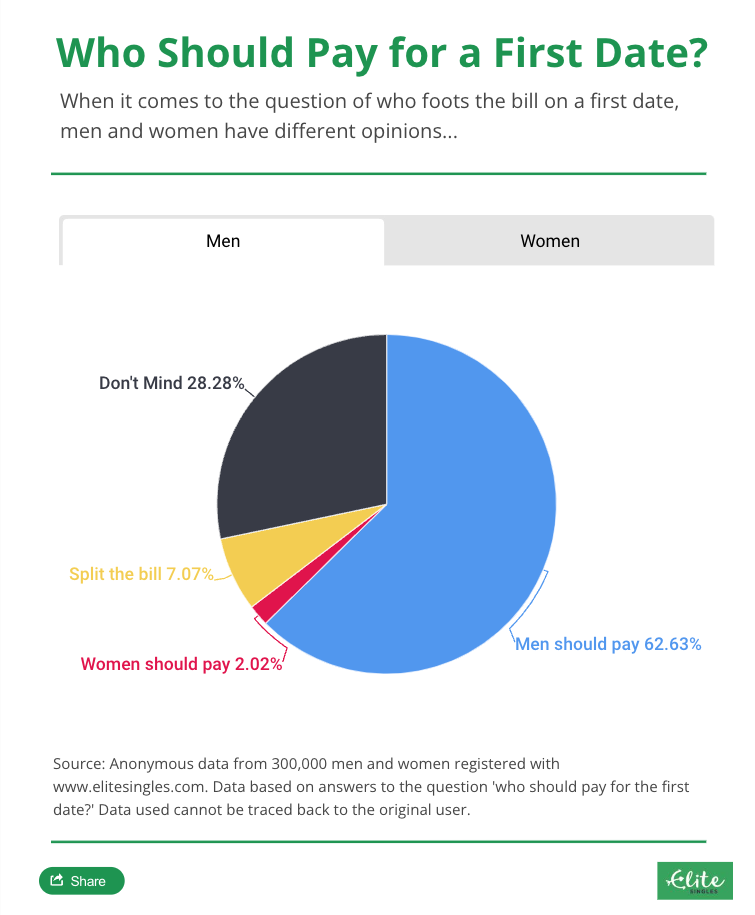
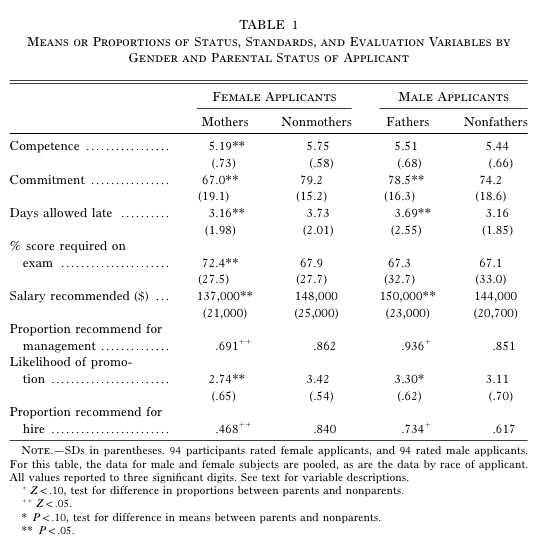
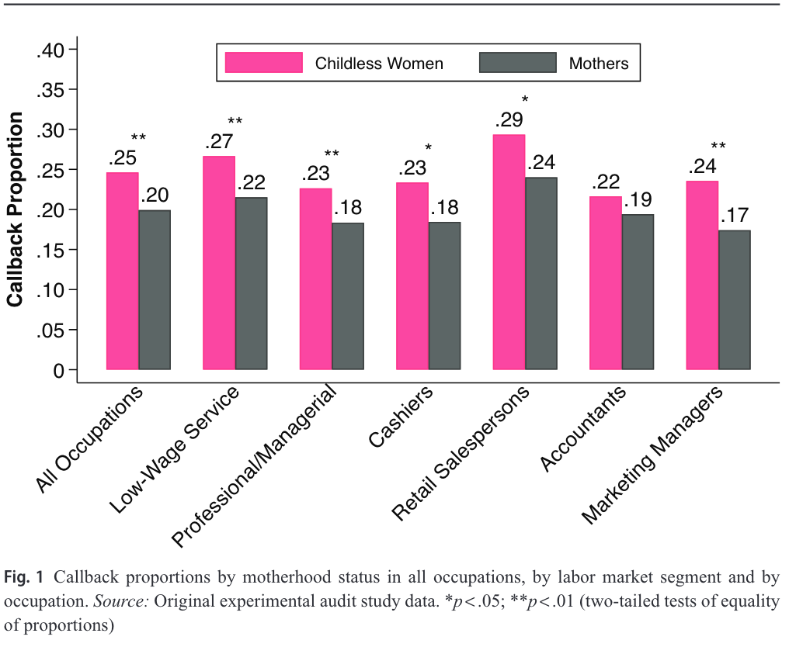
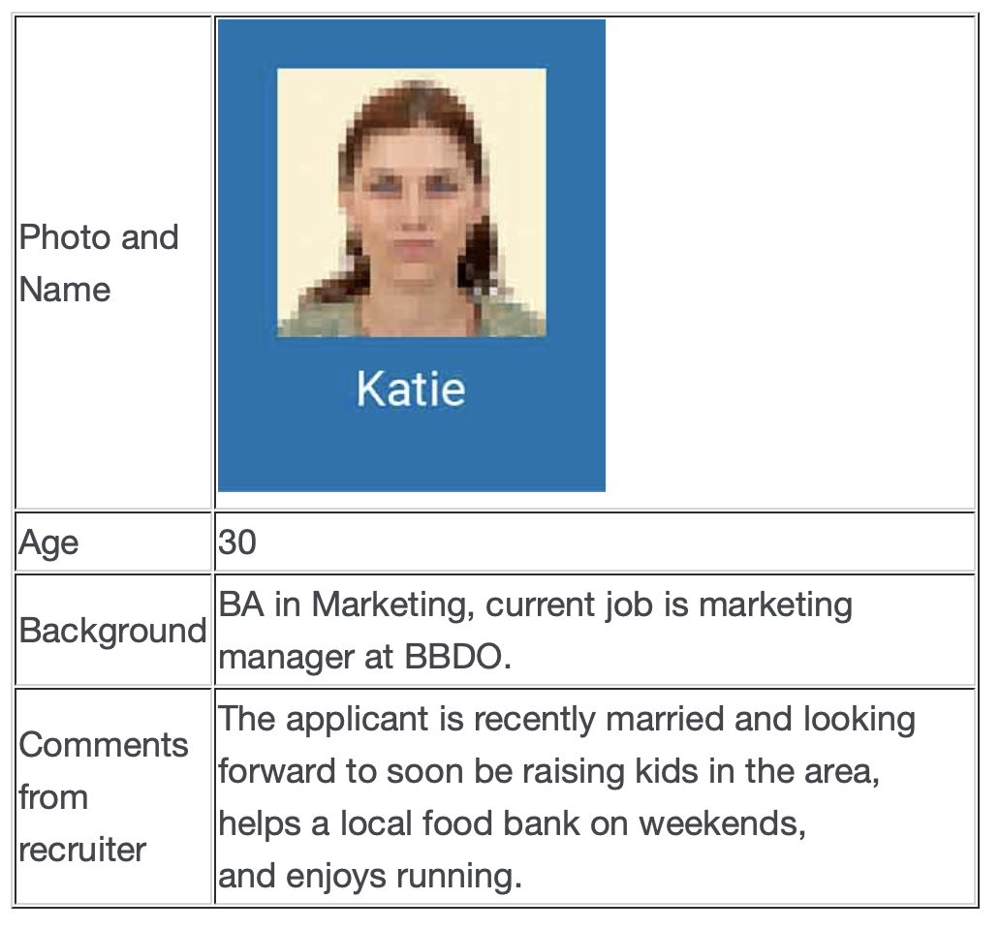
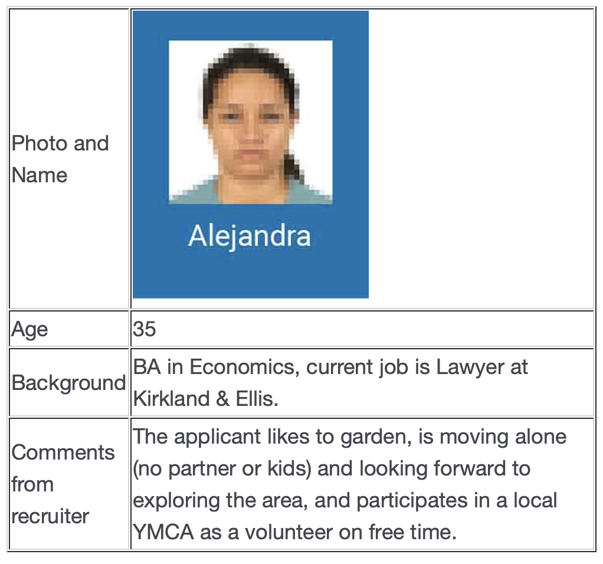
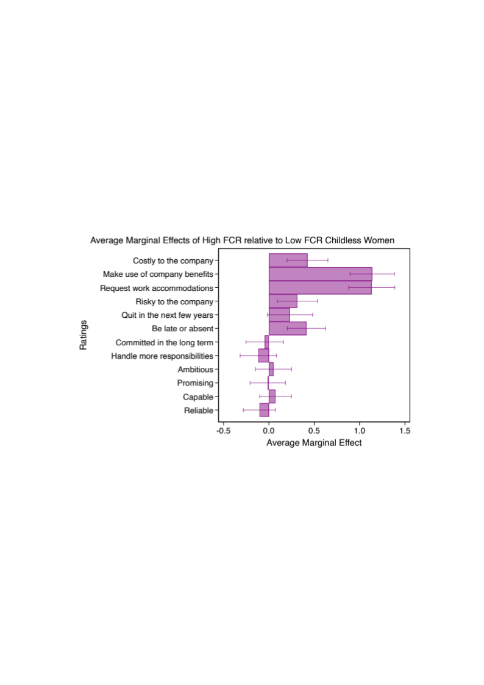
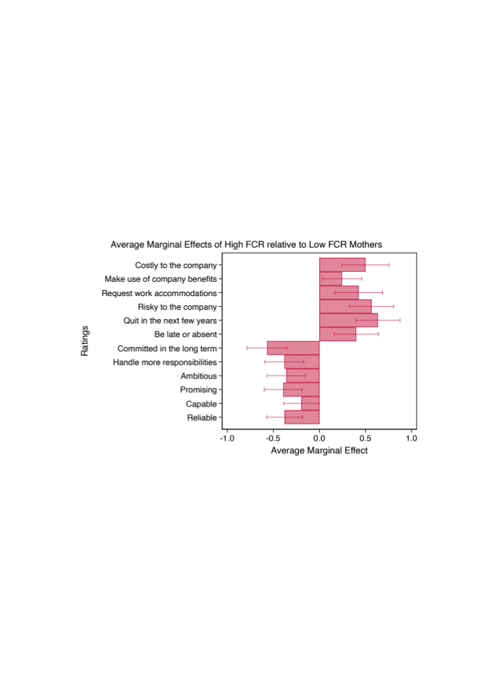

---

# Sociología del Género {background-image="C8C9_01.jpg" background-size="cover" background-opacity="0.35" style="color:white;"}

::: {style="color:#d4b8f5; font-size:1.1em; margin-top:0.5em;"}
(MINI) Clase 8: Relaciones románticas y sexoafectivas · Clase 9: Trabajo remunerado y mercado laboral · SOL191
:::

---

## Objetivos de hoy

- Revisar resultados de evaluación temprana.
- Discutir el persistente rol del género en las relaciones románticas y sexoafectivas (versión abreviada)
- Comprender algunas formas de desigualdad de género en el trabajo y cómo operan.

---

## Evaluación temprana

::: {style="font-size:0.85em;"}
Buena percepción general del curso, el contenido, las clases. ¡Gracias!

::: columns
::: {.column width="50%"}
**Aspectos positivos**

- Temas claros y lecturas relevantes
- Metodología activa y participativa: actividades en clases.
- Clases dinámicas
- Ambiente respetuoso e inclusivo
:::
::: {.column width="50%"}
**Aspectos a mejorar**

- Muchas lecturas: algunos cambios al programa (revisar).
- Alta exigencia de participación en clases: flexibilidad en formas de participación.
- Clases a veces muy rápidas: me comprometo a ir más lento y les pido que avisen si necesitan más explicaciones o tiempo.
:::
:::
:::

---

# Parte 1: Relaciones románticas y sexoafectivas {background-color="#6B4C9A" style="color:white;"}

---

## La persistencia de las citas generizadas en parejas heterosexuales (Lamont)

::: {style="font-size:0.85em;"}
- Muchos cambios en las últimas décadas: atraso del matrimonio, aumento de aspiraciones igualitarias en las relaciones, aumento del espacio para que las mujeres sean sexualmente activas, foco en el desarrollo personal y profesional de las mujeres.
- Sin embargo, el [modelo proactivo-reactivo]{.hl} en las citas persiste.
- Estos cambios en otras esferas han llevado a hombres y mujeres heterosexuales a traducir viejas desigualdades en nuevos espacios de citas mediante creencias preexistentes de género que guían la interacción social.
:::

::: notes
15 min revisar y completar guía – 10 min plenario
:::

---

## ¿Quién debería pagar la comida en la primera cita?

::: columns
::: {.column width="50%"}
{fig-align="center"}
:::
::: {.column width="50%"}
{fig-align="center"}
:::
:::

---

## Parejas de mismo sexo (Lamont)

::: {style="font-size:0.85em;"}
- Estudio entrevista a 40 personas que se identifican como LGBTQ: ¿Cómo las personas queer negocian las prácticas dominantes culturalmente de cortejo y citas?
- En vez de replicar normas heterosexuales, los participantes activamente rechazan estas normas.
- Buscan [nuevas formas más igualitarias]{.hl} de construir relaciones románticas:
  - Prácticas de citas recíprocas: ambas partes deben invitar, pagar, comunicar interés, avanzar la relación.
  - Importancia de la individualidad y la igualdad: balancear sus propias necesidades con las necesidades de su pareja.
:::

---

## Parejas de mismo sexo (Lamont)

::: {style="font-size:0.85em;"}
- Sin embargo, en algunos casos podría operar como un "mito":
  - Al ser suficientemente "queer" se atribuyen mayor libertad para seguir ciertas normas de género. Lo ven como una preferencia personal o juego de género, no como parte de un problema sistémico (como lo sería para parejas heterosexuales).
- O terminar restringiendo las prácticas "aceptables" de manera similar a como las normas más tradicionales de género lo hacen con las relaciones heterosexuales.
  - Presión de siempre ser radicales y rechazar la heteronorma.
:::

---

## Actividad en grupos

::: {.cuadro-actividad}
Formar 5 grupos; cada uno busca una definición (y un ejemplo si aplica) de los siguientes conceptos, la anota en la pizarra y la explica al curso:

- Modelo o narrativa "proactivo-reactiva" en el cortejo (*courtship*) o citas.
- *Hookup culture*
- *Egalitarian essentialism* (esencialismo igualitario)
- *Choice feminism*
- Narrativas de desesperación
:::

---

## ¿Qué es para ti un indicador de igualdad de género en la pareja? {background-color="#f8f4ff"}

---

## La igualdad se trabaja (Martínez-Echagüe)

::: {style="font-size:0.82em;"}
::: columns
::: {.column width="55%"}
¿Cómo se define teóricamente la igualdad de género en las relaciones de pareja heterosexuales?

- Reconocimiento de las diferencias entre mujeres y hombres y la valorización (en salario y estatus) de sus especificidades de igual manera.
- Disolución de la división sexual del trabajo y la búsqueda de la simetría (el modelo doble proveedor/a-doble cuidador/a).
- Autonomía para decidir qué roles se quiere ocupar (dentro y fuera del hogar) más allá del género.
:::
::: {.column width="43%"}
{fig-align="center"}
:::
:::
:::

---

## Principales resultados (Martínez-Echagüe)

::: {style="font-size:0.85em;"}
- La mayoría se considera igualitario, pero no 50-50 sino más abierto y flexible.
  - Disminuían el peso de la división del trabajo doméstico en la determinación de si una pareja es igualitaria o no.
- Igualdad como lo que cada pareja defina (centrado en la elección), en lugar de definiciones simétricas.
- Usan "estándares más realistas" en lugar de objetivos simétricamente estrictos, focalizándose en los aspectos de sus relaciones que, sin duda, son más igualitarios.

::: {.cuadro-actividad}
La autora argumenta que "esto les permite salvar tanto sus relaciones como sus ideales" ¿A qué se refiere? ¿Por qué les permitiría hacer eso?
:::
:::

---

## Principales resultados (Martínez-Echagüe)

::: {style="font-size:0.85em;"}
Preocupación sobre y trabajo para la igualdad de género recae principalmente en las mujeres

::: {.cuadro-datos}
"Tener una relación igualitaria (en un sentido simétrico o en uno flexible que con el tiempo se balancee) requiere trabajo y este recae en las mujeres porque son las que tienen las de perder si no se hace. Los varones, por su parte, tienen ventajas culturales y estructurales que les permiten desentenderse."
:::

Paradoja: disyuntiva entre hacer el trabajo no remunerado que su pareja no está haciendo, o hacer el trabajo no remunerado de educar a su pareja en cómo tener una relación igualitaria.

::: {.cuadro-actividad}
¿Por qué creen que la autora encuentra que el trabajo para la igualdad recae principalmente en las mujeres? ¿Cómo se podría salir de esta paradoja?
:::
:::

---

# Trabajo remunerado y mercado laboral {background-color="#6B4C9A" style="color:white;"}

---

## Castigo a la maternidad en salarios en Latinoamérica (Villanueva & Lin 2019)

::: {style="font-size:0.85em;"}
- ¿Qué buscan estudiar en este artículo? ¿Qué encuentran para Chile?
- Castigo a la maternidad en salarios en 5 países: desde 12% en Brasil a [21% en Chile]{.hl} (el más alto).
- La participación de madres en trabajo informal explica parte del castigo a la maternidad
  - Pero no tanto en Chile: % de informalidad más bajo y donde la maternidad no es un determinante tan importante en el trabajo informal como en otros países.
  - NOTA: Esto fue en 2019, antes de la pandemia, cuando la informalidad laboral de las mujeres aumentó bastante.
:::

---

## Castigo a la maternidad en contrataciones en USA

::: columns
::: {.column width="50%"}
{fig-align="center"}
:::
::: {.column width="50%"}
{fig-align="center"}
:::
:::

::: notes
Time pressure, collaboration, and travel demands are more common in professional and managerial job ads, whereas nonstandard hours and schedule instability are more common in low-wage service ads. Moreover, employers discriminate more strongly against mothers in professional and managerial jobs when time pressure, collaboration, and travel are explicit requirements. In contrast, employers discriminate similarly against mothers in low-wage service jobs regardless of whether job ads require nonstandard hours, but schedule instability predicts stronger discrimination.
:::

---

## Sesgos asociados a la maternidad

::: {style="font-size:0.85em;"}
::: columns
::: {.column width="40%"}
{fig-align="center"}
:::
::: {.column width="58%"}
- Foco tiende a estar en la maternidad, que tiene impactos significativos en la participación laboral, salarios, oportunidades, etc.
- ¿Se extiende esta penalización a aquellas mujeres que no son madres?
- Las mujeres podrían ser afectadas por estos estereotipos tan solo por la expectativa de que serán madres en el futuro.
:::
:::
:::

::: notes
21 min.

Realicé un estudio diseñado para medir estereotipos en contextos de selección y evaluación de personas, para ver cómo son percibidas las mujeres que no son madres pero podrían ser consideradas como "futuras madres".
:::

---

## Datos

::: {style="font-size:0.85em;"}
- Encuesta experimental para análisis conjunto (*conjoint study*) con [713 participantes]{.hl} en Estados Unidos (Hainmueller and Hiscox 2010; Schachter 2016).
  - Participantes viven en EEUU, son empleados a tiempo completo, y tienen experiencia en contrataciones y en gerencia/supervisión de personas.
- Escenario ficticio de evaluación de perfiles de postulantes a diversos cargos
  - Los perfiles varían aleatoriamente estado parental y riesgo de maternidad futura, entre otras.
  - Participantes evalúan a las postulantes en medidas de costo, riesgo, crecimiento potencial, y competencias.
:::

::: notes
Conjoint survey experiments allow us to causally test the effect of treatments in the outcome variable by estimating the average effect of each profile attribute value (e.g., being married) en el puntaje, where the average is based on the distribution of all other attributes across repeated samples (Hainmueller, Hopkins, and Yamamoto 2014, 11). This is called the average marginal component effect (AMCE).
:::

---

## Ejemplo de perfiles evaluados

::: columns
::: {.column width="50%"}
{fig-align="center"}
:::
::: {.column width="50%"}
{fig-align="center"}
:::
:::

::: notes
Este marco permite incluir información que típicamente no está en currículum o postulaciones, como el estado parental y los planes de familia.

Para presentar esto de manera más realista, se les dijo que los postulantes se estaban mudando de ciudad para el trabajo, entonces la información dice algo como: recién casada y esperando criar hijo en el área.

También incluye información distractora como...
:::

---

## Estereotipos de maternidad futura

{fig-align="center" width="80%"}

::: notes
Resultados para las mujeres que NO son madres. El gráfico muestra los efectos de componente marginal promedio de tener un alto riesgo de maternidad futura.

Un efecto mayor a cero indica que las mujeres de alto riesgo tienen una evaluación más alta en el indicador. La escala de los ítems es de 0 a 7, de menos probable o menos de un atributo a más probable o más de un atributo.

Acorde con mis hipótesis, las mujeres de alto riesgo son vistas como más costosas, en todas las medidas de costo, y como más riesgosas, en algunas medidas.

Contrario a mi hipótesis, las mujeres sin hijos no son penalizadas en medidas de crecimiento potencial por tener un alto riesgo.

Como esperado, las mujeres de alto riesgo no son penalizadas en competencias actuales para llevar a cabo el trabajo. En resumen, entre mujeres NO madres, la maternidad futura es penalizada solo en medidas de costo y riesgo.
:::

---

## Estereotipos de "hijo/a adicional"

{fig-align="center" width="80%"}

::: notes
Aquí muestro los resultados para mujeres que son madres.

Las madres de alto riesgo de tener otro hijo o hija en el futuro son vistas como más costosas y riesgosas que las madres de bajo riesgo.

Pero además, entre las madres, el alto riesgo es penalizado en medidas de crecimiento profesional y de competencia, a diferencia de las mujeres sin hijas. Es decir, los efectos del alto riesgo de tener otro hijo/a entre madres son más extensos, y las madres de alto riesgo son, por lo tanto, el grupo más penalizado de todos.
:::

---

## Discriminación en contrataciones en Chile (Undurraga 2019)

::: {style="font-size:0.9em;"}
- ¿Qué hace la autora en este estudio?
- ¿Cuáles son los principales resultados?
  - Género
  - Clase
  - Estado civil
  - Sexualidad
  - Edad
:::

---

## Brecha salarial de género en Chile

::: {style="font-size:0.85em;"}
::: columns
::: {.column width="50%"}
::: {.cuadro-actividad}
**En grupos de máximo 4 personas:**

- Busquen el % de la brecha salarial de género en Chile (reciente)
- Identifiquen cómo está medida o calculada esa brecha salarial
  - ¿A quiénes compara para estimar ese porcentaje?
  - ¿Cómo lo calculan?
:::
:::
::: {.column width="48%"}
{fig-align="center"}

::: {style="font-size:0.6em; color:#999; text-align:right;"}
*This Photo by Unknown Author is licensed under CC BY-SA-NC*
:::
:::
:::
:::

---

## Video brecha salarial para discusión

::: {style="font-size:1.1em; text-align:center; margin-top:2em; color:#6B4C9A;"}
🎥 Video incrustado para discusión grupal
:::

---

## Estudio Cruz y Rau (2022)

::: {style="font-size:0.85em;"}
- Datos administrativos.
- Brecha salarial de [24%]{.hl}, pero heterogeneidad por sectores y tamaño de empresa
  - Hasta 10 trabajadores: 8% vs. 200 o más trabajadores: 36%
  - Sector financiero: 9% vs. Minería: 48%
- Explicaciones:
  - 82-92% de la brecha se debe a la subrepresentación de mujeres en empresas que pagan salarios altos y sobrerrepresentación en empresas que pagan salarios bajos.
  - 8-18% de la brecha se debe a diferencias entre hombres y mujeres con igual educación, habilidad y en las mismas empresas.
- Ley de Igualdad Salarial del 2009
:::

---

## Recordatorios

::: {style="font-size:0.9em;"}
- Próxima semana el martes es feriado. ¡Que descansen!
- Próxima semana día viernes 24 de mayo: ayudantía para presentaciones.
- Martes 28 de mayo: familia y conciliación.
  - Bass, B.C. 2015. "Preparing for Parenthood?: Gender, Aspirations, and the Reproduction of Labor Market Inequality."
  - Herrera, F., Miranda, C., Pavicevic, Y., & Sciaraffia, V. (2018). "Soy un papá súper normal": Experiencias parentales de hombres gay en Chile.
:::
