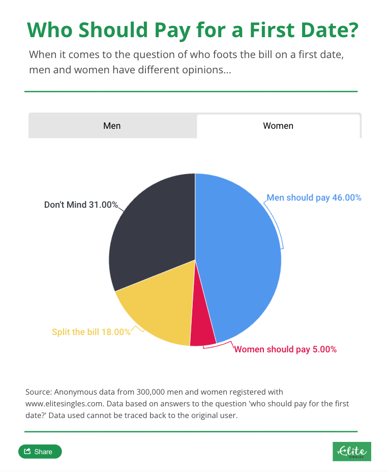

---

# Relaciones románticas y sexoafectivas {background-image="C8_01.jpg" background-size="cover" background-opacity="0.35" style="color:white;"}

::: {style="color:#d4b8f5; font-size:1.1em; margin-top:0.5em;"}
SOL191 · Clase 8
:::

---

## Prueba {background-color="#f8f4ff"}

::: {style="font-size:0.9em;"}
- 70 minutos
- Poner su nombre en cada hoja
- Leer bien las preguntas y criterios de evaluación
- Por favor volver luego del break, tendremos clase corta! :)
:::

---

## Objetivos de hoy

::: {style="font-size:0.9em;"}
- Discutir el persistente rol del género en las relaciones románticas y sexoafectivas.
- Revisar resultados de evaluación temprana.
:::

---

## La persistencia de las citas generizadas en parejas heterosexuales (Lamont)

::: {style="font-size:0.8em;"}
Muchos cambios en las últimas décadas: atraso del matrimonio, aumento de aspiraciones igualitarias en las relaciones, aumento del espacio para que las mujeres sean sexualmente activas, foco en el desarrollo personal y profesional de las mujeres.

Sin embargo, el [modelo proactivo-reactivo]{.hl} en las citas persiste.

Estos cambios en otras esferas han llevado a hombres y mujeres heterosexuales a traducir viejas desigualdades en nuevos espacios de citas mediante creencias preexistentes de género que guían la interacción social.
:::

::: notes
15 min revisar y completar guía – 10 min plenario
:::

---

## ¿Quién debería pagar en la primera cita?

::: columns
::: {.column width="50%"}
{fig-align="center"}
:::
::: {.column width="50%"}
{fig-align="center"}
:::
:::

---

## Parejas de mismo sexo (Lamont)

::: {style="font-size:0.85em;"}
- Estudio entrevista a 40 personas que se identifican como LGBTQ: ¿Cómo las personas queer negocian las prácticas dominantes culturalmente de cortejo y citas?
- En vez de replicar normas heterosexuales, los participantes [activamente rechazan]{.hl} estas normas.
- Buscan nuevas formas más igualitarias de construir relaciones románticas:
  - Prácticas de citas recíprocas: ambas partes deben invitar, pagar, comunicar interés, avanzar la relación.
  - Importancia de la individualidad y la igualdad: balancear sus propias necesidades con las necesidades de su pareja.
:::

---

## Parejas de mismo sexo (Lamont)

::: {style="font-size:0.85em;"}
Sin embargo, en algunos casos podría operar como un "mito":

- Al ser suficientemente "queer" se atribuyen mayor libertad para seguir ciertas normas de género. Lo ven como una preferencia personal o juego de género, no como parte de un problema sistémico (como lo sería para parejas heterosexuales).

O terminar restringiendo las prácticas "aceptables" de manera similar a como las normas más tradicionales de género lo hacen con las relaciones heterosexuales.

- Presión de siempre ser radicales y rechazar la heteronorma.
:::

---

## Actividad en grupos

::: {style="font-size:0.85em;"}
::: {.cuadro-actividad}
**Formar 5 grupos.** Cada uno busca una definición de los siguientes conceptos (y un ejemplo si aplica), lo anota en la pizarra y lo explica al curso:

1. Modelo o narrativa "proactivo-reactiva" en el cortejo (*courtship*) o citas.
2. *Hookup culture*
3. *Egalitarian essentialism* (esencialismo igualitario)
4. *Choice feminism*
5. Narrativas de desesperación
:::
:::

---

## ¿Qué es para ti un indicador de igualdad de género en la pareja? {background-color="#f8f4ff"}

::: {.cuadro-actividad}
**Pregunta para la sala:** ¿Qué es para ti un indicador de igualdad de género en la pareja?
:::

---

## La igualdad se trabaja (Martínez-Echagüe)

::: {style="font-size:0.85em;"}
::: columns
::: {.column width="53%"}
¿Cómo se define teóricamente la [igualdad de género]{.hl} en las relaciones de pareja heterosexuales?

- Reconocimiento de las diferencias entre mujeres y hombres y la valorización (en salario y estatus) de sus especificidades de igual manera.
- Disolución de la división sexual del trabajo y la búsqueda de la simetría (el modelo doble proveedor/a–doble cuidador/a).
- Autonomía para decidir qué roles se quiere ocupar (dentro y fuera del hogar) más allá del género.
:::
::: {.column width="45%"}
{fig-align="center"}
:::
:::
:::

---

## Principales resultados (Martínez-Echagüe)

::: {style="font-size:0.85em;"}
- La mayoría se considera igualitario, pero no 50-50 sino más abierto y flexible.
  - Disminuían el peso de la división del trabajo doméstico en la determinación de si una pareja es igualitaria o no.
- Igualdad como lo que cada pareja defina (centrado en la elección), en lugar de definiciones simétricas.
- Usan "estándares más realistas" en lugar de objetivos simétricamente estrictos, focalizándose en los aspectos de sus relaciones que, sin duda, son más igualitarios.
- La autora argumenta que "esto les permite salvar tanto sus relaciones como sus ideales."

::: {.cuadro-actividad}
¿A qué se refiere la autora con esto? ¿Por qué les permitiría hacer eso?
:::
:::

---

## Principales resultados (Martínez-Echagüe)

::: {style="font-size:0.8em;"}
Preocupación sobre y trabajo para la igualdad de género recae principalmente en las mujeres.

::: {.cuadro-datos}
"Tener una relación igualitaria (en un sentido simétrico o en uno flexible que con el tiempo se balancee) requiere trabajo y este recae en las mujeres porque son las que tienen las de perder si no se hace. Los varones, por su parte, tienen ventajas culturales y estructurales que les permiten desentenderse."
:::

Paradoja: disyuntiva entre hacer el trabajo no remunerado que su pareja no está haciendo, o hacer el trabajo no remunerado de educar a su pareja en cómo tener una relación igualitaria.

::: {.cuadro-actividad}
¿Por qué creen que la autora encuentra que el trabajo para la igualdad recae principalmente en las mujeres? ¿Cómo se podría salir de esta paradoja?
:::
:::

---

## Evaluación temprana

::: {style="font-size:0.8em;"}
Buena percepción general del curso, el contenido, las clases. ¡Gracias!

::: columns
::: {.column width="50%"}
**Aspectos positivos**

- Temas claros y lecturas relevantes
- Metodología activa y participativa: actividades en clases.
- Clases dinámicas
- Ambiente respetuoso e inclusivo
:::
::: {.column width="50%"}
**Aspectos a mejorar**

- Muchas lecturas: algunos cambios al programa (revisar).
- Alta exigencia de participación en clases: flexibilidad en formas de participación.
- Clases a veces muy rápidas: me comprometo a ir más lento y les pido que avisen si necesitan más explicaciones o tiempo.
:::
:::
:::

---

## Recordatorios {background-color="#f8f4ff"}

::: {style="font-size:0.88em;"}
- Hoy enviaremos la nota y feedback de sus ideas de propuesta.
  - Revisarlo en detalle y si tienen dudas, agendar reunión con ayudantes o conmigo.
- Próxima semana: [trabajo remunerado y mercado laboral]{.hl}. Lecturas mínimas:
  - Undurraga, R. (2019). "Who will get the job? Hiring Practices and Inequalities in the Chilean Labour Market"
  - Villanueva y Lin (2018). "Motherhood Wage Penalties in Latin America: The Significance of Labor Informality"
:::
